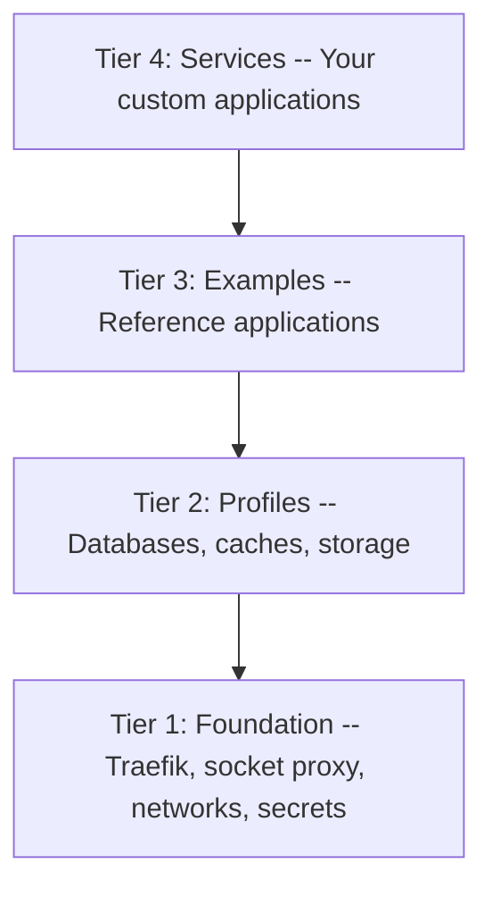
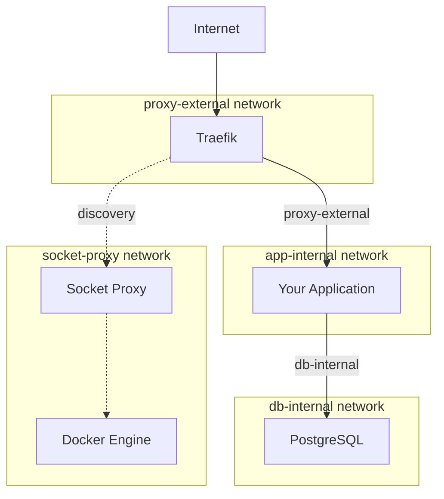
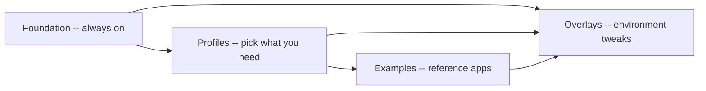

# Chapter 2: Concepts

> Learn the vocabulary, architecture, and mental models you need to understand how Docker Lab organizes, secures, and composes container services.

## Overview

Before you deploy a single container, you need a map of the territory. Docker Lab is not just another Docker Compose project with a long YAML file. It is a structured system with specific layers, deliberate network boundaries, and a composability model that lets you pick exactly which pieces you need.

Think of Docker Lab as a well-designed building. The foundation -- concrete, plumbing, electrical -- runs no matter what. The rooms on each floor serve different purposes: some hold databases, others hold applications. You choose which rooms to furnish and how to arrange them. The building's internal corridors control who can walk where, so a visitor in the lobby cannot wander into the server room. This chapter gives you the complete floor plan.

Why does this matter? Every decision you make with Docker Lab -- which profiles to activate, which networks a service joins, how to add your own application -- depends on understanding these concepts. Skim this chapter and you will spend hours debugging network connectivity. Read it carefully and the rest of the manual will feel intuitive.

## The Four-Tier Architecture

Docker Lab organizes everything into four tiers, stacked from the always-running infrastructure at the bottom to your custom applications at the top. Each tier builds on the one below it, and no tier depends on anything above it.

### A Building Analogy

Picture a four-story building:

- **Ground floor (Tier 1: Foundation)** -- The building systems that run 24/7. Electricity, plumbing, the front desk receptionist. Without these, the building is a shell.
- **Second floor (Tier 2: Profiles)** -- Shared facilities like the cafeteria, the mailroom, and the copy center. You open only the ones your tenants need.
- **Third floor (Tier 3: Examples)** -- Fully furnished office suites that show what a tenant setup looks like. You can copy one as a starting point or just study it.
- **Fourth floor (Tier 4: Services)** -- Your custom offices, arranged exactly the way you want. These integrate deeply with the building systems downstairs.

The following diagram shows these four tiers and how they depend on each other:



Each tier depends only on the tier directly below it. Tier 1 runs independently. Tier 2 requires Tier 1. Tier 3 uses Tiers 1 and 2. Tier 4 can use anything in the stack.

### Tier 1: Foundation (Always Running)

The foundation is the infrastructure that starts with every deployment and never stops. It provides three essential capabilities:

- **Traefik** -- the reverse proxy that receives all incoming traffic and routes it to the right container. Traefik discovers your services automatically through Docker labels, so you never edit a central routing configuration file.
- **Socket proxy** -- a security filter between your services and the Docker Engine. Instead of giving Traefik direct access to the Docker socket (which would be like handing out the master key), the socket proxy restricts access to read-only container discovery.
- **Networks and secrets** -- the four internal networks that control which containers can talk to each other, and the file-based secrets system that keeps credentials out of environment variables and compose files.

The foundation has zero runtime dependencies on anything above it. You can run the foundation alone and it works. Every other tier is optional.

### Tier 2: Profiles (Activated Per Need)

Profiles are supporting infrastructure that applications need but that are not applications themselves. They include databases, caches, and object storage.

| Profile | Service | What It Provides |
|---------|---------|------------------|
| `postgresql` | PostgreSQL 16 | Relational database with pgvector for AI workloads |
| `mysql` | MySQL 8.0 | Traditional web application database |
| `mongodb` | MongoDB 7.0 | Document database |
| `redis` | Redis 7 | Caching and session storage |
| `minio` | MinIO | S3-compatible object storage |

You activate profiles by name in your `.env` file. If your application needs PostgreSQL and Redis, you set `COMPOSE_PROFILES=postgresql,redis`. If it needs nothing beyond the foundation, you leave profiles empty. Profiles you do not activate consume zero resources -- they do not start, do not reserve memory, and do not appear in `docker compose ps`.

### Tier 3: Examples (Reference Implementations)

Examples are complete, working application deployments that demonstrate how to compose the foundation and profiles into real systems. Docker Lab ships with several:

- **Ghost** -- a publishing platform using MySQL
- **LibreChat** -- an AI assistant interface using MongoDB and PostgreSQL
- **Matrix** -- a federated communication server using PostgreSQL
- **WordPress** -- a classic CMS using MySQL
- **Python API** -- a minimal API workload using the foundation only

Examples are not core infrastructure. They exist to show you the integration patterns: how to assign networks, how to set Traefik labels, how to declare database dependencies. You can deploy them as-is, use them as templates for your own applications, or ignore them entirely.

### Tier 4: Services (Custom Integrations)

Services are applications that integrate deeply with the foundation's module system. They register with the dashboard, communicate through the event bus, and declare their capabilities through a module manifest.

The Docker Lab dashboard is a Tier 4 service. It displays running containers, resource usage, and module status. Tier 4 services are where you build your own tools that are native to the Docker Lab ecosystem.

### What Runs Always vs. What Is Optional

This distinction is the most important mental model in Docker Lab:

| Always Running | Optional |
|----------------|----------|
| Traefik (reverse proxy) | Databases (PostgreSQL, MySQL, MongoDB) |
| Socket proxy (Docker API filter) | Caches (Redis) |
| Four internal networks | Storage (MinIO) |
| Secrets infrastructure | Example applications |
| Dashboard (Tier 4 service) | Monitoring (Prometheus, Grafana) |

When you run `docker compose up -d` with no profiles activated, you get the "always running" column. Everything in the "optional" column starts only when you explicitly request it through profiles or compose file includes. This means a fresh Docker Lab deployment is lightweight -- the foundation services use approximately 90 MB of container memory at idle. You scale up by adding profiles, and each profile adds only the resources its services need.

## The Four-Network Topology

Docker Lab isolates containers using four distinct networks. This is not complexity for its own sake -- it is the difference between a compromised container reaching your database and that same container being stuck in a dead end with no way out.

### Why Network Segmentation Matters

By default, Docker puts all containers on a single shared network. Every container can talk to every other container. This is like an office building with no doors -- anyone who walks in can reach any room, including the vault. If a single container is compromised in a flat network, the attacker can reach databases, the Docker socket, and every other service. The blast radius is everything.

Docker Lab replaces this with four purpose-built networks, each with specific rules about what traffic it carries and whether containers on it can reach the outside internet. Three of the four networks are marked `internal: true`, which removes the default gateway and prevents outbound internet connections. This is a critical security property: your database cannot be used for data exfiltration because it has no route to send data anywhere outside the Docker network.

### The Four Networks

The following diagram shows how a request flows from the internet through Docker Lab's network layers to reach a database:



A request arrives from the internet, hits Traefik on the `proxy-external` network, and is routed to your application. Your application talks to PostgreSQL through the `app-internal` and `db-internal` networks. The database container itself has no route to the internet -- it cannot make outbound connections. Meanwhile, the `socket-proxy` network is entirely separate, used only by Traefik to discover running containers through the filtered Docker API.

Here is what each network does:

**proxy-external** -- The only network with an internet gateway. Traefik lives here, along with any service that needs to receive external traffic. This is the front door of the building.

**app-internal** -- Internal communication between application containers. Marked `internal: true` in Docker, which means containers on this network have no default gateway and cannot initiate outbound internet connections. Services that need to talk to each other (your app to its cache, for instance) communicate here.

**db-internal** -- Reserved for database access. Also marked `internal: true`. Databases live here and never connect to `proxy-external`. A compromised web application on `proxy-external` cannot reach a database unless it is also connected to `db-internal` -- and you control which services join which networks.

**socket-proxy** -- The most restricted network. Only the socket proxy container and Traefik connect here. This isolates the Docker Engine's API from all application containers. Even if an attacker compromises your application, they cannot reach the Docker socket.

### The Access Matrix

This table shows which services connect to which networks:

| Service | socket-proxy | db-internal | app-internal | proxy-external |
|---------|:------------:|:-----------:|:------------:|:--------------:|
| Socket proxy | Yes | | | |
| Traefik | Yes | | | Yes |
| PostgreSQL / MySQL / MongoDB | | Yes | | |
| Redis | | | Yes | |
| Web applications | | Yes | Yes | Yes |

Notice the pattern: each service connects only to the networks it genuinely needs. PostgreSQL connects to `db-internal` and nothing else. It cannot reach the internet, cannot reach Traefik, and cannot reach the Docker socket. This is the principle of least privilege applied to container networking.

### Why Not Simpler? Why Not More Complex?

Docker Lab considered three alternatives before choosing four networks:

- **Flat network (one network for everything):** Simplest to configure, but any compromised container can reach every other container. This violates the CIS Docker Benchmark for production deployments.
- **Two-tier (proxy + internal):** Better, but databases are still exposed to every application container, and the Docker socket has no isolation.
- **Micro-segmented (one network per service pair):** Maximum isolation, but exponential complexity that is overkill for single-server deployments.

Four networks hit the sweet spot: meaningful security boundaries without management overhead.

## Profiles and Composability

Docker Lab uses Docker Compose profiles to let you assemble exactly the stack you need. This is the composability model -- you start with the foundation and layer on only what your deployment requires.

### How Profiles Work

A compose profile is a label attached to a service in your `docker-compose.yml`. Services with no profile label start automatically. Services with a profile label start only when that profile is activated.

```yaml
services:
  # No profile -- always starts
  traefik:
    image: traefik:v2.11

  # Profile "postgresql" -- starts only when activated
  postgres:
    image: postgres:16
    profiles:
      - postgresql
```

You activate profiles in your `.env` file:

```bash
# Start foundation + PostgreSQL + Redis
COMPOSE_PROFILES=postgresql,redis
```

Then run `docker compose up -d`. Docker starts the foundation services (no profile) plus PostgreSQL and Redis (matching profiles). MySQL, MongoDB, MinIO, and everything else stays off.

### The Composability Model

The following diagram shows how the four tiers compose together:



The composability model works in layers. The foundation runs first and provides the base. Profiles add databases and infrastructure on top. Examples and services add applications on top of that. Overlays -- environment-specific adjustments like resource limits or TLS settings -- can modify any layer.

Think of it like cooking from a modular recipe system:

- **Foundation** is the fixed base recipe. Every dish starts here.
- **Profiles** are ingredient modules. Need a relational database? Add PostgreSQL. Need caching? Add Redis. You do not add ingredients you will not use.
- **Examples** are complete recipes built from the foundation and profiles. They demonstrate techniques and provide starting points.
- **Overlays** are adjustments for taste and serving size. More memory for production. Different domain names for staging. Debug logging for development.

### Profile Categories

Docker Lab organizes profiles into two categories:

**Supporting tech profiles** add infrastructure services:

| Profile Name | What It Adds | Typical Use |
|-------------|-------------|-------------|
| `postgresql` | PostgreSQL 16 with pgvector | Relational data, AI embeddings |
| `mysql` | MySQL 8.0 | WordPress, Ghost, traditional web apps |
| `mongodb` | MongoDB 7.0 | Document storage, LibreChat |
| `redis` | Redis 7 | Session caching, queues |
| `minio` | MinIO | S3-compatible file storage |

**Feature profiles** add operational capabilities:

| Profile Name | What It Adds | Typical Use |
|-------------|-------------|-------------|
| `monitoring` | Prometheus + Grafana | Metrics dashboards and alerting |
| `backup` | Automated backup tooling | Scheduled database and volume backups |
| `dev` | Adminer, debug tools | Local development and troubleshooting |

### Resource Profiles

Separate from compose profiles, Docker Lab also defines three resource profiles that control how much CPU and memory each container receives:

| Resource Profile | Total RAM Envelope | Total CPU | Best For |
|------------------|-------------------|-----------|----------|
| `lite` | ~512 MB | 0.5 cores | CI/CD pipelines, quick tests |
| `core` | ~2 GB | 2 cores | Development, staging, small production |
| `full` | ~8 GB | 4 cores | Production with monitoring |

You set the resource profile in your `.env` file:

```bash
RESOURCE_PROFILE=core
```

Resource profiles prevent runaway containers from consuming all available memory. A PostgreSQL instance under the `lite` profile gets 256 MB maximum. Under `full`, it gets 2 GB. The foundation enforces these limits through Docker's built-in resource constraints.

## The Two-Layer Deployment Model

Docker Lab sits on top of infrastructure, but it does not provision that infrastructure itself. This separation is intentional and important to understand.

### OpenTofu Handles Infrastructure

The first layer is infrastructure provisioning. OpenTofu (an open-source Terraform alternative) manages the physical resources your containers run on:

- Creating and configuring VPS instances through provider APIs (Hetzner, for example)
- Setting up firewalls, networks, and DNS records
- Planning changes, reviewing them, and applying them with explicit approval gates

Think of OpenTofu as the general contractor who builds the building. It pours the concrete slab, runs the utility connections, and hands you the keys. Once the building exists, the contractor leaves. When you need structural changes -- a new wing, rewired electrical -- you call the contractor back.

OpenTofu runs `plan` and `apply` workflows. It is not a long-running service. It creates infrastructure, records the state, and stops. When you need to change infrastructure -- resize a server, update a firewall rule, add a DNS record -- you run OpenTofu again. Between runs, OpenTofu does nothing. It does not monitor your server, restart crashed containers, or autoscale resources.

### Docker Lab Handles Runtime

The second layer is runtime operations. Once OpenTofu has provisioned a server, Docker Lab takes over:

- Deploying and operating container stacks on the provisioned host
- Managing the foundation, profiles, and applications
- Enforcing deployment promotion gates (validation that must pass before a change goes live)
- Running security, observability, and health checks

If OpenTofu is the general contractor, Docker Lab is the building manager. It keeps the lights on, directs visitors to the right floor, monitors the security cameras, and calls maintenance when something breaks. It runs continuously on the infrastructure that OpenTofu created.

These two layers have different lifecycles. You run OpenTofu infrequently -- when infrastructure needs to change. You interact with Docker Lab continuously -- deploying applications, adjusting profiles, monitoring services. Keeping these layers separate means you can replace either one without affecting the other. If you switch from Hetzner to another VPS provider, your Docker Lab configuration stays the same. If you redesign your container stack, your OpenTofu infrastructure does not need to change.

### Alternative Paths

Not every deployment uses OpenTofu. Docker Lab supports three approaches:

- **API-driven (recommended):** OpenTofu provisions infrastructure, Docker Lab manages runtime. Full reproducibility and audit trail.
- **Manual + Docker Lab:** You provision the VPS by hand through your provider's web console, then deploy Docker Lab. Fastest to start, less infrastructure-as-code control.
- **Hybrid:** OpenTofu manages networking, DNS, and firewalls. You manage the host lifecycle manually.

The concepts in this manual apply regardless of which provisioning approach you choose. The foundation stack, profiles, networks, and composability model work the same way on a hand-provisioned server as they do on an OpenTofu-managed one.

## Modules and the Foundation Framework

Beyond the four-tier architecture, Docker Lab includes a module framework that standardizes how services integrate with the platform.

### What Is a Module?

A module is a self-contained unit of functionality packaged with a manifest (`module.json`), a Docker Compose file, and lifecycle scripts. Think of a module as a standardized shipping container -- no matter what is inside (a database adapter, a monitoring agent, a custom API), the outside looks the same to the foundation. It has the same mounting points, the same labels, and the same handling instructions.

The manifest declares:

- **Identity** -- the module's name, version, and description
- **Requirements** -- what the module needs (database connections, other modules)
- **Capabilities** -- what the module provides (API endpoints, events, dashboard pages)
- **Lifecycle hooks** -- scripts that run when the module is installed, started, stopped, or removed

A module also declares version compatibility with the foundation. If the foundation upgrades to a new major version that changes interfaces, modules that have not been updated will report the incompatibility rather than silently breaking.

### Interfaces Over Implementations

The foundation framework follows a strict design principle: it defines interfaces, not implementations. The foundation tells you what a database connection looks like, but it does not ship a database. It defines what the event bus interface is, but it does not include a message broker.

This matters because it means the core has zero runtime dependencies. You install only the implementations you need:

- Need a database? Activate the PostgreSQL profile.
- Need an event bus? Install the Redis-backed event bus module.
- Need a dashboard? The dashboard service module registers itself through the foundation's standard interface.

If you do not install an implementation, the foundation silently skips it. No errors, no missing dependency warnings. Headless, CLI-only deployments are first-class citizens.

### Module Lifecycle

Every module follows the same lifecycle:

| Phase | Hook Script | What Happens |
|-------|-------------|--------------|
| Install | `install.sh` | One-time setup: create directories, initialize databases |
| Start | `start.sh` | Activate the service: run containers, register with dashboard |
| Health | `health.sh` | Periodic check: verify the module is working correctly |
| Stop | `stop.sh` | Graceful shutdown: drain connections, save state |
| Uninstall | `uninstall.sh` | Clean removal: delete data, unregister from dashboard |

This standardized lifecycle means every module -- whether it is a database, a monitoring stack, or your custom application -- behaves predictably. You install it, start it, check its health, stop it, and uninstall it the same way.

## Putting It All Together: A Concrete Scenario

To see how these concepts combine, walk through a real deployment scenario. You want to run Ghost (a publishing platform) on your server with Docker Lab.

Here is what happens at each layer:

1. **Foundation (Tier 1)** starts automatically: Traefik begins listening on ports 80 and 443. The socket proxy starts and connects to the Docker Engine. The four networks are created.

2. **Profile (Tier 2)** activated: You set `COMPOSE_PROFILES=mysql` in your `.env` file because Ghost needs MySQL. Docker Compose starts a MySQL 8.0 container, connected only to the `db-internal` network. MySQL has no internet access and no connection to Traefik.

3. **Example (Tier 3)** deployed: You add the Ghost compose file. Ghost starts with Traefik labels declaring its hostname (`ghost.example.com`). It connects to `proxy-external` (so Traefik can route traffic to it) and `db-internal` (so it can reach MySQL). Traefik discovers Ghost through the socket proxy and creates a route.

4. **The request flows**: A visitor opens `https://ghost.example.com` in their browser. The request hits Traefik on `proxy-external`. Traefik terminates TLS with a Let's Encrypt certificate, matches the hostname to Ghost, and forwards the request. Ghost queries MySQL on `db-internal` to fetch the page content and returns the response through Traefik to the visitor.

5. **Resource limits apply**: If you set `RESOURCE_PROFILE=core`, Ghost runs with a 512 MB memory limit and MySQL with a 512 MB limit. Neither container can consume more than its allocation, protecting the rest of your stack.

Every concept from this chapter -- tiers, networks, profiles, resource limits, Traefik routing, socket proxy discovery -- is at work in this single deployment. Once you understand the pattern, adding a second application follows the same steps.

## Docker Lab Vocabulary

Here is a reference table of every key term used throughout this manual. Bookmark this section -- you will refer back to it.

| Term | Definition |
|------|-----------|
| **Foundation** | The always-running core infrastructure: Traefik, socket proxy, networks, and secrets. Tier 1 of the architecture. |
| **Profile** | A named group of optional services activated through `COMPOSE_PROFILES` in your `.env` file. Profiles include databases, caches, and feature modules. |
| **Resource profile** | A sizing preset (`lite`, `core`, `full`) that controls CPU and memory limits for all containers. |
| **Overlay** | An environment-specific adjustment layer that modifies foundation, profile, or application configuration (domain names, TLS settings, debug flags). |
| **Module** | A self-contained unit of functionality with a manifest, compose file, and lifecycle scripts that integrates with the foundation framework. |
| **Tier** | One of four architectural layers (Foundation, Profiles, Examples, Services) that organize Docker Lab from core infrastructure to custom applications. |
| **Socket proxy** | A security filter between containers and the Docker Engine API. It restricts which API calls a service can make, reducing the blast radius of a container compromise. |
| **Reverse proxy** | Traefik -- the service that receives all incoming HTTP/HTTPS traffic and routes it to the correct container based on Docker labels. |
| **Network (Docker Lab)** | One of four isolated Docker networks (`proxy-external`, `app-internal`, `db-internal`, `socket-proxy`) that control which containers can communicate. |
| **Compose profile** | A Docker Compose feature that assigns services to named groups. Services start only when their profile is activated. Foundation services have no profile and always start. |
| **Example** | A reference application deployment in Tier 3 that demonstrates how to compose the foundation and profiles into a working system. |
| **Service (Tier 4)** | A custom application that integrates with the foundation's module system, event bus, and dashboard. |
| **OpenTofu** | An open-source infrastructure-as-code tool that provisions servers, networks, and DNS records. Docker Lab runs on the infrastructure OpenTofu creates. |
| **VPS host** | The virtual private server where Docker Lab runs. Provisioned through a provider like Hetzner, either manually or via OpenTofu. |
| **Foundation runtime** | The Docker Lab base services (Traefik, socket proxy, networks, secrets) and their deployment controls, running on a provisioned host. |
| **Lifecycle hook** | A standardized script (`install.sh`, `start.sh`, `health.sh`, `stop.sh`, `uninstall.sh`) that defines how a module transitions between states. |

## Common Gotchas

**Profiles vs. resource profiles are different things.** A compose profile (`postgresql`, `redis`, `monitoring`) controls which services start. A resource profile (`lite`, `core`, `full`) controls how much CPU and memory each container gets. They are configured separately and serve different purposes.

**Services must be assigned to the correct networks.** If your application cannot reach its database, check whether both containers share the `db-internal` network. If Traefik cannot route traffic to your service, check whether the service is on `proxy-external`. Network misconfiguration is the most common source of "it worked locally but not through Traefik" errors.

**Internal networks block outbound internet access.** Containers on `db-internal`, `app-internal`, and `socket-proxy` cannot reach the internet by design. If your application needs to make outbound HTTP calls (fetching an API, downloading updates), it must also be connected to `proxy-external`.

**The foundation runs without profiles.** Running `docker compose up -d` with no `COMPOSE_PROFILES` set starts only the foundation. This is correct behavior, not an error. Profiles are additive -- you opt in to what you need.

## Key Takeaways

- Docker Lab uses a four-tier architecture: Foundation (always on), Profiles (databases and infrastructure), Examples (reference applications), and Services (custom integrations). Each tier depends only on the tier below it.
- Four isolated networks (`proxy-external`, `app-internal`, `db-internal`, `socket-proxy`) enforce the principle of least privilege. Containers connect only to the networks they genuinely need.
- Compose profiles let you activate only the services your deployment requires. Everything you do not activate consumes zero resources.
- The two-layer deployment model separates infrastructure provisioning (OpenTofu) from runtime operations (Docker Lab). You can use either layer independently.
- The module framework defines interfaces, not implementations. The foundation has zero runtime dependencies and works out of the box.

## Next Steps

Now that you have the vocabulary and mental models, it is time to get your hands dirty. In [Chapter 3: Quick Start](./quick-start.md), you will deploy the foundation stack on a real server in five minutes. You will see these concepts in action -- Traefik routing traffic, the socket proxy filtering Docker API access, and the network topology isolating your containers.
