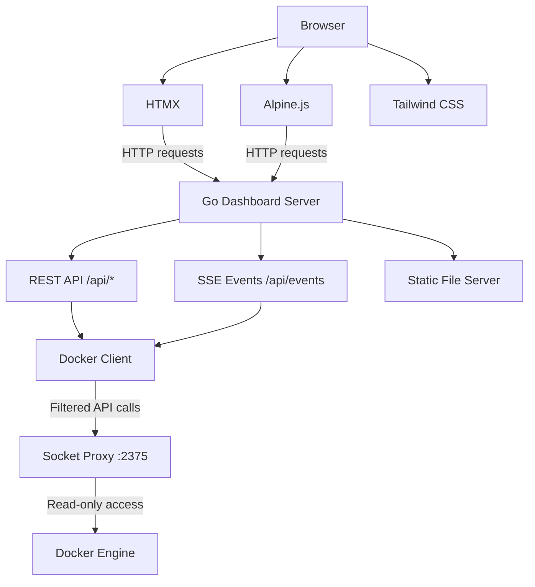
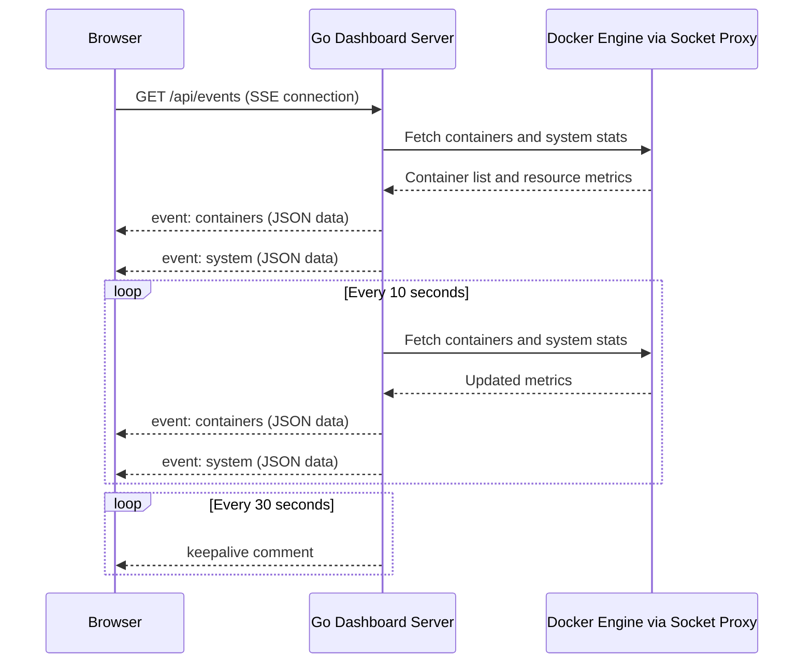

# Chapter 8: The Dashboard

> The Docker Lab dashboard gives you a real-time window into your entire container infrastructure -- containers, volumes, resources, and alerts -- all from a single browser tab.

## Overview

Running containers on a remote VPS creates an immediate problem: visibility. You can SSH in and run `docker compose ps`, but that only gives you a snapshot. What if a container crashed five minutes ago? What if memory usage has been climbing steadily for hours? What if a volume is filling up and you do not notice until a service fails?

The Docker Lab dashboard solves this by providing a live, web-based monitoring interface that updates automatically. You open your browser, log in, and see the current state of every container, every volume, and every system metric -- no SSH required. When something goes wrong, the dashboard surfaces alerts before you even know there is a problem.

This chapter walks you through every part of the dashboard: how to access it, what each page shows, how the live update system works, and how to configure it for your deployment. By the end, you will be comfortable using the dashboard as your primary tool for monitoring Docker Lab.

## Why the Dashboard Matters

If you have been following this manual from the beginning, you have already deployed the foundation stack: socket proxy, Traefik, and the dashboard itself. Those first two services are invisible infrastructure -- they do their work behind the scenes. The dashboard is where you actually *see* what is happening.

Think of the dashboard as the instrument panel in a car. The engine (Docker), transmission (Traefik), and safety systems (socket proxy) do the real work. But without the instrument panel, you would not know your speed, your fuel level, or whether the engine temperature is climbing into the danger zone. The dashboard makes the invisible visible.

For Docker Lab specifically, the dashboard serves three purposes:

- **Operational awareness** -- See which containers are running, stopped, or unhealthy at a glance
- **Resource monitoring** -- Track CPU and memory usage per container in real time
- **Proactive alerting** -- Get warned about problems before they cause outages

## The Technology Behind the Dashboard

Before we explore the interface, understanding the technology stack helps explain why the dashboard behaves the way it does -- and why certain design decisions were made.

### A Go Backend for Simplicity

The dashboard server is written in Go. This choice directly supports one of Docker Lab's core principles: everything must work identically on a $20 VPS and on a developer's laptop, without requiring Node.js, npm, or any build toolchain.

Go compiles to a single binary with no runtime dependencies. The resulting Docker image is approximately 15 MB. The server starts in milliseconds and uses 10-20 MB of memory at idle. Compare that to a Node.js dashboard, which would require installing npm, managing `node_modules`, and shipping a 100 MB+ Docker image that takes seconds to start and consumes 50-100 MB of memory.

Go also provides native goroutines for concurrent operations. This matters for the dashboard because it needs to handle multiple simultaneous SSE connections (one per browser tab) while continuously polling the Docker API -- all without blocking. In Go, this concurrency is built into the language, not bolted on through an async framework.

### A Zero-Build Frontend

The frontend uses HTMX, Alpine.js, and Tailwind CSS -- three libraries that load directly from a CDN with zero build step.

| Library | Purpose | Size |
|---------|---------|------|
| HTMX | Server-driven UI updates via HTML attributes | ~14 KB |
| Alpine.js | Lightweight client-side interactivity | ~14 KB |
| Tailwind CSS | Utility-first styling | Via CDN |

This combination means a developer can edit the dashboard's HTML files and see changes immediately. There is no `npm run build`, no webpack configuration, no PostCSS pipeline. After the browser caches the CDN resources on first load, the frontend works completely offline.

The practical benefit: if you need to customize the dashboard for your deployment, you edit HTML and CSS directly. No toolchain installation required.

### How the Pieces Fit Together

The following diagram shows the dashboard's internal architecture:



The browser communicates with the Go server over HTTP. HTMX handles page navigation and form submissions by making requests and swapping HTML fragments. Alpine.js adds client-side interactivity for things like dropdown menus and modals. The Go server queries the Docker engine through the socket proxy -- never directly -- which means the dashboard only has read access to the Docker API.

## Accessing the Dashboard

### Your Dashboard URL

After deploying the foundation stack, the dashboard is available at your configured domain:

- **Production**: `https://yourdomain.com` (served through Traefik with automatic HTTPS)
- **Local development**: `http://localhost:8080` (direct access, no reverse proxy)

If you followed the deployment steps in the previous chapters, Traefik is already routing traffic to the dashboard. Open your browser and navigate to your domain.

### Logging In

The dashboard uses session-based authentication. When you arrive at the dashboard URL, you are redirected to the login page.

Enter your credentials:

- **Username**: The value of `DOCKERLAB_USERNAME` in your `.env` file (defaults to `admin`)
- **Password**: The value of `DOCKERLAB_PASSWORD` in your `.env` file

After successful authentication, the server creates a session that lasts 24 hours. Your browser stores a secure, HTTP-only cookie -- you will not need to log in again until the session expires.

### How Authentication Works Under the Hood

The dashboard's authentication is straightforward but carefully designed:

1. **You submit credentials** -- The login form sends your username and password to `/api/login`.
2. **Constant-time comparison** -- The server compares your credentials using `subtle.ConstantTimeCompare`, which takes the same amount of time whether the password is correct or nearly correct. This prevents attackers from using timing differences to guess passwords character by character.
3. **Brute-force delay** -- Failed login attempts incur a 500-millisecond delay before the server responds. This slows automated password-guessing attacks significantly.
4. **Session creation** -- On success, the server generates a cryptographically random 32-byte session ID and stores the session in memory with a 24-hour expiry.
5. **Secure cookie** -- Your browser receives a cookie with `Secure`, `HttpOnly`, and `SameSiteStrict` flags. The `HttpOnly` flag prevents JavaScript from reading the cookie (protecting against XSS). The `SameSiteStrict` flag prevents the cookie from being sent with cross-site requests (protecting against CSRF).
6. **Anti-caching headers** -- Every authenticated response includes `Cache-Control: no-store` to prevent browsers from caching dashboard content. This ensures that hitting the back button after logging out does not reveal stale data.

### Demo Mode and Guest Access

If your deployment has demo mode enabled (`DOCKERLAB_DEMO_MODE=true`), the login page shows an additional "Enter as Guest (View Only)" button. Clicking this creates a guest session with read-only access to all monitoring pages.

Guest users can:

- View all containers, volumes, images, and system information
- See real-time resource charts and event streams
- View registered remote instances

Guest users cannot:

- Trigger deployment syncs
- Register or remove remote instances
- Perform any write operations

Demo mode is designed for public showcases, conference presentations, and evaluation by potential users. For private deployments, leave `DOCKERLAB_DEMO_MODE` unset or set it to `false`.

## The Dashboard Home Page

After logging in, you arrive at the main dashboard. This page is designed to give you a complete picture of your infrastructure at a glance.

### Container Status Overview

The top section displays aggregate container statistics with color-coded indicators:

- **Total Containers** -- The count of all containers, running and stopped
- **Running** (green) -- Active containers serving traffic or performing work
- **Stopped** (yellow) -- Containers that have exited, whether intentionally or due to an error
- **Unhealthy** (red) -- Containers whose health checks are failing

These numbers update automatically every 10 seconds through the SSE event stream. You never need to refresh the page.

### Resource Charts

Below the status overview, you see real-time resource usage charts for each running container:

- **CPU Usage** -- Displayed as a percentage per container
- **Memory Usage** -- Shown as megabytes consumed versus the configured memory limit

The charts update every 10 seconds. If you see empty charts when you first load the page, wait a few seconds -- the first data poll has not completed yet.

### Recent Events Feed

The bottom section shows a live stream of container events:

- Container starts and stops
- Health check status changes
- Resource threshold warnings
- System-level events

Events are displayed with timestamps and color-coded by severity: blue for informational, yellow for warnings, and red for critical issues.

## The Containers Page

The Containers page is where you go for detailed information about every Docker container on your system.

### What You See

For each container, the page displays:

| Field | Description |
|-------|-------------|
| Name | Container name from Docker Compose service definition |
| Image | Docker image and tag |
| Status | Running state (running, exited, dead) |
| Health | Health check result (healthy, unhealthy, none) |
| Uptime | Time since the container started |
| Profile | Detected Docker Lab profile or project name |
| Ports | Exposed ports with protocol |
| Networks | Connected Docker networks |
| CPU | Current CPU usage percentage |
| Memory | Current memory in MB versus configured limit |

Containers are sorted alphabetically by name. Running containers show live resource metrics that update through the SSE stream. Stopped containers display cached information from their last run.

### Profile Detection

One detail that makes the Containers page especially useful is profile detection. The dashboard examines Docker Compose labels on each container to determine which Docker Lab profile it belongs to:

- `com.docker.compose.service` -- The service name from your compose file
- `com.docker.compose.project` -- The Docker Compose project name
- `pmdl.profile` -- A custom Docker Lab label for explicit profile assignment

This means you can immediately see which containers belong to the foundation stack, which belong to a database profile, and which belong to an application profile -- all without checking compose files.

### Health Check Interpretation

The dashboard does not just report Docker's health check status verbatim. It interprets health information intelligently:

- If a container defines a `HEALTHCHECK` instruction and Docker reports a status, the dashboard uses that status directly
- If no health check is defined but the container is running, the dashboard infers a "healthy" state from the running status
- If a container is stopped or dead, it is marked accordingly regardless of health check configuration

This interpretation prevents the common confusion of seeing "no health check" for perfectly healthy containers that simply do not define one.

## The Volumes Page

The Volumes page tracks all Docker volumes on your system.

### What You See

For each volume:

| Field | Description |
|-------|-------------|
| Name | Volume name as defined in your compose file |
| Driver | Volume driver (typically `local`) |
| Size | Volume size in human-readable format (KB, MB, GB, TB) |
| In Use | Whether any running container currently mounts this volume |
| Used By | List of container names using this volume |
| Mount Point | Host filesystem path where the volume is stored |
| Created | Volume creation timestamp |
| Labels | Docker labels attached to the volume |

Volumes are sorted alphabetically. The page also shows total volume count and cumulative storage size at the top.

### Practical Uses

The Volumes page answers three questions that come up frequently in day-to-day operations:

1. **Are there orphaned volumes?** If a volume shows "Not In Use" and you do not recognize the name, it may be leftover from a removed service. Orphaned volumes consume disk space without providing value.

2. **How much storage is each service consuming?** The size column lets you identify which volumes are growing and may need attention.

3. **Which containers share storage?** The "Used By" column reveals shared volumes, which is important when planning container restarts or migrations.

**A note about volume sizes:** Docker does not always report volume size, depending on the storage driver. If you see a size of 0 bytes, this is expected behavior -- not a dashboard bug. The "In Use" status and mount information remain accurate regardless.

## The Images Page

The Images page shows Docker images currently present on your system. For each image, you see the repository and tag, the image ID (short hash), the size on disk, and the creation date.

This page is read-only. Image management -- pulling new versions, removing old ones -- is handled through the deployment sync feature or via the command line. The Images page exists to give you visibility into what is cached on your host, which is useful when troubleshooting version mismatches or planning disk cleanup.

## The System Info Page

The System Info page displays host-level details about the server running your Docker Lab deployment:

- **Hostname** -- The system hostname
- **Operating System** -- Host OS (typically `linux` for VPS deployments)
- **Architecture** -- CPU architecture (`amd64`, `arm64`)
- **Docker Version** -- The installed Docker Engine version
- **Dashboard Uptime** -- How long the dashboard service has been running
- **CPU Count** -- Number of CPU cores available to containers
- **Total Memory** -- Total system RAM in megabytes

This information is useful for capacity planning (do you have enough CPU and memory for additional profiles?) and for troubleshooting platform-specific issues (is the architecture what you expect?).

## Live Updates with Server-Sent Events

One of the dashboard's most important features is its real-time update system. The dashboard does not poll the server on a timer from the browser. Instead, it uses Server-Sent Events (SSE) to receive a continuous stream of updates from the server.

### How SSE Works

When your browser loads the dashboard, it opens a persistent HTTP connection to `/api/events`. Unlike a regular HTTP request that gets a response and closes, this connection stays open. The server sends events down this connection whenever new data is available.

The following diagram shows the SSE event flow:



The server polls the Docker API every 10 seconds and pushes updated data to all connected browsers. Between data updates, a keepalive comment is sent every 30 seconds to prevent reverse proxies and load balancers from closing the connection due to inactivity.

### SSE Event Types

The dashboard sends three types of events:

| Event Type | Payload | Frequency |
|------------|---------|-----------|
| `containers` | Full container list with resource metrics and timestamps | Every 10 seconds |
| `system` | System resource statistics (CPU, memory totals) | Every 10 seconds |
| `error` | Error message when Docker API queries fail | On error |

### Why SSE Instead of WebSockets?

SSE was chosen over WebSockets for several reasons:

- **Simplicity** -- SSE is standard HTTP. It works through any reverse proxy without special configuration (beyond disabling response buffering).
- **One-directional** -- The dashboard only needs server-to-client updates. The browser never needs to send data back through the event stream.
- **Automatic reconnection** -- Browsers automatically reconnect when an SSE connection drops, with no custom code needed.
- **Traefik compatibility** -- SSE works through Traefik by adding a single header (`X-Accel-Buffering: no`), which is already configured in the foundation stack's compose file.

### SSE and Traefik Configuration

For SSE to work correctly through Traefik, response buffering must be disabled for the dashboard's event endpoint. The foundation stack's compose file already includes this configuration:

```yaml
labels:
  - "traefik.http.middlewares.sse-headers.headers.customresponseheaders.X-Accel-Buffering=no"
  - "traefik.http.routers.dashboard.middlewares=dashboard-security,dashboard-ratelimit"
```

The `X-Accel-Buffering: no` header tells Traefik (and any upstream proxies like nginx) not to buffer the response. Without this header, updates would be delayed until the proxy's buffer fills -- defeating the purpose of real-time streaming.

## Deployment Sync

The Deployment page shows metadata about your current deployment and provides a one-click mechanism to update services.

### What You See

- **Environment** -- Detected environment label (production, staging, development, local)
- **Version** -- Application version from the `APP_VERSION` environment variable
- **Git Commit** -- Current git commit SHA (when available)
- **Deployed At** -- Timestamp of the last deployment
- **Sync Status** -- Result of the most recent sync operation

### Triggering a Sync

Click the "Trigger Sync" button to pull the latest Docker images for all services and optionally restart containers. This is the equivalent of running `docker compose pull && docker compose up -d` on the server -- but you do it from your browser without SSH access.

The sync operation runs a predefined script. By default, it executes `docker compose pull`. You can customize this behavior by setting the `SYNC_SCRIPT` environment variable to point to your own deployment script:

```bash
SYNC_SCRIPT=/usr/local/bin/deploy.sh
```

Your custom script should be executable, exit 0 on success (non-zero on failure), and print meaningful output that will be captured and displayed to the user.

Here is an example custom sync script:

```bash
#!/bin/bash
set -e

echo "Pulling latest images..."
docker compose pull

echo "Restarting updated services..."
docker compose up -d

echo "Deployment complete!"
```

**Important:** Only authenticated users can trigger sync operations. Guest users see the deployment information but the sync button is disabled.

## Alerts

The Alerts page is your early warning system. Instead of discovering problems when users report them, the dashboard continuously evaluates container health and resource usage against configurable thresholds.

### Alert Types and Thresholds

The dashboard monitors six conditions:

| Alert Type | Warning Threshold | Critical Threshold |
|------------|------------------|--------------------|
| High CPU | 80% | 95% |
| High Memory | 80% of limit | 90% of limit |
| High Disk | 80% capacity | 90% capacity |
| Container Stopped | -- | Container in `exited` or `dead` state |
| Container Unhealthy | -- | Docker health check failing |
| Volume Orphan | -- | Volume not mounted by any container |

### Severity Levels

Each alert carries a severity level displayed with color coding:

- **Info** (blue) -- Informational notices that do not require action
- **Warning** (yellow) -- Issues that deserve attention but are not yet impacting service
- **Critical** (red) -- Urgent problems affecting availability

### Alert Details

Each alert provides:

- A title and description explaining the issue
- The affected resource (container name or mount point)
- A timestamp
- Detailed metrics (CPU percentage, memory usage in MB, disk capacity)

The alerts are recalculated on every page load, giving you a current snapshot rather than a historical log. For historical trending, consider the observability profiles covered later in this manual.

### How Alerts Are Generated

The alert system works by querying the Docker API directly each time you load the Alerts page. Here is what happens behind the scenes:

1. **Container health scan** -- The dashboard lists all containers and inspects each one. Stopped containers generate a "Container Stopped" warning. Containers with failing health checks generate a "Container Unhealthy" critical alert.
2. **Resource usage scan** -- For every running container, the dashboard fetches real-time stats from the Docker API. It calculates CPU percentage and memory usage as a fraction of the configured limit, then compares against the warning and critical thresholds.
3. **Disk usage scan** -- The dashboard checks key mount points (`/` and `/var/lib/docker` on Linux) using the system's `statfs` call. If used capacity exceeds the threshold, an alert is generated.
4. **Summary calculation** -- All alerts are counted by severity to produce the summary displayed at the top of the page.

This approach means alerts are always current -- there is no delay between a problem occurring and the alert appearing. The trade-off is that transient spikes (a container that briefly hits 85% CPU during startup) may generate alerts that disappear on the next page load. For persistent monitoring with historical data, the observability profiles (Netdata, Prometheus, Grafana) provide a complementary solution.

### Practical Example: Reading an Alert

Suppose you see a critical alert titled "Critical Memory Usage" for the `pmdl_dashboard` container. The details show memory at 92% of its configured limit (184 MB of 200 MB). This tells you:

1. The dashboard container is approaching its memory ceiling
2. If memory continues to grow, Docker will OOM-kill the container
3. You should either increase the memory limit in your compose file or investigate what is consuming memory

This kind of proactive warning is what prevents 3 AM incidents.

## Multi-Instance Management

If you run Docker Lab on multiple servers -- production, staging, development -- the Multi-Instance feature lets you monitor all of them from a single dashboard.

### What Is an Instance?

An instance is a remote Docker Lab deployment running its own dashboard. When you register an instance with your primary dashboard, you can view its containers, check its health, and trigger sync operations -- all without opening a separate browser tab or SSH session.

### The "This Instance" Card

When you open the Instances page, the first card you see is labeled "This Instance." This represents the local server you are currently viewing. It is not clickable because you are already looking at its data -- every other page in the dashboard (Containers, Volumes, System Info) shows data from this instance.

The card displays:

- Instance name (from `DOCKERLAB_INSTANCE_NAME` or the server hostname)
- Unique instance ID
- Dashboard URL
- Health status (always "healthy" since you can reach it)
- Environment label (production, staging, development, local)

### Adding a Remote Instance

To monitor another Docker Lab deployment:

**Step 1: Ensure the remote dashboard is accessible**

The remote server must have Docker Lab running with the dashboard accessible via HTTPS. Both your primary dashboard and the remote dashboard must use the same password (set via `DOCKERLAB_PASSWORD`). This shared password acts as the authentication mechanism for instance-to-instance communication.

**Step 2: Register the instance**

1. Click "Add Instance" on the Instances page
2. Fill in the form:
   - **Name**: A friendly identifier (e.g., "Staging Server")
   - **URL**: The full URL of the remote dashboard (e.g., `https://staging.example.com`)
   - **Description** (optional): Notes about this instance
   - **Token**: Leave blank to use the default shared password, or provide a custom token
3. Click "Register"

The system generates a unique instance ID, stores the registration locally, performs an initial health check, and adds a card to the instances list.

**Step 3: Verify the connection**

The new instance card shows health status (healthy, unhealthy, or unknown), the last seen timestamp, version information, and the environment label. If the health check fails, verify that the remote dashboard URL is accessible from your primary server, that both dashboards use the same `DOCKERLAB_PASSWORD`, and that no firewall rules block the connection.

### Managing Connected Instances

Each registered instance card provides four actions:

- **View Containers** -- Opens a modal showing all containers on the remote instance, with the same detail as the local Containers page
- **Trigger Sync** -- Tells the remote instance to pull latest images and restart services (authenticated users only)
- **Check Health** -- Forces an immediate health check instead of waiting for the automatic 30-second interval
- **Remove** -- Unregisters the instance from your dashboard without affecting the remote server (authenticated users only)

### Instance Authentication and Security

Multi-instance communication uses a shared-secret model. Understanding it helps you make good decisions about your deployment topology.

**How the shared secret works:**

1. When you register an instance, the dashboard hashes the token (or uses the default `DOCKERLAB_PASSWORD`) and stores the hash locally.
2. When your primary dashboard communicates with the remote instance, it sends the token in an `X-Instance-Token` HTTP header.
3. The remote instance validates the token against its own configured password using constant-time comparison, preventing timing attacks.

**Permission model for multi-instance operations:**

| User Type | View Instances | Register or Remove | Health Check | Trigger Sync | View Remote Containers |
|-----------|:--------------:|:------------------:|:------------:|:------------:|:----------------------:|
| Authenticated | Yes | Yes | Yes | Yes | Yes |
| Guest | Yes | No | Yes | No | Yes |
| Unauthenticated | No | No | No | No | No |

**Production security recommendations:**

- Always use HTTPS for instance-to-instance traffic. Tokens are sent in HTTP headers, so plaintext connections expose them to interception.
- Deploy instances on a private network or VPN when possible. This adds a network-level security boundary beyond the shared secret.
- Use firewall rules to restrict dashboard ports to known IP addresses.
- Rotate the shared password periodically across all instances. After rotation, re-register any instances that used the old password.
- Set a dedicated `DOCKERLAB_INSTANCE_SECRET` rather than relying on the default password. This lets you change user login credentials without disrupting instance-to-instance communication.

### Instance Data Persistence

Instance registrations are stored in `/data/instances.json` inside the dashboard container. To preserve registrations across container restarts, mount a Docker volume:

```yaml
services:
  dashboard:
    volumes:
      - dashboard_data:/data

volumes:
  dashboard_data:
```

Without this volume, you will need to re-register instances every time the dashboard container restarts.

## API Endpoint Reference

The dashboard exposes a REST API that powers the UI. You rarely need to call these endpoints directly, but knowing them is useful for scripting, integration with external tools, and troubleshooting.

### Core Endpoints

| Endpoint | Method | Auth Required | Description |
|----------|--------|:-------------:|-------------|
| `/health` | GET | No | Liveness probe, returns `{"status":"healthy"}` |
| `/api/login` | POST | No | Authenticate with username and password |
| `/api/logout` | POST | No | End the current session |
| `/api/guest-login` | POST | No | Create a guest session (requires demo mode) |
| `/api/session` | GET | No | Return current session information |
| `/api/containers` | GET | Yes | Container list with resource metrics |
| `/api/volumes` | GET | Yes | Docker volume inventory |
| `/api/system` | GET | Yes | Host system information |
| `/api/alerts` | GET | Yes | Current system health alerts |
| `/api/events` | GET | Yes | SSE stream for real-time updates |
| `/api/deployment` | GET | Yes | Deployment metadata and sync status |

### Multi-Instance Endpoints

| Endpoint | Method | Auth Required | Description |
|----------|--------|:-------------:|-------------|
| `/api/instances` | GET | Yes | List all registered instances |
| `/api/instances` | POST | Yes (non-guest) | Register a new remote instance |
| `/api/instances/{id}` | GET | Yes | Get instance details |
| `/api/instances/{id}` | DELETE | Yes (non-guest) | Remove a registered instance |
| `/api/instances/{id}/health` | GET | Yes | Check remote instance health |
| `/api/instances/{id}/sync` | POST | Yes (non-guest) | Trigger sync on remote instance |
| `/api/instances/{id}/containers` | GET | Yes | Get containers from remote instance |

## Configuration Reference

All dashboard behavior is controlled through environment variables. Set these in your `.env` file or pass them directly in your compose configuration.

### Core Configuration

| Variable | Description | Default |
|----------|-------------|---------|
| `DOCKERLAB_USERNAME` | Login username | `admin` |
| `DOCKERLAB_PASSWORD` | Login password (required for authentication) | (none) |
| `DOCKERLAB_DEMO_MODE` | Enable demo mode with guest access | `false` |
| `PORT` | Dashboard HTTP port | `8080` |
| `ENVIRONMENT` | Environment label (production, staging, development) | (auto-detected) |
| `APP_VERSION` | Application version string displayed in the UI | `0.1.0-mvp` |

### Instance Configuration

| Variable | Description | Default |
|----------|-------------|---------|
| `DOCKERLAB_INSTANCE_NAME` | Human-readable name for this instance | hostname |
| `DOCKERLAB_INSTANCE_ID` | Unique instance identifier | auto-generated |
| `DOCKERLAB_INSTANCE_URL` | Public URL of this dashboard | (auto-detected) |
| `DOCKERLAB_INSTANCE_SECRET` | Shared secret for instance-to-instance auth | (same as password) |

### Infrastructure Configuration

| Variable | Description | Default |
|----------|-------------|---------|
| `DOCKER_HOST` | Docker socket proxy URL | `http://socket-proxy:2375` |
| `SYNC_SCRIPT` | Path to custom deployment sync script | (uses `docker compose pull`) |

### Deprecated Variables

These variables still work but will be removed in a future version. Use the `DOCKERLAB_*` equivalents instead.

| Deprecated | Replacement |
|------------|-------------|
| `DASHBOARD_USERNAME` | `DOCKERLAB_USERNAME` |
| `DASHBOARD_PASSWORD` | `DOCKERLAB_PASSWORD` |
| `DEMO_MODE` | `DOCKERLAB_DEMO_MODE` |
| `INSTANCE_NAME` | `DOCKERLAB_INSTANCE_NAME` |

## Troubleshooting

### Empty Resource Charts

**Symptom**: CPU and memory charts show no data after loading the dashboard.

**Cause**: The SSE connection has not delivered its first data event, or there is a connection issue.

**Solution**:

1. Wait 10-15 seconds. The server polls the Docker API every 10 seconds, so the first data delivery takes up to that long.
2. Open your browser's developer console and check the Network tab for errors on the `/api/events` endpoint.
3. Verify that the SSE endpoint is accessible by navigating directly to `https://yourdomain.com/api/events` -- you should see a stream of `event:` lines.
4. Confirm that containers are actually running. The charts have nothing to show if all containers are stopped.

### SSE Connection Drops or 401 Errors

**Symptom**: The browser console shows repeated SSE errors, or you see "401 Unauthorized" on the events endpoint.

**Cause**: Your session has expired (sessions last 24 hours), or the reverse proxy is interfering with the long-lived SSE connection.

**Solution**:

1. Refresh the page to re-authenticate.
2. If using Traefik (the default), verify that the `X-Accel-Buffering: no` header is configured for the dashboard route. This header is included in the foundation stack compose file by default.
3. If you have a custom reverse proxy in front of Traefik, ensure it does not buffer SSE responses or impose short read timeouts.

### Repeated Login Redirects

**Symptom**: You enter correct credentials but keep getting sent back to the login page.

**Cause**: Session cookies are not being set or stored by your browser.

**Solution**:

1. Confirm the dashboard is served over HTTPS. Session cookies have the `Secure` flag set, which means browsers reject them on plain HTTP connections.
2. Check that your browser allows cookies for the dashboard domain.
3. Disable browser extensions that block cookies or modify HTTP headers.
4. For local development without HTTPS, the session cookie's `Secure` flag will prevent it from working. Use `http://localhost:8080` directly (bypassing Traefik) for local testing.

### Remote Instance Shows "Unhealthy"

**Symptom**: A registered remote instance displays an unhealthy status even though the remote dashboard is running.

**Cause**: Network connectivity failure or password mismatch between instances.

**Solution**:

1. Test connectivity from the primary server:

```bash
$ curl -I https://remote-instance.example.com/health
HTTP/2 200
content-type: application/json
```

2. Verify that `DOCKERLAB_PASSWORD` is identical on both the primary and remote dashboards.
3. Check firewall rules on both servers to ensure the dashboard port is open.
4. Review dashboard logs on both servers for error messages:

```bash
$ docker compose logs dashboard
```

### Volume Sizes Show as 0 Bytes

**Symptom**: The Volumes page shows 0 bytes for all volume sizes.

**Cause**: The Docker API does not always report volume size. Whether size information is available depends on the storage driver.

**Solution**: This is expected behavior, not a bug. The "In Use" status, container associations, and mount point information remain accurate regardless of whether Docker reports size data.

### Health Endpoint Returns 401

**Symptom**: External monitoring tools (like Uptime Kuma) report the dashboard as down because `/api/health` returns 401 Unauthorized.

**Cause**: By design, all API endpoints are protected by authentication. This is an intentional security-first decision that prevents information disclosure.

**Solution**: The `/health` endpoint (without the `/api` prefix) is accessible without authentication and returns `{"status":"healthy"}`. Use this endpoint for external monitoring:

```bash
$ curl https://yourdomain.com/health
{"status":"healthy"}
```

## Key Takeaways

- The dashboard provides real-time visibility into containers, volumes, resources, and alerts without requiring SSH access
- Live updates use Server-Sent Events (SSE), which stream data every 10 seconds over a persistent HTTP connection -- no page refresh needed
- The Go backend and zero-build frontend (HTMX, Alpine.js, Tailwind) keep the dashboard lightweight enough to run on any VPS
- Multi-instance management lets you monitor multiple Docker Lab deployments from a single browser tab
- All endpoints are authenticated by default, with demo mode available for public showcases

## Next Steps

With the dashboard giving you visibility into your infrastructure, the next chapter covers [Multi-Instance Management](./multi-instance.md) in depth. You will learn how to design a multi-server Docker Lab topology, configure instance discovery, and build operational workflows for managing distributed deployments.
