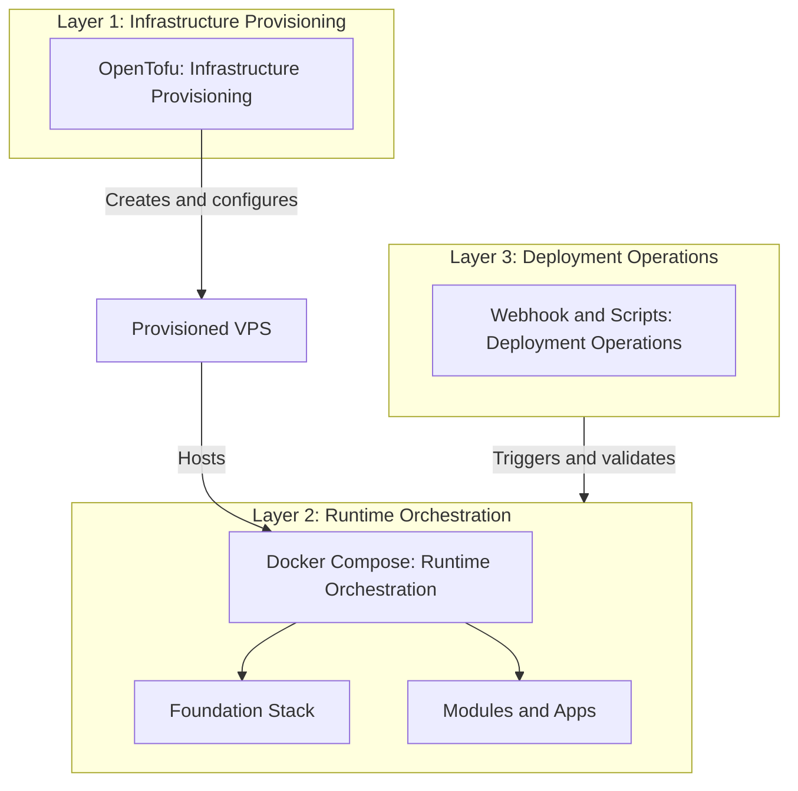
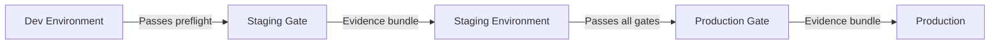
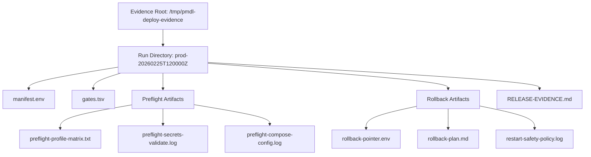
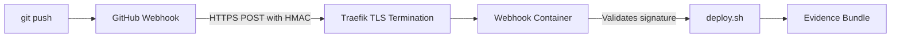

# Chapter 7: Deployment

> This chapter teaches you how to take Docker Lab from your local machine to a live production server, using a structured promotion model that ensures every deployment is safe, traceable, and reversible.

## Overview

Deploying software to a live server is the moment everything becomes real. A mistake in development costs you five minutes of debugging. A mistake in production can take down a service that people depend on. Docker Lab takes this seriously by building safety into the deployment process itself, not as an afterthought.

Think of Docker Lab's deployment model like moving from a rehearsal stage to a concert hall. You do not walk onto the main stage without a soundcheck. Docker Lab enforces a three-stage pipeline -- dev, staging, production -- where each promotion requires passing a set of gates. Every gate produces evidence: logs, health checks, configuration snapshots. If something goes wrong, you have a clear record of what happened and a tested rollback path to get back to safety.

This chapter walks you through the complete deployment lifecycle. You will learn how to prepare a VPS, run your first production deployment, set up automated webhook-based deployments, and use the promotion model to move changes safely from development to production. By the end, you will understand not just the commands, but the reasoning behind each safety gate.

## The Three-Layer Model

Before diving into commands, you need to understand a fundamental design decision in Docker Lab. Deployment is split into three independent layers, each with its own tools, responsibilities, and rollback strategies.

Think of it like a building. Someone has to construct the building (infrastructure), someone has to set up the offices and utilities inside it (runtime orchestration), and someone has to manage the daily operations like deliveries and maintenance schedules (deployment operations). Each role requires different skills, different tools, and different recovery plans when things go wrong.

The following diagram shows how these three layers relate:



**Layer 1 -- OpenTofu (infrastructure provisioning)** handles everything about the server itself: creating the VPS through a provider API, configuring firewalls, setting up DNS records, and managing network rules. Think of OpenTofu as the construction crew that builds and wires the building.

**Layer 2 -- Docker Compose (runtime orchestration)** defines the service topology: which containers run, how they connect through networks, what secrets they consume, and what health checks they report. Compose files are the source of truth for what your stack looks like.

**Layer 3 -- Webhook and scripts (deployment operations)** handles the act of deploying: pulling code, running preflight checks, applying Compose changes, verifying health, and generating evidence bundles. This is the operational layer that triggers and validates runtime changes.

This three-layer separation matters because each layer has a different failure mode and a different recovery path. If the server is unreachable, that is a Layer 1 problem. If a container fails to start, that is a Layer 2 configuration issue. If the deployment process itself fails a gate, that is a Layer 3 operations issue.

| Layer | Tool | Manages | Rollback Strategy |
|-------|------|---------|-------------------|
| Infrastructure | OpenTofu | VPS, firewall, DNS, network | Destroy and re-provision |
| Runtime | Docker Compose | Service topology, networks, secrets | Redeploy previous configuration |
| Operations | `deploy.sh` and webhook | Promotion gates, evidence, apply/rollback | Re-apply known-good state |

You can use all three layers together (recommended) or skip OpenTofu and provision your server manually. The runtime and operations layers work the same way regardless of how the server was created.

### Responsibility Boundaries

The boundary between layers is strict, and understanding what each layer avoids doing is just as important as understanding what it does.

| Domain | Primary Owner | Not Responsible For |
|--------|--------------|---------------------|
| VPS provisioning and lifecycle | OpenTofu | Runtime containers, application config |
| DNS records and host routing | OpenTofu | Service-level routing (Traefik handles that) |
| Network and firewall primitives | OpenTofu | Docker network topology |
| Runtime service topology | Docker Compose | Server provisioning, deployment triggers |
| Deployment trigger and pull mechanics | Webhook and scripts | Infrastructure changes, runtime config authoring |
| Application and module lifecycle | Docker Lab scripts | Infrastructure API operations |

OpenTofu does not run as a long-lived monitor, does not replace Docker Compose, and does not autoscale. It applies changes when you invoke it, then exits. Docker Compose does not provision servers or manage DNS. The deploy script intentionally avoids `git` commands -- a separate orchestrator (webhook wrapper or human operator) handles source synchronization.

This strict boundary means that if a deployment fails, you always know which layer to investigate.

## Preparing Your VPS

Every Docker Lab deployment starts with a properly configured server. Whether OpenTofu provisions it or you set it up by hand, the server must meet specific requirements before Docker Lab can run.

### Hardware Requirements

Docker Lab supports three resource profiles. Choose based on what you plan to run:

| Profile | vCPUs | RAM | Storage | Monthly Cost | Use Case |
|---------|-------|-----|---------|--------------|----------|
| `lite` | 1 | 2 GB | 25 GB SSD | ~$12 | Foundation stack only |
| `core` | 2 | 4 GB | 50 GB SSD | ~$24 | Foundation plus one database |
| `full` | 4 | 8 GB | 100 GB SSD | ~$48 | Full stack with observability |

Any VPS provider offering Ubuntu 22.04 or 24.04 LTS with root SSH access works. Hetzner Cloud is the primary tested provider, but DigitalOcean, Linode, Vultr, and OVHcloud are all valid choices. Before committing to a provider, verify it offers SSH key authentication, firewall or security group support, an IPv4 address, and optionally automated backups.

### Software Requirements

Your VPS needs these components before Docker Lab can deploy:

- **Docker Engine 24+** with the Compose plugin (v2.20+)
- **SSH key authentication** (password authentication must be disabled)
- **UFW firewall** with ports 22, 80, and 443 open
- **A swap file** (4 GB recommended for the `core` profile)
- **Essential CLI tools**: `curl`, `wget`, `jq`, `htop`, `ncdu`

### VPS Setup Walkthrough

Connect to your freshly provisioned VPS and run through these steps. All commands execute as root.

**Create a deploy user.** Never run services as root. A dedicated user limits the blast radius if a service is compromised:

```bash
$ adduser deploy
$ usermod -aG sudo deploy
$ mkdir -p /home/deploy/.ssh
$ cp ~/.ssh/authorized_keys /home/deploy/.ssh/
$ chown -R deploy:deploy /home/deploy/.ssh
$ chmod 700 /home/deploy/.ssh
$ chmod 600 /home/deploy/.ssh/authorized_keys
```

Before continuing, open a second terminal and verify you can log in as the deploy user. If you lock yourself out by misconfiguring SSH, you will need console access from your VPS provider to recover.

**Harden SSH.** Edit `/etc/ssh/sshd_config` with these settings:

```text
PasswordAuthentication no
PubkeyAuthentication yes
PermitRootLogin no
MaxAuthTries 3
Protocol 2
```

Validate and restart SSH. Keep your current session open until you confirm the new settings work from a separate terminal:

```bash
$ sshd -t
$ systemctl restart sshd
```

**Install system packages and Docker.** Update the system and install the official Docker repository:

```bash
$ apt update && apt upgrade -y
$ apt install -y curl wget git htop ncdu unzip fail2ban ufw ca-certificates gnupg jq
$ install -m 0755 -d /etc/apt/keyrings
$ curl -fsSL https://download.docker.com/linux/ubuntu/gpg | gpg --dearmor -o /etc/apt/keyrings/docker.gpg
$ chmod a+r /etc/apt/keyrings/docker.gpg
$ echo "deb [arch=$(dpkg --print-architecture) signed-by=/etc/apt/keyrings/docker.gpg] https://download.docker.com/linux/ubuntu $(. /etc/os-release && echo "$VERSION_CODENAME") stable" | tee /etc/apt/sources.list.d/docker.list > /dev/null
$ apt update
$ apt install -y docker-ce docker-ce-cli containerd.io docker-buildx-plugin docker-compose-plugin
$ usermod -aG docker deploy
```

Verify the installation:

```bash
$ docker --version
Docker version 27.5.1, build 9f9e405

$ docker compose version
Docker Compose version v2.32.4
```

**Configure the Docker daemon** for production. Create `/etc/docker/daemon.json`:

```json
{
  "log-driver": "json-file",
  "log-opts": {
    "max-size": "10m",
    "max-file": "3"
  },
  "live-restore": true,
  "no-new-privileges": true,
  "default-ulimits": {
    "nofile": {
      "Name": "nofile",
      "Hard": 65536,
      "Soft": 65536
    }
  }
}
```

Each setting addresses a real production concern:

- **Log rotation** (`max-size`, `max-file`): Without these limits, container logs grow until they fill the disk. A 10 MB cap with 3 rotated files means each container uses at most 30 MB for logs.
- **Live restore**: Containers survive Docker daemon restarts. Without this, restarting the daemon stops all containers, causing a brief outage.
- **No new privileges**: Prevents container processes from gaining elevated permissions through `setuid` binaries or similar mechanisms.
- **File descriptor limits**: Raises the default limit from 1024 to 65536, which prevents "too many open files" errors under load.

Apply the configuration:

```bash
$ systemctl restart docker && systemctl enable docker
```

**Set up swap.** Swap prevents out-of-memory kills when your services spike temporarily. Without swap, the Linux OOM killer terminates processes to free memory, and it does not always pick the right one:

```bash
$ fallocate -l 4G /swapfile
$ chmod 600 /swapfile
$ mkswap /swapfile
$ swapon /swapfile
$ echo '/swapfile none swap sw 0 0' >> /etc/fstab
$ echo 'vm.swappiness=10' >> /etc/sysctl.conf
$ sysctl -p
```

A swappiness value of 10 tells Linux to prefer keeping data in RAM and only use swap under pressure. This balances performance (RAM is faster) with safety (swap prevents kills).

### Firewall Configuration

Docker modifies iptables directly, which can bypass UFW rules. This is one of the most common surprises for new Docker users: you set up a firewall, but Docker punches holes through it for container ports. You need to configure both layers to get the protection you expect.

**Set up UFW base rules:**

```bash
$ ufw default deny incoming
$ ufw default allow outgoing
$ ufw allow 22/tcp
$ ufw allow 80/tcp
$ ufw allow 443/tcp
$ ufw enable
```

**Block database ports from external access.** Append these rules to `/etc/ufw/after.rules`:

```text
*filter
:DOCKER-USER - [0:0]
-A DOCKER-USER -j RETURN -s 10.0.0.0/8
-A DOCKER-USER -j RETURN -s 172.16.0.0/12
-A DOCKER-USER -j RETURN -s 192.168.0.0/16
-A DOCKER-USER -j DROP -p tcp -m tcp --dport 5432
-A DOCKER-USER -j DROP -p tcp -m tcp --dport 6379
COMMIT
```

These rules allow internal Docker network traffic (so your services can reach their databases) while blocking external access to database ports. The three `RETURN` rules match Docker's internal networks (`10.x`, `172.16.x`, `192.168.x`), while the `DROP` rules block everything else. Reload with `ufw reload`.

After applying these rules, verify from an external machine that database ports are blocked:

```bash
$ nc -zv YOUR_VPS_IP 5432
Connection refused

$ nc -zv YOUR_VPS_IP 6379
Connection refused
```

| Port | Protocol | Purpose | External Access |
|------|----------|---------|-----------------|
| 22 | TCP | SSH | Allowed |
| 80 | TCP | HTTP (redirects to HTTPS) | Allowed |
| 443 | TCP | HTTPS | Allowed |
| 5432 | TCP | PostgreSQL | Blocked |
| 6379 | TCP | Redis | Blocked |

### DNS Configuration

Before deploying, point your domain to the VPS. You need two DNS records:

| Type | Name | Value | TTL |
|------|------|-------|-----|
| A | `@` | Your VPS IP | 300 |
| A | `*` | Your VPS IP | 300 |

The wildcard record lets Traefik route subdomains automatically. When a request arrives for `dashboard.yourdomain.com`, Traefik checks its routing table and sends the request to the dashboard container. You do not need to create separate DNS records for each service.

Verify propagation before continuing:

```bash
$ dig +short yourdomain.com
46.225.188.213

$ dig +short dashboard.yourdomain.com
46.225.188.213
```

Wait for DNS to propagate (typically 5-30 minutes) before starting Let's Encrypt certificate generation. If you deploy too early, the ACME challenge fails because Let's Encrypt cannot reach your server at the domain name, and Traefik falls back to a self-signed certificate.

## Your First Production Deployment

With the VPS prepared, you are ready to deploy Docker Lab. This section walks through every step of the first deployment, from copying files to verifying health.

### Step 1: Transfer Files to the VPS

Docker Lab files are copied to the VPS, not cloned with git. This is a deliberate design choice -- it avoids storing the entire git history on production servers and keeps the deployment footprint small. Transfer the project to the standard deployment path:

```bash
$ scp -r ./peer-mesh-docker-lab deploy@your-vps-ip:/opt/peer-mesh-docker-lab
```

On the VPS, switch to the deploy user and navigate to the project:

```bash
$ su - deploy
$ cd /opt/peer-mesh-docker-lab
```

### Step 2: Configure the Environment

Copy the environment template and fill in your values:

```bash
$ cp .env.example .env
$ nano .env
```

Set these required variables:

```text
DOMAIN=yourdomain.com
ADMIN_EMAIL=admin@yourdomain.com
COMPOSE_PROFILES=foundation
RESOURCE_PROFILE=core
```

Use a real email address for `ADMIN_EMAIL`. Let's Encrypt uses this for certificate expiration notifications and ACME account registration. Placeholder domains like `example.com` cause ACME registration failures. Some free wildcard dynamic DNS domains hit Let's Encrypt rate limits; if this happens, switch to an owned domain.

### Step 3: Generate Secrets

Docker Lab uses file-based secrets with strict permissions. Each secret is a file containing a cryptographically random hex string, stored in a directory that only the deploy user can read. The generation script is idempotent -- it skips secrets that already exist, so running it multiple times is safe:

```bash
$ chmod +x scripts/*.sh
$ ./scripts/generate-secrets.sh
=== Generating Secrets ===
  [CREATED] postgres_password
  [CREATED] dashboard_password
  [CREATED] webhook_secret
=== Complete ===

$ ls -la secrets/
drwx------ 2 deploy deploy 4096 Feb 25 10:00 .
-rw------- 1 deploy deploy   64 Feb 25 10:00 postgres_password
-rw------- 1 deploy deploy   64 Feb 25 10:00 dashboard_password
-rw------- 1 deploy deploy   64 Feb 25 10:00 webhook_secret
```

The `secrets/` directory has permission `700` and each file has `600`. These restrictive permissions prevent other users on the system from reading your credentials. If you see different permissions, the `generate-secrets.sh` script sets them automatically -- but verify after running.

### Step 4: Validate Before Deploying

Always validate configuration before starting services. This catches problems that would otherwise cause confusing runtime errors:

```bash
$ docker compose config --quiet
$ ./scripts/validate-secret-parity.sh --environment production
Secret parity summary: CRITICAL=0 WARNING=0
```

The first command checks Compose file syntax. If it produces no output, the configuration is valid. The second command verifies **secret parity**: every secret referenced in your compose files has a corresponding file in the `secrets/` directory, and every file in `secrets/` is referenced by at least one service. A parity mismatch means either a secret is missing (service will fail to start) or a secret is orphaned (security hygiene issue).

For a complete preflight check that includes supply-chain validation, run the deploy script in validate-only mode:

```bash
$ ./scripts/deploy.sh \
    --validate \
    --deploy-mode operator \
    --environment production \
    --evidence-root /tmp/pmdl-deploy-evidence \
    -f docker-compose.yml
```

This runs every gate without making changes and writes the results to the evidence root. Check `gates.tsv` in the evidence directory to see the pass/fail status of each gate.

### Step 5: Pull Images and Start Services

Pull all container images first, then start the foundation stack:

```bash
$ docker compose pull --ignore-buildable
$ docker compose up -d traefik socket-proxy
```

The `--ignore-buildable` flag skips services like the dashboard that are built locally rather than pulled from a registry. Without this flag, Docker tries to pull images that do not exist in any registry, and the command fails.

Starting Traefik and the socket proxy first ensures the reverse proxy is ready before other services try to register with it. Wait for Traefik to report healthy, then start everything else:

```bash
$ docker compose ps traefik
NAME       STATUS              PORTS
traefik    running (healthy)   80/tcp, 443/tcp

$ docker compose up -d
```

### Step 6: Verify Deployment

Run a full health check to confirm everything is working:

```bash
$ docker compose ps
NAME                STATUS              PORTS
pmdl_socket-proxy   running             2375/tcp
pmdl_traefik        running (healthy)   80/tcp, 443/tcp
pmdl_dashboard      running (healthy)   3000/tcp

$ curl -I https://yourdomain.com
HTTP/2 200

$ curl -vI https://dashboard.yourdomain.com 2>&1 | grep "issuer"
*  issuer: C=US; O=Let's Encrypt; CN=R11
```

You should see all services running and healthy, HTTPS responding with a valid Let's Encrypt certificate, and the dashboard accessible through its subdomain. If any service shows as "unhealthy" or "restarting", check its logs with `docker compose logs <service-name> --tail 50`.

## The Deployment Pipeline: Dev, Staging, Production

Docker Lab enforces a three-stage promotion model. You cannot deploy to production without first passing through dev and staging. Each stage has gates that must pass before promotion is allowed.

Think of this like the approval process at a publishing house. A manuscript goes through editorial review (dev), then copyediting and proofreading (staging), then final approval for print (production). Each stage catches different categories of problems, and skipping a stage means those problems reach readers.

The following diagram shows how changes flow through the pipeline:



Each promotion produces an evidence bundle -- a directory of artifacts that prove every gate passed. If an auditor asks "why did you deploy this version?", the evidence bundle answers the question.

### Promotion Policy

The promotion policy is strict and enforced by the deploy script:

| Target Environment | Required Source | Purpose |
|--------------------|-----------------|---------|
| `dev` | None | Bootstrap and local validation |
| `staging` | `dev` | Promotion rehearsal |
| `production` | `staging` | Release promotion |

You cannot skip stages. Deploying to production with `--promotion-from dev` fails with a policy violation error. The only override is `--allow-promotion-bypass`, which records the bypass in the evidence manifest so there is always a traceable reason for any deviation from the standard process.

### The Canonical Deploy Script

Every deployment -- whether triggered by an operator, a webhook, or a manual command -- flows through a single entrypoint: `./scripts/deploy.sh`. This design decision was made early and is enforced by architecture review. Having a single entrypoint means there is exactly one set of gates, one evidence format, and one rollback mechanism. There is no separate "webhook deploy" or "manual deploy" with subtly different behavior.

The deploy script runs these phases in order:

1. **Preflight validation** -- Checks environment variables, verifies secret parity with `validate-secret-parity.sh`, validates compose file syntax, and confirms the federation adapter boundary is clean.
2. **Promotion policy enforcement** -- Verifies that the declared promotion source matches the policy table. Blocks the deployment if the promotion path is invalid.
3. **Supply-chain gates** -- Validates image pinning policy (no `:latest` tags in production), generates SBOMs (Software Bills of Materials) in CycloneDX format, and runs vulnerability threshold checks against declared severity limits.
4. **Container operations** -- Pulls images (unless `--skip-pull` is set), starts services via Docker Compose.
5. **Health verification** -- Waits for critical services to reach "healthy" status.
6. **Restart safety** -- Enforces the restart safety policy from `configs/deploy/restart-safety.env`. Critical services (Traefik, socket proxy) must be running and healthy. Stateful services are recorded for audit context.
7. **Evidence generation** -- Writes the evidence bundle with all gate results, rollback pointers, and deployment metadata.

### Running the Full Pipeline

Here is the complete three-stage deployment, from dev through production.

**Stage 1: Deploy to dev.** This validates your configuration and starts services in a development context:

```bash
$ ./scripts/deploy.sh \
    --deploy-mode operator \
    --environment dev \
    --promotion-id dev-20260225T100000Z \
    --evidence-root /tmp/pmdl-deploy-evidence \
    -f docker-compose.yml
```

**Stage 2: Promote to staging.** This rehearses the production deployment with all gates active:

```bash
$ ./scripts/deploy.sh \
    --deploy-mode operator \
    --environment staging \
    --promotion-from dev \
    --promotion-id stage-20260225T110000Z \
    --evidence-root /tmp/pmdl-deploy-evidence \
    -f docker-compose.yml
```

**Stage 3: Promote to production.** This is the final promotion that makes the deployment live:

```bash
$ ./scripts/deploy.sh \
    --deploy-mode operator \
    --environment production \
    --promotion-from staging \
    --promotion-id prod-20260225T120000Z \
    --evidence-root /tmp/pmdl-deploy-evidence \
    -f docker-compose.yml
```

Each stage uses a unique `--promotion-id` for traceability. The convention is `<environment>-<ISO8601-timestamp>`, which makes it easy to correlate evidence bundles with deployment events in your operations log.

### Preflight-Only Validation

You can run the preflight checks without actually deploying. This is useful for testing configuration changes before committing to a deployment, or for generating evidence that a particular configuration meets all gates:

```bash
$ ./scripts/deploy.sh \
    --validate \
    --deploy-mode operator \
    --environment dev \
    --evidence-root /tmp/pmdl-deploy-evidence \
    -f docker-compose.yml
```

The `--validate` flag runs all gates and generates evidence, but skips the actual container operations. If every gate passes with `--validate`, the real deployment will succeed with the same configuration.

## Evidence Bundles: Proof That Deployment Was Safe

Every deployment generates an evidence bundle in the evidence root directory. Think of an evidence bundle as a flight recorder for your deployment -- it captures everything that happened, every check that passed (or failed), and the information needed to roll back if necessary.

Why does this matter? In regulated environments, you need to prove that deployments followed proper procedure. Even outside regulated environments, evidence bundles save debugging time. When a production issue occurs at 2 AM, you do not want to reconstruct "what changed?" from memory. The evidence bundle tells you exactly what was deployed, when, by whom, and what gates it passed.

The following diagram shows the structure of an evidence bundle:



Each run directory contains these artifacts:

| File | Purpose |
|------|---------|
| `manifest.env` | Deployment metadata: environment, promotion ID, timestamps, deploy mode |
| `gates.tsv` | Pass/fail status of every gate, with timestamps |
| `preflight-profile-matrix.txt` | Active compose profiles and their services |
| `preflight-secrets-validate.log` | Secret parity check results |
| `preflight-compose-config.log` | Resolved compose configuration snapshot |
| `rollback-pointer.env` | Source reference for the pre-deployment state |
| `rollback-plan.md` | Step-by-step instructions for reverting this deployment |
| `restart-safety-policy.log` | Critical service health status after deployment |
| `RELEASE-EVIDENCE.md` | Human-readable summary of the entire deployment |

### Reading an Evidence Bundle

After a deployment, inspect the evidence to confirm everything passed:

```bash
$ ls /tmp/pmdl-deploy-evidence/prod-20260225T120000Z/
gates.tsv
manifest.env
preflight-compose-config.log
preflight-profile-matrix.txt
preflight-secrets-validate.log
RELEASE-EVIDENCE.md
restart-safety-policy.log
rollback-plan.md
rollback-pointer.env

$ cat /tmp/pmdl-deploy-evidence/prod-20260225T120000Z/gates.tsv
gate	status	timestamp
environment_check	PASS	2026-02-25T12:00:01Z
secret_parity	PASS	2026-02-25T12:00:03Z
compose_syntax	PASS	2026-02-25T12:00:04Z
promotion_policy	PASS	2026-02-25T12:00:04Z
supply_chain	PASS	2026-02-25T12:00:08Z
health_check	PASS	2026-02-25T12:00:22Z
restart_safety	PASS	2026-02-25T12:00:24Z
```

If any gate shows `FAIL`, the deployment was blocked at that stage and no container changes were made. The corresponding log file explains the specific failure.

## Webhook Deployment: Automated Pull-Based Updates

For ongoing updates after your first deployment, Docker Lab supports webhook-based deployment. Instead of SSHing into your server to run commands, your VPS automatically pulls and deploys new code when you push to GitHub.

### Why Pull-Based Instead of Push-Based?

Traditional CI/CD uses a push model: GitHub Actions stores your SSH credentials and connects to your server to deploy. This creates a real security problem. If your GitHub account is compromised, the attacker gains direct SSH access to your production server. With webhook deployment, the worst an attacker with the webhook secret can do is trigger a deployment of code that is already in your repository.

Webhook deployment inverts the trust model. Your VPS listens for HTTPS notifications from GitHub. When it receives one, it pulls the code using a local deploy key and runs the canonical deploy script. SSH credentials never leave your server. The webhook secret itself only authorizes one action: "please deploy the latest code."

The following diagram shows how webhook deployment flows:



The webhook container validates the HMAC-SHA256 signature on every request. This cryptographic check ensures that only GitHub (which knows the shared secret) can trigger deployments. Forged requests without a valid signature are rejected immediately.

| Concern | Push-Based CI/CD | Pull-Based Webhook |
|---------|------------------|--------------------|
| Credential location | GitHub Secrets | VPS only |
| GitHub compromise impact | Direct server access | Can only trigger deploys |
| Network exposure | SSH port to CI runners | Single HTTPS endpoint |
| Audit compliance | Acceptable | Preferred by auditors |

### Setting Up Webhook Deployment

**Generate the webhook secret on your VPS:**

```bash
$ cd /opt/peer-mesh-docker-lab
$ openssl rand -hex 32
a1b2c3d4e5f67890abcdef1234567890abcdef1234567890abcdef1234567890
```

Add the secret to your `.env` file:

```text
WEBHOOK_SECRET=a1b2c3d4e5f67890abcdef1234567890abcdef1234567890abcdef1234567890
```

**Start the webhook listener:**

```bash
$ docker compose -f docker-compose.yml -f docker-compose.webhook.yml --profile webhook up -d
```

This starts a lightweight webhook receiver container. The container reads the hook configuration from `deploy/webhook/hooks.json`, which specifies the branch filter (only `main` triggers deployments) and the signature validation requirement.

**Create a deploy key on your VPS** (read-only access to your repository):

```bash
$ ssh-keygen -t ed25519 -f ~/.ssh/deploy_key -N ""
$ cat ~/.ssh/deploy_key.pub
ssh-ed25519 AAAA... deploy@your-vps
```

Add this public key to your GitHub repository under **Settings > Deploy keys**. Leave "Allow write access" unchecked. The deploy key only needs to read code. If the key is compromised, the worst case is that someone can read your source (which is often public anyway for open-source projects). They cannot push changes, create branches, or access other repositories.

**Configure the webhook on GitHub:**

1. Go to your repository **Settings > Webhooks**
2. Click **Add webhook**
3. Set the payload URL to `https://webhook.yourdomain.com/hooks/deploy`
4. Set content type to `application/json`
5. Paste the webhook secret from your `.env`
6. Select "Just the push event"
7. Save

GitHub sends a ping to verify the webhook is reachable. Check for a green checkmark in the Recent Deliveries section.

### How the Webhook Wrapper Works

When GitHub sends a push event, the webhook container routes the request to `deploy/webhook/deploy.sh`. This wrapper script performs three actions before handing off to the canonical deploy entrypoint:

1. **Source synchronization** -- Fetches the latest code and resets to the approved release revision.
2. **Sensitive file verification** -- Checks that no files matching `.deployignore` patterns (like `.env` or `*.key`) are tracked in the repository. If sensitive files are detected, the deployment is blocked.
3. **Canonical deploy invocation** -- Calls `./scripts/deploy.sh` with `--deploy-mode webhook`, `--environment production`, and `--promotion-from staging`.

If the deploy script fails, the wrapper automatically attempts a rollback by re-applying the previous runtime state with `--skip-pull` and records rollback evidence.

### Testing Webhook Deployment

Trigger a test deployment from your local machine:

```bash
$ git commit --allow-empty -m "test webhook deployment"
$ git push
```

On the VPS, check the webhook logs:

```bash
$ docker compose -f docker-compose.yml -f docker-compose.webhook.yml logs webhook --tail 50
```

You should see the signature validation succeed and the deploy script execute. If the delivery fails, check GitHub's Recent Deliveries for the HTTP response code and error message.

You can also trigger the webhook deployment manually for debugging:

```bash
$ cd /opt/peer-mesh-docker-lab
$ ./deploy/webhook/deploy.sh refs/heads/main manual-test
```

### Webhook Security Maintenance

**Rotate the webhook secret every 90 days:**

```bash
$ openssl rand -hex 32
$ nano .env  # Update WEBHOOK_SECRET
$ docker compose -f docker-compose.yml -f docker-compose.webhook.yml --profile webhook up -d
```

Then update the secret in GitHub's webhook settings. The old secret becomes invalid immediately when the container restarts with the new value.

**Rotate the deploy key** if you suspect it has been compromised:

```bash
$ ssh-keygen -t ed25519 -f ~/.ssh/deploy_key.new -N ""
$ cat ~/.ssh/deploy_key.new.pub
```

Add the new key on GitHub, verify it works by running a manual webhook test, then remove the old key from GitHub's deploy keys settings.

## Choosing Your Deployment Method

Docker Lab supports three deployment modes. Each is appropriate for different situations.

| Mode | Trigger | Best For | How It Calls deploy.sh |
|------|---------|----------|------------------------|
| Operator | Manual SSH command | First deployment, debugging, emergency fixes | Direct invocation with explicit flags |
| Webhook | GitHub push event | Routine updates on a running server | Via `deploy/webhook/deploy.sh` wrapper |
| Manual | Direct script execution | Rollback, one-off operations | Direct invocation with `--skip-pull` |

Use **operator mode** when you need direct control. You SSH into the server, run `deploy.sh` with explicit flags, and watch the output in real time. This is the right choice for your first deployment and for any situation where you want to inspect each step before proceeding.

Use **webhook mode** for day-to-day updates. Once the webhook is configured, pushing to your main branch triggers an automatic deployment. The webhook wrapper calls the same `deploy.sh` entrypoint, so you get the same gates, evidence, and rollback support as operator mode.

Use **manual mode** for rollback and recovery. When a deployment fails and you need to restore the previous version, manual mode with `--skip-pull` re-applies the existing container images without fetching new ones.

All three modes produce identical evidence bundles. The only difference is how the deployment is triggered and what value appears in the `deploy_mode` field of `manifest.env`.

## The Canonical Deploy Contract

Docker Lab's deployment system is governed by a set of invariants -- rules that every deployment must follow, regardless of mode, environment, or operator. These are not guidelines; they are enforced by the deploy script itself. Understanding them helps you predict how the system behaves and avoid surprises.

1. **Root Compose plus `COMPOSE_PROFILES` is the authoritative runtime activation mechanism.** Profile-specific overlays compose additively. You activate services by setting profiles, not by editing compose files.
2. **`scripts/deploy.sh` is the authoritative operator entrypoint.** Webhook deployment calls the same guarded path. There is no separate deploy logic for automated versus manual deployments.
3. **Every deploy path must execute secret and config preflight checks before apply.** No deployment bypasses secret validation, regardless of mode or urgency.
4. **Environment promotion sequence is required: dev, staging, production** with explicit gate evidence at each transition.
5. **No undocumented deploy path is production-ready.** If a deployment method is not described in the evidence bundle format, it has not been validated and should not be used for production.

These invariants exist because the project is designed to run unattended for months. Automated systems need predictable behavior, and predictable behavior comes from enforced contracts, not good intentions.

## Supply-Chain Gates

Before any container image reaches production, Docker Lab runs a supply-chain validation pipeline. This prevents vulnerable or unverified images from entering your runtime.

The supply-chain gate checks three things:

- **Image policy validation**: Every image must use a specific version tag or digest. The `:latest` tag is forbidden in production because it is mutable -- the same tag can point to different images at different times. Docker Lab enforces `SUPPLY_CHAIN_FAIL_ON_LATEST=true` by default.
- **SBOM generation**: For each image, the pipeline generates a Software Bill of Materials in CycloneDX format. The SBOM lists every package and dependency inside the image, providing a complete inventory for vulnerability tracking.
- **Vulnerability threshold checks**: The pipeline scans images against known vulnerability databases and fails if any vulnerability exceeds the declared severity threshold.

Run the supply-chain gate manually:

```bash
$ ./scripts/security/validate-supply-chain.sh --severity-threshold CRITICAL
```

For authenticated scanning (recommended for production):

```bash
$ DOCKER_SCOUT_USERNAME=your-user \
  DOCKER_SCOUT_TOKEN_FILE=/run/secrets/docker_scout_pat \
  ./scripts/security/validate-supply-chain.sh --severity-threshold CRITICAL
```

The default deploy script runs supply-chain validation as part of its preflight phase. If a vulnerability exceeds the threshold, the deployment is blocked before any container changes are made.

## CI/CD: Automated Validation on Every Change

In addition to the VPS-side deployment pipeline, Docker Lab includes three GitHub Actions workflows that validate your code automatically when you push or create pull requests.

| Workflow | Trigger | What It Checks |
|----------|---------|----------------|
| Validate | Push to `main`, PRs | YAML lint, Compose syntax for all profiles, JSON/YAML schema, security scan (Trivy), shell script lint (ShellCheck) |
| Integration | PRs changing infrastructure files | Container health convergence within 180 seconds, multi-architecture builds (amd64 and arm64) |
| Release | Semantic version tags (`v*.*.*`) | Changelog generation, SHA-256 checksums, GitHub Release creation |

The validate workflow catches configuration errors before they reach your VPS. If a compose file has a syntax error or a shell script has a bug that ShellCheck detects, the workflow fails and the PR is blocked. The integration workflow goes further by actually starting containers and verifying that health checks pass within the expected window.

These CI workflows complement the VPS-side deployment pipeline. CI catches errors at the code level (syntax, schema, static analysis). The VPS-side pipeline catches errors at the deployment level (secret parity, promotion policy, runtime health). Together, they provide defense in depth.

## Backup and Restore

Every production deployment should have a backup strategy. Docker Lab provides database-specific backup scripts for each supported profile:

| Profile | Backup Command | Restore Command |
|---------|---------------|-----------------|
| PostgreSQL | `./profiles/postgresql/backup-scripts/backup.sh all` | `./profiles/postgresql/backup-scripts/restore.sh restore -f <file>` |
| MySQL | `./profiles/mysql/backup-scripts/backup.sh all` | `./profiles/mysql/backup-scripts/restore.sh restore -f <file>` |
| Redis | `./profiles/redis/backup-scripts/backup.sh` | `./profiles/redis/backup-scripts/restore.sh -f <file>` |

These scripts share common features: automated scheduling via cron (staggered between 2:00 AM and 4:00 AM daily), encryption with `age` for off-site storage, SHA-256 checksum verification, and retention management (7 daily backups, 5 pre-deploy backups). All scripts read credentials from file-based secrets, never from environment variables.

For disaster recovery planning, here are the estimated recovery times:

| Scenario | Estimated RTO |
|----------|---------------|
| Single database restore | 15 minutes |
| Full stack restore (local backup) | 30 minutes |
| Full stack restore (off-site backup) | 1 hour |
| Complete server rebuild | 2 hours |

Always run `./scripts/backup.sh` before any major deployment. The backup is your safety net if a rollback requires restoring data to a pre-deployment state.

## OpenTofu: Infrastructure as Code

If you want your VPS provisioning to be reproducible and automated, Docker Lab includes an OpenTofu scaffold for infrastructure management. OpenTofu (the open-source Terraform fork) provisions your server, firewall, and DNS records through provider APIs.

Using OpenTofu is optional but recommended. Without it, you provision your VPS manually through your provider's web console and run through the VPS setup steps by hand. With OpenTofu, you declare the desired state in configuration files and let the tool create, update, or destroy resources to match that state.

### Setting Up OpenTofu

**Prepare the input files.** Create a variable file for your deployment:

```bash
$ mkdir -p infra/opentofu/env
$ cp infra/opentofu/env/pilot-single-vps.auto.tfvars.example \
     infra/opentofu/env/pilot-single-vps.auto.tfvars
```

Set your provider values in the variable file:

```text
compute_provider = "hetzner"
dns_provider     = "cloudflare"
```

**Configure credentials.** Docker Lab stores provider credentials in a local file outside the repository, never in version control:

```bash
$ mkdir -p "${XDG_CONFIG_HOME:-$HOME/.config}/docker-lab/opentofu"
$ cp ./infra/opentofu/env/pilot-single-vps.credentials.env.example \
     "${XDG_CONFIG_HOME:-$HOME/.config}/docker-lab/opentofu/pilot-single-vps.credentials.env"
$ chmod 600 "${XDG_CONFIG_HOME:-$HOME/.config}/docker-lab/opentofu/pilot-single-vps.credentials.env"
```

Edit the credentials file with your API tokens:

```text
HCLOUD_TOKEN=your-hetzner-api-token
CLOUDFLARE_API_TOKEN=your-cloudflare-api-token
```

The `chmod 600` ensures only your user can read the file. These API tokens have full access to your cloud provider accounts, so protecting them is critical.

**Run the readiness check and plan:**

```bash
$ infra/opentofu/scripts/pilot-apply-readiness.sh \
    --var-file infra/opentofu/env/pilot-single-vps.auto.tfvars \
    --env-file "${XDG_CONFIG_HOME:-$HOME/.config}/docker-lab/opentofu/pilot-single-vps.credentials.env"
```

Review the plan output carefully. OpenTofu shows you exactly what resources it will create, modify, or destroy before making any changes. Never apply a plan you have not read.

**Apply the plan** after setting approval controls:

```bash
$ export OPENTOFU_PILOT_APPLY_APPROVED=true
$ export OPENTOFU_PILOT_CHANGE_REF=WO-101-initial-deploy
```

The `OPENTOFU_PILOT_CHANGE_REF` variable links this infrastructure change to a work order or ticket, creating a traceable audit trail between your infrastructure operations and your project management system.

After OpenTofu provisions the server, deploy Docker Lab runtime using the standard deployment steps from the "Your First Production Deployment" section. The layers are complementary: OpenTofu handles the "build the server" part, Docker Compose defines the "what to run" part, and the deploy script handles the "how to safely deploy" part.

### OpenTofu Phased Approach

Docker Lab takes a deliberate, phased approach to OpenTofu adoption. The current phase is a single-VPS pilot that proves reproducible provisioning for one server. Multi-VPS expansion is planned but will not begin until single-VPS validation is complete with live evidence.

This phased approach exists because infrastructure automation has real consequences -- a misconfigured OpenTofu run can delete your production server. By validating each phase before moving to the next, you reduce the blast radius of any mistake. If OpenTofu encounters a problem at any phase, the Docker Compose plus webhook runtime deployment path remains the safe fallback. OpenTofu is additive infrastructure, never a replacement for existing runtime behavior.

## Updates and Rollback

### Routine Updates

For standard updates, use the canonical deploy script with the full promotion pipeline. Always start with a backup and a preflight validation:

```bash
$ ./scripts/backup.sh
$ ls -la /var/backups/pmdl/

$ ./scripts/deploy.sh \
    --deploy-mode operator \
    --environment staging \
    --promotion-from dev \
    --promotion-id stage-$(date -u +%Y%m%dT%H%M%SZ) \
    --evidence-root /tmp/pmdl-deploy-evidence \
    -f docker-compose.yml
```

After validating in staging, promote to production:

```bash
$ ./scripts/deploy.sh \
    --deploy-mode operator \
    --environment production \
    --promotion-from staging \
    --promotion-id prod-$(date -u +%Y%m%dT%H%M%SZ) \
    --evidence-root /tmp/pmdl-deploy-evidence \
    -f docker-compose.yml
```

### Rollback Procedures

Every deployment generates rollback artifacts. When a deployment fails, the evidence bundle contains everything you need to revert. The rollback process has three steps: inspect, restore source, re-apply runtime.

**Step 1: Inspect the rollback plan:**

```bash
$ cat /tmp/pmdl-deploy-evidence/prod-20260225T120000Z/rollback-pointer.env
PRE_DEPLOY_SOURCE_REF=abc123def456
ENVIRONMENT=production
PROMOTION_ID=prod-20260225T120000Z

$ cat /tmp/pmdl-deploy-evidence/prod-20260225T120000Z/rollback-plan.md
```

The rollback pointer tells you what source revision was running before the failed deployment. The rollback plan provides step-by-step instructions tailored to the specific deployment that failed.

**Step 2: Restore the source** using whatever method you used to transfer files (scp, rsync, or git fetch on the VPS).

**Step 3: Re-apply the known-good runtime:**

```bash
$ ./scripts/deploy.sh \
    --deploy-mode manual \
    --environment production \
    --promotion-from staging \
    --promotion-id rollback-$(date -u +%Y%m%dT%H%M%SZ) \
    --skip-pull \
    --evidence-root /tmp/pmdl-deploy-evidence \
    -f docker-compose.yml
```

The `--skip-pull` flag is critical during rollback. It re-applies the container images already present on the server rather than pulling new ones, which ensures you return to the exact state that was running before the failed deployment. The rollback itself generates its own evidence bundle, so you have a complete record of both the failed deployment and the recovery.

### Database Updates

Database updates require extra caution because data persistence is at stake. Unlike stateless services that can be replaced instantly, a database update gone wrong can corrupt your data:

```bash
$ ./scripts/backup.sh
$ docker compose exec postgres psql -U postgres -c "SELECT version();"
$ docker compose stop postgres
$ docker compose up -d postgres
$ docker compose exec postgres pg_isready -U postgres
```

Always backup first, verify the current version, stop the service, update the image reference in your compose file or `.env`, start with the new version, and verify connectivity. If the new version fails to start, stop it, revert the image reference, and restart the old version. Your data volumes remain intact throughout this process.

## Monitoring Deployment Health

After every deployment, verify that your services are healthy and performing as expected.

### Quick Health Check

```bash
$ docker compose ps --format "table {{.Name}}\t{{.Status}}\t{{.Ports}}"
NAME                STATUS              PORTS
pmdl_socket-proxy   running             2375/tcp
pmdl_traefik        running (healthy)   80/tcp, 443/tcp
pmdl_dashboard      running (healthy)   3000/tcp

$ docker stats --no-stream
CONTAINER          CPU %   MEM USAGE / LIMIT
pmdl_traefik       0.15%   42.3MiB / 256MiB
pmdl_socket-proxy  0.01%   8.1MiB / 64MiB
pmdl_dashboard     0.08%   38.2MiB / 128MiB
```

### Certificate Monitoring

TLS certificates from Let's Encrypt are valid for 90 days and auto-renew at 30 days before expiry. Verify your certificate is current:

```bash
$ echo | openssl s_client -servername yourdomain.com -connect yourdomain.com:443 2>/dev/null | openssl x509 -noout -enddate
notAfter=May 26 10:00:00 2026 GMT
```

If the expiry date is less than 30 days away and Traefik has not renewed it, check the Traefik logs for ACME errors. The most common cause is a DNS change that broke the Let's Encrypt challenge.

### Deployment Logs

View the most recent deployment execution log with the evidence bundle hint:

```bash
$ ./scripts/view-deploy-log.sh --tail 120
```

Or use the convenience wrapper:

```bash
$ just deploy-log
```

These commands show the tail of the latest deployment log and point you to the evidence bundle directory for that run.

## Deployment Security: What Never Leaves the VPS

Docker Lab uses a `.deployignore` file to ensure sensitive files never appear on production servers. The webhook deployment script verifies this after every code pull, blocking the deployment if any matching files are found in the tracked source.

| Category | Examples | Reason |
|----------|----------|--------|
| Secrets | `.env`, `secrets/`, `*.key`, `*.pem` | Contain credentials |
| Development workspace | `.dev/` | Work orders, findings, development notes |
| Local overrides | `*.local.*`, `docker-compose.override.yml` | Dev-specific configs |
| IDE config | `.vscode/`, `.idea/` | Developer settings |
| Test fixtures | `**/test/fixtures/`, `*.test.env` | May contain mock credentials |

The production `.env` file is created directly on the VPS and never committed to version control. For maximum safety, store it outside the project directory and symlink it in:

```bash
$ ls -la /opt/peer-mesh-docker-lab/.env
lrwxrwxrwx 1 deploy deploy 28 Feb 25 10:00 .env -> /opt/secrets/peermesh.env
```

This way, even if the project directory is accidentally overwritten during a deployment, your environment configuration survives in a separate location.

## Common Gotchas

**DNS not propagated before deployment.** If you start Docker Lab before DNS records resolve to your VPS IP, Let's Encrypt challenges fail and Traefik serves self-signed certificates. Always verify DNS propagation with `dig +short yourdomain.com` before deploying. If you already deployed too early, fix the DNS, then restart Traefik with `docker compose restart Traefik` to trigger a new certificate request.

**Skipping the staging promotion.** Attempting to promote directly from dev to production fails with a policy violation. The error message tells you exactly which promotion path is required. If you genuinely need to bypass staging for an emergency fix, use `--allow-promotion-bypass` -- but the bypass is recorded in the evidence bundle, so there is always a traceable reason.

**Forgetting `--ignore-buildable` during image pull.** Running `docker compose pull` without this flag attempts to pull locally-built images (like the dashboard) from a registry, which fails with "image not found." Always use `docker compose pull --ignore-buildable`.

**Database port exposed externally.** Docker's default behavior is to add iptables rules that bypass UFW. Without the `DOCKER-USER` chain rules described in the firewall section, your PostgreSQL or Redis ports are accessible from the internet. Verify with `nc -zv YOUR_VPS_IP 5432` from an external machine -- the connection should be refused.

**Running deploy.sh without evidence root.** The deploy script requires `--evidence-root` to write its artifacts. Omitting this flag causes the script to fail at the evidence-generation stage. Always specify a writable directory like `/tmp/pmdl-deploy-evidence`.

**ACME registration with placeholder email.** Using `admin@example.com` or similar placeholder addresses causes Let's Encrypt account registration to fail silently. Traefik then serves self-signed certificates instead of valid ones. Use a real email address you control.

## Key Takeaways

- Docker Lab uses a three-layer model: OpenTofu provisions infrastructure, Docker Compose defines runtime topology, and the deploy script manages deployment operations. Each layer has strict boundaries and independent rollback strategies.
- Every deployment flows through a single entrypoint (`scripts/deploy.sh`) regardless of whether it is triggered by an operator, webhook, or manual command. One entrypoint means one set of gates and one evidence format.
- The promotion pipeline (dev, staging, production) prevents untested changes from reaching production. Each promotion produces an evidence bundle for audit and rollback.
- Supply-chain gates validate every container image before it reaches production: no `:latest` tags, SBOM generation, and vulnerability threshold checks.
- Webhook deployment is the recommended approach for ongoing updates. It uses a pull model that keeps SSH credentials on your VPS instead of storing them in GitHub.
- Evidence bundles are your deployment flight recorder. They prove every gate passed and contain step-by-step rollback instructions if something goes wrong.

## Next Steps

With your deployment running and your promotion pipeline in place, the next chapter covers the [Dashboard](./dashboard.md). You will learn how to use Docker Lab's built-in dashboard to monitor your services, view container health, and inspect resource usage -- all through a browser interface protected by the authentication layer we deployed in this chapter.
