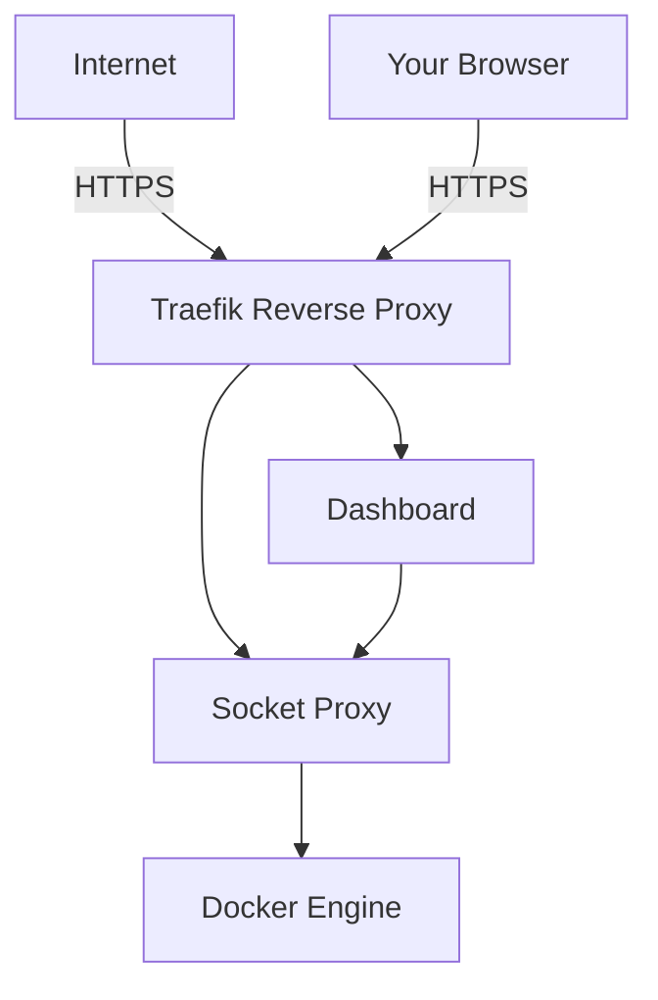
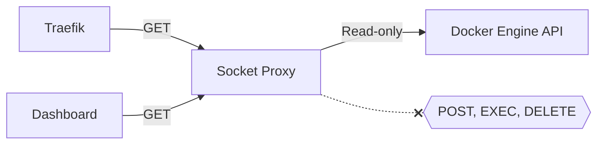
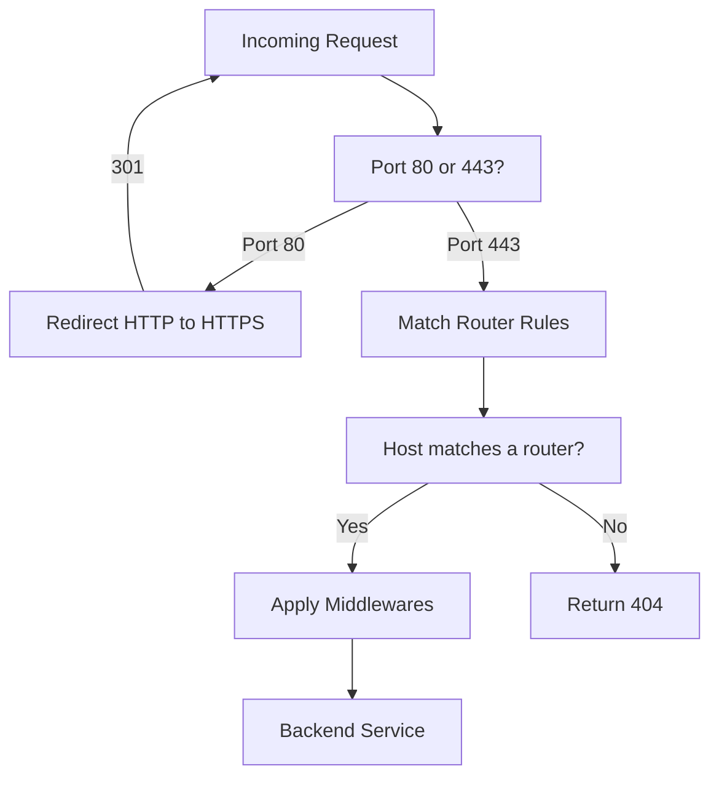

# Chapter 4: The Foundation Stack

> The foundation stack is the bedrock of every Docker Lab deployment -- three services that handle traffic routing, Docker API security, and system monitoring before any application container starts.

## Overview

Every building needs a foundation before you can add floors. Docker Lab works the same way. Before you deploy a database, a web application, or any other service, three containers must be running: the **socket proxy**, **Traefik**, and the **dashboard**. Together, these three form the foundation stack.

Why does this matter? Without the foundation stack, your services have no way to receive traffic from the internet, no safe mechanism to discover each other, and no window into what is happening inside your deployment. The foundation stack solves all three problems with a design that prioritizes security from the ground up. It forms the first layer of Docker Lab's five-layer defense-in-depth model: network perimeter, application proxy, container isolation, service security, and data security. Every decision in this chapter connects back to those principles.

The following diagram shows how the three foundation stack components interact with each other and with the outside world:



Traefik sits at the front door, accepting all incoming HTTP and HTTPS traffic. It decides which backend service should handle each request based on domain names and routing rules. To discover those backend services, Traefik queries the Docker engine -- but it never touches the Docker socket directly. Instead, it goes through the socket proxy, which filters every API call and blocks anything dangerous. The dashboard also connects through the socket proxy to read container status and resource metrics, giving you a real-time view of your entire deployment.

This chapter explores each of these three services in depth: what they do, why they exist, how they are configured, and what pitfalls to avoid.

## The Socket Proxy: Your Docker Socket's Bodyguard

### Why Your Docker Socket Needs Protection

The Docker socket (`/var/run/docker.sock`) is the master key to your entire container environment. Any process with access to this socket can create containers, delete volumes, execute commands inside running containers, and even escape to the host operating system. Giving a service direct access to the Docker socket is like handing a stranger the keys to every room in your building, the safe, and the alarm system.

Traefik needs to talk to Docker to discover your services. It reads container labels to figure out which domain names should route to which containers. But Traefik does not need the master key -- it only needs to read the building directory. That is exactly what the socket proxy provides: a restricted pass that allows reading container information while blocking every write operation.

### How the Socket Proxy Works

The socket proxy is a lightweight container based on [tecnativa/docker-socket-proxy](https://github.com/Tecnativa/docker-socket-proxy). It sits between your services and the Docker socket, acting as a filtering gateway built on HAProxy. Every Docker API call passes through it, and the proxy checks each call against a whitelist of allowed endpoints.

The following diagram shows what the socket proxy allows and what it blocks:



When Traefik sends a `GET /containers` request, the proxy passes it through to the Docker engine. When anything sends a `POST` request to create or modify a container, the proxy blocks it. The result: if Traefik is ever compromised, the attacker gets a read-only view of your containers -- not the master key to your host.

### Socket Proxy Configuration

Here is the actual socket proxy configuration from Docker Lab's `docker-compose.yml`:

```yaml
services:
  socket-proxy:
    image: tecnativa/docker-socket-proxy@sha256:083bd0ed8783e...
    container_name: pmdl_socket-proxy
    restart: unless-stopped
    user: "0:0"
    environment:
      # Allowed: read-only service discovery
      CONTAINERS: 1
      NETWORKS: 1
      INFO: 1
      VERSION: 1
      VOLUMES: 1
      IMAGES: 1
      SYSTEM: 1
      # Blocked: all modifications
      POST: 0
      SERVICES: 0
      TASKS: 0
      SWARM: 0
      BUILD: 0
      COMMIT: 0
      CONFIGS: 0
      DISTRIBUTION: 0
      EXEC: 0
      GRPC: 0
      NODES: 0
      PLUGINS: 0
      SECRETS: 0
      SESSION: 0
    volumes:
      - /var/run/docker.sock:/var/run/docker.sock:ro
    networks:
      - socket-proxy
    deploy:
      resources:
        limits:
          memory: 32M
        reservations:
          memory: 16M
```

Each environment variable controls access to a Docker API endpoint. Setting a variable to `1` allows read access; setting it to `0` blocks it entirely. The most important line is `POST: 0`, which blocks all write operations across every endpoint. Even if `CONTAINERS` is set to `1`, the proxy only allows reading container information, not creating or deleting containers.

The following table breaks down what each setting controls:

| Setting | Value | What It Allows |
|---------|-------|----------------|
| `CONTAINERS` | `1` | Read container labels, state, and metadata |
| `NETWORKS` | `1` | Read network topology information |
| `INFO` | `1` | Docker daemon version and configuration |
| `VERSION` | `1` | API version compatibility checks |
| `VOLUMES` | `1` | Read volume inventory (for dashboard) |
| `IMAGES` | `1` | Read image list (for dashboard) |
| `SYSTEM` | `1` | System-wide information |
| `POST` | `0` | Blocks all create, update, and delete operations |
| `EXEC` | `0` | Blocks executing commands inside containers |
| `BUILD` | `0` | Blocks building new images |

Notice that the socket proxy runs as `user: "0:0"` (root). This is required because only root can access the Docker socket on the host. The security comes from network isolation and API filtering, not from running as a non-root user.

### Network Isolation

The socket proxy lives on a dedicated internal network called `socket-proxy`:

```yaml
networks:
  socket-proxy:
    internal: true
    name: pmdl_socket-proxy
```

The `internal: true` flag is critical. It means containers on this network cannot reach the internet and the internet cannot reach them. Only the socket proxy, Traefik, and the dashboard are connected to this network. Application containers, databases, and everything else are completely isolated from the Docker API.

### Common Gotchas: Socket Proxy

#### NEVER Set read_only on the Socket Proxy

This is the single most important gotcha in the entire foundation stack. The `tecnativa/docker-socket-proxy` image generates its `haproxy.cfg` configuration file from a template (`haproxy.cfg.template`) at container startup. Both the template and the generated config live in `/usr/local/etc/haproxy/`.

If you set `read_only: true` on the socket proxy container, the entrypoint script cannot write the generated configuration file. If you try to work around this by mounting a `tmpfs` on `/usr/local/etc/haproxy/`, you wipe the baked-in template that the entrypoint needs to read.

**Symptoms:**

- Container enters a restart loop
- Logs show `can't create /usr/local/etc/haproxy/haproxy.cfg: Read-only file system`
- Or logs show `sed: /usr/local/etc/haproxy/haproxy.cfg.template: No such file or directory`

**The fix:** Do not apply `read_only: true` to the socket proxy. Use `cap_drop: ALL` and `no-new-privileges` for security hardening instead. These controls restrict what the container process can do without interfering with the entrypoint's configuration generation.

## Traefik: Your Traffic Director

### What Traefik Does

Think of Traefik as a smart receptionist in a building lobby. When a visitor arrives and says "I am here for dashboard.example.com," Traefik checks its directory and sends them to the right office. When another visitor asks for "s3.example.com," Traefik routes them to the MinIO service instead. You never write these routing rules by hand. Traefik discovers them automatically by reading Docker container labels.

Traefik handles five responsibilities in Docker Lab:

1. **Traffic routing** -- Directs incoming requests to the correct backend service based on domain names
2. **TLS termination** -- Obtains and renews HTTPS certificates automatically through Let's Encrypt
3. **HTTP-to-HTTPS redirect** -- Forces all traffic to use encrypted connections
4. **Security headers** -- Adds protective HTTP headers to every response
5. **Proxy header forwarding** -- Passes the real client IP address and protocol to backend services via `X-Forwarded-For`, `X-Forwarded-Proto`, and `X-Real-IP` headers

Docker Lab currently uses Traefik v2.11 rather than v3. Traefik v3.2 has a Docker API compatibility issue with Docker Engine 29.x -- its Docker client uses API v1.24, but Docker 29.x requires minimum v1.44. The project will migrate to Traefik v3 once this is resolved upstream.

### How Traefik Discovers Services

Traditional reverse proxies like nginx require you to write a configuration file listing every backend service and its routing rules. When you add a new service, you edit the configuration file and reload the proxy. Traefik takes a different approach.

Traefik watches the Docker engine for container events. When a new container starts with `traefik.enable=true` in its labels, Traefik reads the other labels to build a routing rule automatically. When the container stops, Traefik removes the route. No configuration files to edit, no reloads to trigger.

Here is how a service tells Traefik to route traffic to it:

```yaml
services:
  dashboard:
    image: pmdl/dashboard:0.1.0
    labels:
      - "traefik.enable=true"
      - "traefik.http.routers.dashboard.rule=Host(`dockerlab.example.com`)"
      - "traefik.http.routers.dashboard.entrypoints=websecure"
      - "traefik.http.routers.dashboard.tls.certresolver=letsencrypt"
      - "traefik.http.services.dashboard.loadbalancer.server.port=8080"
    networks:
      - proxy-external
```

This tells Traefik: "Route HTTPS requests for `dockerlab.example.com` to port 8080 on this container, and use Let's Encrypt for the TLS certificate." Traefik does the rest.

### The Routing Decision Flow

The following diagram shows how Traefik processes an incoming request:



Every request first hits an entrypoint. Docker Lab configures three entrypoints: `web` on port 80, `websecure` on port 443, and `matrix-fed` on port 8448 (for Matrix federation). All HTTP traffic on port 80 is automatically redirected to HTTPS on port 443. Once a request arrives on the secure entrypoint, Traefik checks its routing table for a matching `Host()` rule, applies any configured middlewares (rate limiting, security headers, authentication), and forwards the request to the backend container.

### Traefik Configuration in Docker Lab

Here is the actual Traefik service definition from `docker-compose.yml`:

```yaml
services:
  traefik:
    image: traefik@sha256:05ff868caaf67ef937b3228d4fe734ef...
    container_name: pmdl_traefik
    security_opt:
      - no-new-privileges:true
    cap_drop:
      - ALL
    restart: unless-stopped
    depends_on:
      socket-proxy:
        condition: service_started
    entrypoint: ["traefik"]
    command:
      # Docker provider via socket proxy
      - "--providers.docker=true"
      - "--providers.docker.endpoint=tcp://socket-proxy:2375"
      - "--providers.docker.exposedbydefault=false"
      - "--providers.docker.network=pmdl_proxy-external"

      # Entrypoints
      - "--entrypoints.web.address=:80"
      - "--entrypoints.websecure.address=:443"
      - "--entrypoints.matrix-fed.address=:8448"

      # HTTP to HTTPS redirect
      - "--entrypoints.web.http.redirections.entrypoint.to=websecure"
      - "--entrypoints.web.http.redirections.entrypoint.scheme=https"

      # TLS certificates via Let's Encrypt
      - "--certificatesresolvers.letsencrypt.acme.email=${ADMIN_EMAIL}"
      - "--certificatesresolvers.letsencrypt.acme.storage=/acme/acme.json"
      - "--certificatesresolvers.letsencrypt.acme.httpchallenge.entrypoint=web"

      # Logging
      - "--log.level=${TRAEFIK_LOG_LEVEL:-INFO}"
      - "--accesslog=true"
      - "--accesslog.format=json"

    ports:
      - "80:80"
      - "443:443"
      - "8448:8448"
      - "127.0.0.1:8080:8080"

    volumes:
      - pmdl_traefik_acme:/acme
      - ./configs/traefik:/etc/traefik:ro

    networks:
      - socket-proxy
      - proxy-external

    healthcheck:
      test: ["CMD-SHELL", "nc -z localhost 80 || exit 1"]
      interval: 30s
      timeout: 10s
      retries: 5
      start_period: 30s

    deploy:
      resources:
        limits:
          memory: 256M
        reservations:
          memory: 64M
```

There are several important design decisions in this configuration:

- **`providers.docker.endpoint=tcp://socket-proxy:2375`** -- Traefik connects to the Docker API through the socket proxy, never directly to the Docker socket.
- **`providers.docker.exposedbydefault=false`** -- Services must explicitly opt in to Traefik routing with `traefik.enable=true`. This follows Docker Lab's zero-trust network principle: no service is publicly accessible unless it explicitly declares itself.
- **`providers.docker.network=pmdl_proxy-external`** -- Traefik only routes traffic on the proxy-external network. Services on internal networks are not reachable from the internet.
- **`entrypoint: ["traefik"]`** -- Forces the direct binary entrypoint. Some Traefik image builds include a wrapper script that can rewrite command arguments and drop critical flags.
- **`127.0.0.1:8080:8080`** -- The Traefik dashboard is bound to localhost only. It is not accessible from the internet.

### TLS Certificates

Traefik handles TLS certificates automatically through Let's Encrypt. When a new router is configured with `tls.certresolver=letsencrypt`, Traefik:

1. Receives the first HTTPS request for that domain
2. Initiates an HTTP-01 challenge with Let's Encrypt
3. Proves domain ownership by responding to the challenge on port 80
4. Receives and stores the certificate in `/acme/acme.json`
5. Renews the certificate automatically before it expires

Certificate storage is backed by a Docker volume (`pmdl_traefik_acme`) so certificates persist across container restarts.

### Middlewares: Adding Security to Every Request

Traefik middlewares process requests between the entrypoint and the backend service. Docker Lab configures several middlewares by default on the dashboard:

```yaml
labels:
  # Security Headers
  - "traefik.http.middlewares.dashboard-security.headers.browserxssfilter=true"
  - "traefik.http.middlewares.dashboard-security.headers.contenttypenosniff=true"
  - "traefik.http.middlewares.dashboard-security.headers.frameDeny=true"
  - "traefik.http.middlewares.dashboard-security.headers.stsSeconds=31536000"
  - "traefik.http.middlewares.dashboard-security.headers.stsIncludeSubdomains=true"
  - "traefik.http.middlewares.dashboard-security.headers.stsPreload=true"
  # Rate Limiting
  - "traefik.http.middlewares.dashboard-ratelimit.ratelimit.average=10"
  - "traefik.http.middlewares.dashboard-ratelimit.ratelimit.burst=20"
  - "traefik.http.middlewares.dashboard-ratelimit.ratelimit.period=1m"
```

These middlewares add the following protections:

| Middleware | What It Does |
|------------|--------------|
| `browserxssfilter` | Enables the browser's built-in XSS protection |
| `contenttypenosniff` | Prevents MIME type sniffing attacks |
| `frameDeny` | Blocks clickjacking by preventing iframe embedding |
| `stsSeconds` | Enforces HTTPS for one year via HSTS |
| `ratelimit` | Limits requests to 10 per minute (burst of 20) to prevent brute force attacks |

### Trusted Proxy Headers

When Traefik forwards a request to a backend service, it automatically adds headers that tell the backend where the original request came from:

| Header | Purpose | Example Value |
|--------|---------|---------------|
| `X-Forwarded-For` | Original client IP address | `203.0.113.50` |
| `X-Forwarded-Proto` | Original protocol (HTTP or HTTPS) | `https` |
| `X-Forwarded-Host` | Original hostname | `dashboard.example.com` |
| `X-Real-IP` | Client IP (single value) | `203.0.113.50` |

These headers matter because backend services see the request coming from Traefik's internal Docker IP (something like `172.19.0.3`), not the real client. If a service uses the source IP for rate limiting, logging, or federation signature validation, it needs to trust these forwarded headers from Traefik.

Applications that run behind Traefik should configure their trusted proxy settings to include the Docker network CIDR range. The most common pattern:

```yaml
environment:
  TRUSTED_PROXIES: "172.16.0.0/12,10.0.0.0/8"
```

Different applications use different variable names for this setting. GoToSocial uses `GTS_TRUSTED_PROXIES`, Mastodon uses `TRUSTED_PROXY_IP`, and Express.js apps use `TRUST_PROXY`. The Docker Lab patterns documentation covers each application's specific configuration.

Without trusted proxy configuration, several things break:

- **Rate limiting fails** -- The application sees all requests as coming from one IP (Traefik), so it rate-limits all users together
- **Logging is useless** -- Access logs show the proxy IP instead of real client IPs
- **Federation breaks** -- ActivityPub and Matrix use HTTP signatures that validate against the request origin. If the app reconstructs the wrong origin, signatures fail and remote servers reject the request
- **HTTPS redirect loops** -- The app sees HTTP from the proxy (internal communication is unencrypted) and keeps redirecting, not trusting the `X-Forwarded-Proto: https` header

You can verify your proxy network's CIDR range with:

```bash
$ docker network inspect pmdl_proxy-external --format '{{range .IPAM.Config}}{{.Subnet}}{{end}}'
```

### Common Gotchas: Traefik

#### Entrypoints Not Binding (Port 80 Works, 443 Does Not)

On some Traefik image builds, a wrapper script can rewrite command arguments and drop critical flags. The symptom: the host shows `docker-proxy` listening on port 443, but TLS requests hang or fail. Inside the Traefik container, only port 80 is actually listening.

**The fix:** Always include an explicit entrypoint override in your compose file:

```yaml
entrypoint: ["traefik"]
```

You can verify correct binding by inspecting the container:

```bash
$ docker inspect pmdl_traefik --format '{{json .Config.Cmd}}'
$ docker exec pmdl_traefik sh -lc 'netstat -tln'
```

You should see listeners on ports 80, 443, 8448, and 8080.

#### ACME Certificate Stuck on Default Certificate

Let's Encrypt can fail silently, leaving Traefik serving its self-signed default certificate instead of a valid one. Common causes:

- The `ADMIN_EMAIL` variable uses a placeholder domain like `example.com` that ACME rejects
- The domain uses a dynamic DNS service (like `nip.io`) that is rate-limited by Let's Encrypt

**The fix:** Verify your certificate with:

```bash
$ echo | openssl s_client -connect your-domain:443 -servername your-domain 2>/dev/null \
  | openssl x509 -noout -subject -issuer
```

The issuer should be a trusted public certificate authority (like "Let's Encrypt"), not "TRAEFIK DEFAULT CERT."

#### Traefik Non-Root Breaks ACME Storage

Setting `user: "65534:65534"` (nobody) on Traefik v2.11 causes ACME certificate operations to fail because the certificate store volume is owned by root. Traefik starts but cannot write to `/acme/acme.json`, and TLS certificates are never obtained.

**The fix:** Keep Traefik running as root until the v3 migration. Use `cap_drop: ALL` and `no-new-privileges` for security hardening instead of a non-root user directive. These controls restrict the process capabilities without breaking ACME storage access.

## The Dashboard: Your Window Into Docker Lab

### What the Dashboard Does

The dashboard is a web-based monitoring interface that gives you real-time visibility into your Docker Lab deployment. Think of it as the control room in a building -- banks of monitors showing which systems are running, what resources they are consuming, and whether anything needs attention.

Without the dashboard, you would need SSH access and command-line tools to check container status. The dashboard puts this information in a browser window with live updates, making it accessible to anyone on the team -- even those who are not comfortable with terminal commands.

### Technology Stack

The dashboard is built with a deliberately minimal technology stack:

| Component | Technology | Why |
|-----------|-----------|-----|
| Backend | Go | Single binary, 10-20 MB memory, millisecond startup |
| UI updates | HTMX | Server-driven updates without a JavaScript build step |
| Interactivity | Alpine.js | 14 KB lightweight reactivity, no compilation |
| Styling | Tailwind CSS | Utility-first CSS loaded from CDN |

This stack was chosen because the dashboard must work identically on a $20 VPS and a developer's laptop without requiring Node.js, npm, or any build toolchain -- one of Docker Lab's non-negotiable design constraints. The Go backend compiles to a single binary with a Docker image size of about 15 MB. The frontend loads entirely from CDN with zero build steps. A developer can edit the HTML templates and see changes immediately. After the first page load, the frontend works completely offline thanks to CDN caching.

### How the Dashboard Connects

The dashboard communicates with Docker the same way Traefik does -- through the socket proxy. It never mounts the Docker socket directly.

```yaml
services:
  dashboard:
    image: pmdl/dashboard:0.1.0
    container_name: pmdl_dashboard
    security_opt:
      - no-new-privileges:true
    cap_drop:
      - ALL
    restart: unless-stopped
    user: "1000:1000"
    environment:
      - PORT=8080
      - DOCKER_HOST=tcp://socket-proxy:2375
      - DOCKERLAB_USERNAME=${DOCKERLAB_USERNAME:-admin}
      - DOCKERLAB_PASSWORD=${DOCKERLAB_PASSWORD:-}
      - DOCKERLAB_DEMO_MODE=${DOCKERLAB_DEMO_MODE:-false}
    depends_on:
      socket-proxy:
        condition: service_started
      traefik:
        condition: service_healthy
    networks:
      - socket-proxy
      - proxy-external
    deploy:
      resources:
        limits:
          memory: 64M
        reservations:
          memory: 32M
```

Notice the security configuration: the dashboard runs as non-root (`user: "1000:1000"`), drops all Linux capabilities (`cap_drop: ALL`), and prevents privilege escalation (`no-new-privileges`). It connects to both the `socket-proxy` network (to read Docker state) and the `proxy-external` network (to receive traffic from Traefik).

The `depends_on` section ensures the dashboard only starts after the socket proxy is running and Traefik is healthy. This prevents startup failures when the dashboard tries to connect to services that are not ready yet.

### Dashboard Features

The dashboard provides several monitoring views:

- **Container Status** -- Real-time list of all containers with their state (running, stopped, unhealthy), CPU usage, and memory consumption
- **Resource Charts** -- Live CPU and memory graphs per container, updated every 10 seconds via Server-Sent Events (SSE)
- **Volume Inventory** -- Lists all Docker volumes with size, mount status, and associated containers
- **System Information** -- Host OS, architecture, Docker version, CPU count, and total memory
- **Alerts** -- Automatic detection of stopped containers, failed health checks, high CPU usage (warning at 80%, critical at 95%), and high memory usage (warning at 80%, critical at 90%)
- **Multi-Instance Management** -- Register and monitor remote Docker Lab deployments from a single dashboard

### Live Updates with Server-Sent Events

The dashboard uses Server-Sent Events (SSE) instead of polling for live updates. When you open the dashboard in your browser, it establishes a persistent connection to `/api/events`. The server streams container status and resource metrics every 10 seconds without the browser needing to request them.

This approach uses less bandwidth than polling and provides near-instant updates. The server sends keepalive messages every 30 seconds to prevent proxy timeouts.

### Authentication

The dashboard protects all endpoints behind authentication, including the health check endpoint. This is an intentional secure-by-default design: even health status can reveal system information to attackers. There are no exceptions to the authentication policy in the default configuration.

The authentication system uses bcrypt for password hashing and server-side sessions tracked via cookies. Passwords are never stored in plain text, and session tokens are generated with cryptographic randomness. At the Traefik level, rate limiting restricts login attempts to 10 requests per minute per IP, preventing brute-force attacks before they reach the Go application.

Authentication is configured through environment variables:

| Variable | Purpose | Default |
|----------|---------|---------|
| `DOCKERLAB_USERNAME` | Login username | `admin` |
| `DOCKERLAB_PASSWORD` | Login password (required) | none |
| `DOCKERLAB_DEMO_MODE` | Enable guest read-only access | `false` |

When demo mode is enabled, a "Guest Access" button appears on the login page. Guests can view all monitoring data but cannot trigger any write operations like container restarts or deployment syncs.

### Dashboard API

The dashboard exposes a REST API that both the web UI and external tools can use:

| Endpoint | Method | Description |
|----------|--------|-------------|
| `/api/system` | GET | Host system information |
| `/api/containers` | GET | Container list with resource usage |
| `/api/volumes` | GET | Docker volume inventory |
| `/api/alerts` | GET | System health alerts |
| `/api/events` | GET | Server-Sent Events stream |
| `/api/login` | POST | Authenticate user |
| `/api/logout` | POST | End session |
| `/health` | GET | Liveness probe |

All API endpoints require authentication. If you need an unauthenticated health endpoint for external monitoring tools like Uptime Kuma, you must explicitly modify the auth middleware in the Go source code.

## How the Three Services Work Together

Now that you understand each component individually, here is how they work as a unit. When you run `docker compose up -d` on a fresh Docker Lab deployment, the following sequence occurs:

1. **Socket proxy starts first.** It mounts the Docker socket (read-only), generates its HAProxy configuration from the template, and begins listening on port 2375 of the internal `socket-proxy` network.

2. **Traefik starts next** (it depends on socket proxy). It connects to `tcp://socket-proxy:2375` and begins watching for container events. It binds ports 80, 443, and 8448 on the host. It initiates ACME certificate requests for any domains it discovers.

3. **The dashboard starts last** (it depends on both socket proxy and a healthy Traefik). It connects to the socket proxy to read container state and to the proxy-external network to receive routed traffic from Traefik. Traefik discovers the dashboard's labels and creates a route for it.

From this point forward, adding a new service to Docker Lab is straightforward: define it in a compose file with the right Traefik labels and network memberships, and the foundation stack handles discovery, routing, TLS, and monitoring automatically.

This startup sequence reflects a key architectural principle: **interfaces over implementations**. The foundation stack defines contracts (network memberships, label conventions, socket proxy access patterns), and every service above it -- whether a database profile, an example application, or a custom module -- integrates by following those same contracts. The foundation never needs to know about the services built on top of it.

### Network Membership Summary

Each foundation service connects to exactly the networks it needs:

| Service | socket-proxy | proxy-external | Purpose |
|---------|:------------:|:--------------:|---------|
| socket-proxy | Yes | No | Provides filtered Docker API |
| Traefik | Yes | Yes | Reads Docker state, routes public traffic |
| dashboard | Yes | Yes | Reads Docker state, receives routed traffic |

No foundation service connects to `db-internal` or `app-internal`. Databases and application-tier services live on separate networks, completely isolated from the Docker API and from direct internet access.

## Common Gotchas

### Resource Limits Prevent Out-of-Memory Crashes

Every foundation service has explicit memory limits:

| Service | Memory Limit | Memory Reservation |
|---------|-------------|-------------------|
| socket-proxy | 32 MB | 16 MB |
| Traefik | 256 MB | 64 MB |
| dashboard | 64 MB | 32 MB |

If a service exceeds its memory limit, Docker kills it and the `restart: unless-stopped` policy brings it back. Without these limits, a memory leak in one service consumes all available RAM and crashes every container on the host.

### Health Checks Gate Startup Order

The `depends_on` chain with health check conditions ensures services start in the correct order. The dashboard waits for Traefik to be healthy (not just started) before attempting to connect. If you remove the health check conditions, the dashboard may start before Traefik is ready to route traffic, leading to intermittent connection failures during deployment.

### Security Anchors Apply Consistently

Docker Lab defines a reusable security configuration called a "secured service" anchor:

```yaml
x-secured-service: &secured-service
  security_opt:
    - no-new-privileges:true
  cap_drop:
    - ALL
  restart: unless-stopped
```

Both Traefik and the dashboard inherit from this anchor using `<<: *secured-service`. This ensures consistent security hardening across all foundation stack components without duplicating configuration. The socket proxy is the one exception -- it does not use this anchor because it requires root access to the Docker socket.

## Key Takeaways

- The **socket proxy** is a mandatory security layer that filters Docker API access. It gives Traefik and the dashboard a read-only view of your containers while blocking all write operations. Never set `read_only: true` on this container.
- **Traefik** automatically discovers services through Docker labels and handles TLS certificates, HTTP-to-HTTPS redirects, and security headers. It connects to Docker exclusively through the socket proxy, never through a direct socket mount.
- The **dashboard** provides real-time monitoring with live resource charts, alerts, and multi-instance management. It runs as a non-root Go binary with a 64 MB memory limit.
- All three services run on isolated networks. The `socket-proxy` network is internal-only, preventing any internet access to the Docker API. The `proxy-external` network connects Traefik to public-facing services.
- Security is enforced at every layer: capability dropping, privilege escalation prevention, network isolation, API filtering, rate limiting, and security headers.

## Next Steps

With the foundation stack running, you have traffic routing, Docker API security, and system monitoring in place. In [Chapter 5: Profiles](./profiles.md), you will learn how to add supporting infrastructure -- databases like PostgreSQL and MySQL, caching with Redis, and object storage with MinIO -- using Docker Lab's compose profile system. Profiles build on top of the foundation stack, connecting to the networks and security patterns you have learned in this chapter.
