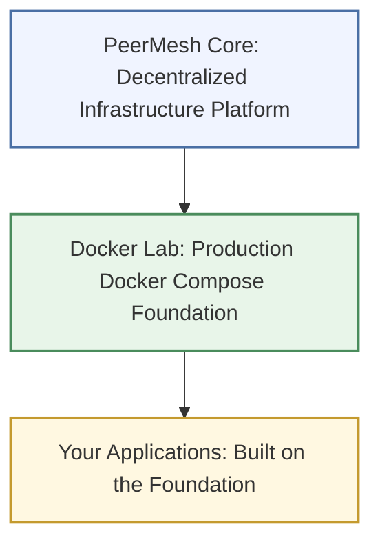
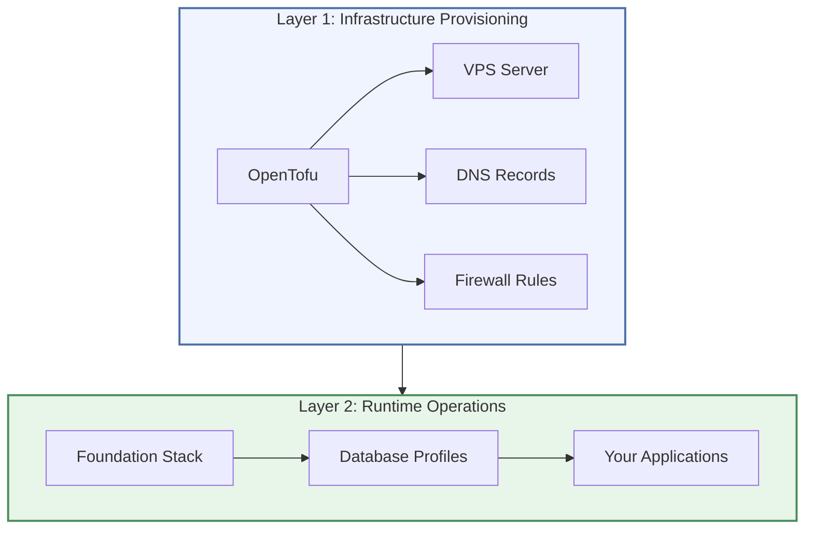

# Chapter 1: Introduction

> Docker Lab is a production-ready Docker Compose foundation you clone, configure, and deploy on a single commodity VPS -- and it becomes the infrastructure your applications run on.

## Why Docker Lab Exists

You have an idea for a web application. You know how to write the code. But between "working on my laptop" and "running in production," there is a gap filled with reverse proxies, TLS certificates, secret management, database provisioning, backup scripts, network isolation, health checks, and a hundred other infrastructure decisions.

Most developers face a familiar fork in the road at this point. Option one: pay a cloud provider to handle it and accept the vendor lock-in, the monthly bill that grows faster than your user base, and the loss of control over your own data. Option two: spend weeks stitching together tutorials, Stack Overflow answers, and half-maintained GitHub repos into something that works on a good day and breaks on a bad one.

Docker Lab is a third option. It is a production-grade Docker Compose boilerplate -- a complete infrastructure foundation that handles reverse proxying, TLS, secrets, databases, backups, security hardening, and resource management out of the box. You clone it, configure it for your domain and credentials, deploy it to a commodity VPS, and start building your actual product on top of it.

The key word is **foundation**. Docker Lab is not an application. It does not include business logic, user interfaces, or application-specific code. It provides the secure, well-configured platform that your applications run on. Think of it as the finished basement of a building -- the plumbing, electrical, and structural work are done so you can focus on designing the rooms.

### What Docker Lab Is

- A production-grade Docker Compose infrastructure foundation
- A reverse proxy (Traefik) with automatic TLS certificate management via Let's Encrypt
- Composable database profiles (PostgreSQL, MySQL, MongoDB, Redis, MinIO) you activate as needed
- A security-hardened baseline with network isolation, non-root containers, and Docker socket protection
- A module system for adding services on top of the foundation
- A deployment model that works identically in development, staging, and production
- A real-time dashboard for monitoring containers, volumes, and system health

### What Docker Lab Is NOT

- **Not app-specific automation.** You bring your own application containers. Docker Lab provides the infrastructure they run on.
- **Not magic.** You still need to understand Docker basics, networking fundamentals, and your own application requirements. This manual teaches you what you need to know, but it does not replace learning.
- **Not a one-size-fits-all solution.** Some configurations will need adjustment for your use case. Docker Lab gives you a strong starting point, not a rigid framework.
- **Not a managed service.** You are responsible for your own server. Docker Lab makes that responsibility manageable, but you still own it.

## Why Docker Compose Over Kubernetes

This is the question experienced engineers ask first, so let us address it directly.

Kubernetes is a container orchestration platform designed for large-scale distributed systems. It excels at managing fleets of machines, auto-scaling across dozens of nodes, and coordinating hundreds of microservices. It is the right tool for organizations with dedicated platform teams and infrastructure budgets measured in thousands per month.

Docker Compose is a tool for defining and running multi-container applications on a single host. It reads a YAML file, creates the containers, networks, and volumes you described, and runs them. That is all it does, and it does it well.

Docker Lab chooses Docker Compose deliberately, based on a constraint that governs the entire project: **the target deployment is a single commodity VPS costing $20-50 per month.** At this scale, Kubernetes is overhead without benefit. The single-server deployment model covers what the vast majority of projects actually need -- a reliable, secure, performant foundation that one person can understand and operate.

This is not a limitation. It is a design decision. If your project grows to the point where a single server is not enough, Kubernetes becomes the natural graduation path. Docker Lab teaches you the container patterns and operational practices that transfer directly to Kubernetes. But it does not force you into that complexity before you need it.

## Why Commodity VPS

Docker Lab targets commodity VPS providers -- Hetzner, DigitalOcean, Vultr, and similar services where you rent a virtual server for a predictable monthly fee. This choice reflects three principles:

**You own your data.** When your database runs on your server, you control where the data lives, who can access it, and what happens to it. There is no vendor lock-in and no surprise policy changes.

**You understand your infrastructure.** A single VPS running Docker Compose is a system you can SSH into, inspect, and debug. There are no abstraction layers hiding what is happening. When something breaks, you can find and fix it.

**You control your costs.** A capable VPS costs $20-50 per month regardless of traffic spikes, storage growth, or the number of API calls your application makes. Compare that to cloud provider pricing where costs scale with usage in ways that are difficult to predict.

Docker Lab defines three resource profiles that map to different VPS tiers:

| Profile | RAM | CPU Cores | Use Case |
|---------|-----|-----------|----------|
| `lite` | 512 MB | 0.5 | CI/CD pipelines, testing, development laptops |
| `core` | 2 GB | 2 | Development servers, staging environments |
| `full` | 8 GB | 4 | Production deployments with monitoring |

The `core` profile runs comfortably on a $10-20/month VPS. The `full` profile with observability fits within a $30-50/month server. These are real numbers from real deployments, not marketing estimates.

## The PeerMesh Vision

Docker Lab does not exist in isolation. It is one component in the PeerMesh ecosystem -- a broader project building tools for decentralized, self-hosted infrastructure.

The following diagram shows how Docker Lab fits into the larger picture:

**PeerMesh Core** is the long-term vision: a platform for decentralized infrastructure that enables peer-to-peer service discovery, federation, and data sovereignty. It is under active development and not yet ready for public use.

**Docker Lab** is the production-ready component available today. It provides the foundational infrastructure patterns that PeerMesh Core will build upon. Everything you learn and deploy with Docker Lab transfers directly to PeerMesh Core when it launches.

**Your Applications** are what you build on top of Docker Lab. The repository includes working examples -- Ghost, LibreChat, Matrix, WordPress, and others -- that demonstrate how real applications integrate with the foundation.

You do not need to wait for PeerMesh Core. Docker Lab is useful on its own, right now, for deploying production applications on your own server. When PeerMesh Core is ready, your Docker Lab deployment becomes a node in a larger decentralized network -- no migration required.

## The Two-Layer Deployment Model

Docker Lab uses a split deployment model that separates infrastructure provisioning from runtime operations. Understanding this split is essential to working with the system effectively.

The following diagram illustrates the two layers:

**Layer 1: Infrastructure Provisioning** uses OpenTofu (the open-source Terraform fork) to create your server, configure DNS records, and set up firewall rules through your hosting provider's API. This layer answers the question "where does my infrastructure live?"

**Layer 2: Runtime Operations** uses Docker Lab to deploy and operate container services on that provisioned server. The foundation stack starts first (reverse proxy, socket proxy, networks, secrets), then database profiles activate as needed, and finally your applications layer on top. This layer answers the question "what runs on my infrastructure?"

This separation gives you two independent control planes. You change infrastructure (upgrade server size, add DNS entries, modify firewall rules) through OpenTofu. You change what runs on that infrastructure (deploy new services, update configurations, manage backups) through Docker Lab. Neither depends on the other at runtime.

You do not need OpenTofu to use Docker Lab. If you prefer to provision your VPS manually through your provider's web console, that works fine. OpenTofu automates the process and makes it reproducible, but it is optional. We cover both paths in [the Deployment chapter](./deployment.md).

## Where Docker Lab Stands Today

Honesty matters. Docker Lab is a real product at a real stage of development, and you deserve to know what is ready and what is still coming.

**What is production-ready today:**

- The foundation stack (Traefik reverse proxy, socket proxy, network isolation, secrets management) is stable and deployed on a live VPS
- Five database profiles (PostgreSQL, MySQL, MongoDB, Redis, MinIO) work as composable modules
- The security baseline meets production standards: non-root containers, Docker socket protection, four-network isolation, TLS everywhere, rate limiting, security headers
- The dashboard provides real-time container monitoring with session-based authentication
- Automated backup with encrypted off-site sync is implemented
- The module system supports custom service integration with manifest-driven lifecycle management
- Resource profiles correctly constrain memory and CPU per service tier

**What is still in progress:**

- The full observability stack (Prometheus, Grafana, Loki) is validated but not yet deployed by default
- The Identity layer (JWT/OIDC authentication, RBAC authorization) has design specifications but no runtime implementation beyond basic session auth
- The Events layer (async messaging between services) has a thorough schema design but no runtime event bus
- Structured centralized logging is defined as a requirement but not yet deployed
- A formal third-party security audit has not yet been submitted

Docker Lab received a **Conditional First Stable Declaration** in February 2026. This means the foundation is stable enough for production use, the security baseline is solid, and the operational tooling works. The "conditional" qualifier reflects that some advanced features (observability, identity federation, event processing) are designed but not yet built. The foundation you deploy today is stable. The advanced capabilities will arrive in future releases.

## Who This Manual Is For

This manual is written for three kinds of readers:

**The eager builder.** You want to deploy a web application on your own server and you are tired of fighting infrastructure. You have basic Docker knowledge (you know what containers and images are) and you are comfortable working in a terminal. This manual walks you through everything else.

**The evaluator.** You are considering Docker Lab for a project and you want to understand what it provides, how it works, and whether it fits your needs. This manual gives you a complete picture of the system's architecture, capabilities, and current maturity.

**The future PeerMesh user.** You are interested in the PeerMesh vision of decentralized infrastructure and you want to learn the foundation before PeerMesh Core launches. Docker Lab teaches you the container patterns, security practices, and operational skills that carry directly into PeerMesh Core.

What this manual expects from you:

- Basic comfort with the command line (navigating directories, running commands)
- A general understanding of what Docker containers are (you do not need to be an expert)
- Familiarity with YAML syntax (or willingness to learn it -- it is straightforward)
- Access to a Linux server or VPS for deployment (we cover how to set this up)

What this manual does NOT expect:

- Kubernetes experience
- Deep networking knowledge
- Cloud platform expertise
- Prior infrastructure automation experience

## What You Will Learn

This manual follows a curriculum that builds from concepts to deployment to operations. Each chapter builds on the previous one.

| Chapter | Title | What You Will Learn |
|---------|-------|---------------------|
| **1** | Introduction (you are here) | What Docker Lab is, why it exists, who it is for |
| **2** | Core Concepts | The mental models behind Docker Lab: tiers, compose profiles, modules, networks |
| **3** | The Foundation Stack | How Traefik, the socket proxy, and network isolation work together |
| **4** | Profiles and Modules | Adding databases and services as composable building blocks |
| **5** | Security Architecture | Network isolation, secret management, container hardening, and why each matters |
| **6** | Configuration | Environment variables, resource profiles, and customization patterns |
| **7** | The Dashboard | Real-time monitoring, container management, and the module registry |
| **8** | Example Applications | Deploying Ghost, LibreChat, Matrix, and other real applications |
| **9** | Deployment | From local development to production VPS, including OpenTofu automation |
| **10** | Operations | Backups, updates, health checks, and day-to-day management |
| **11** | Observability | Monitoring with Netdata, Uptime Kuma, Prometheus, and Grafana |
| **12** | Troubleshooting | Common problems, diagnostic techniques, and proven solutions |
| **13** | Advanced Topics | Custom modules, multi-domain setups, and extending the foundation |
| **14** | The Road Ahead | PeerMesh Core, federation, and where the project is going |

You can read the manual cover to cover for a complete education, or jump to the chapter that addresses your immediate need. The chapters are designed to work both ways -- sequential learning or targeted reference.

## Key Takeaways

- Docker Lab is a production-grade Docker Compose foundation, not an application. It provides the infrastructure your applications run on.
- It targets single-server deployments on commodity VPS hardware costing $20-50 per month. This is a deliberate design choice, not a limitation.
- The two-layer model separates infrastructure provisioning (OpenTofu) from runtime operations (Docker Lab). You control each independently.
- Docker Lab is the production-ready component of the PeerMesh ecosystem. Everything you learn transfers to PeerMesh Core when it launches.
- The foundation is stable and deployed in production today. Advanced features (identity federation, event processing, full observability) are designed and coming in future releases.

## Next Steps

In [the Concepts chapter](./concepts.md), we explore the mental models that make Docker Lab work -- the four-tier architecture, compose profiles, the module system, and the network topology. Understanding these concepts is essential before you start configuring and deploying. Once you have the mental model, everything else in this manual builds on it naturally.
