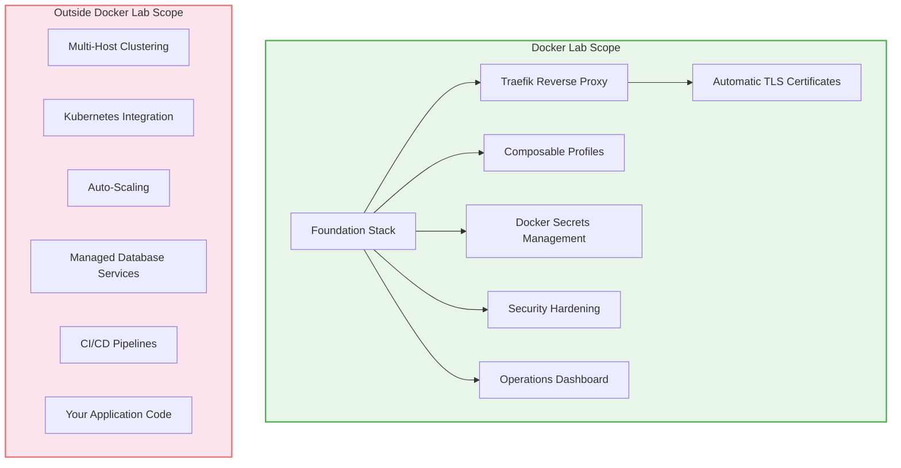

# Chapter 13: Limitations and Roadmap

> Docker Lab is honest about what it does not do yet -- and clear about where it is headed.

## Overview

Every piece of infrastructure software has boundaries. Some boundaries exist by design, because the tool deliberately focuses on one problem and solves it well. Other boundaries are temporary -- things that are not ready yet but are actively being worked on.

This chapter lays out both kinds of boundaries for Docker Lab. You deserve to know exactly what you are getting, what gaps exist today, and what the team plans to address. We respect your time too much to let you discover limitations the hard way during a production deployment at 2 AM.

Think of this chapter as the nutrition label on a food package. The product is genuinely good, but you need to know the ingredients before you commit to the meal. A project that hides its limitations is one you cannot trust. A project that documents them openly is one that earns your confidence.

## What Docker Lab Does -- and Does Not Do

Before diving into specifics, it helps to see the big picture. Docker Lab occupies a specific zone in the infrastructure landscape: it manages a single host running Docker containers behind a reverse proxy with automatic TLS. That is a powerful and practical scope, but it has clear edges.

The following diagram shows where Docker Lab fits and where its boundaries lie:

Docker Lab provides the runtime foundation -- the platform your applications run on. It does not replace your application, your CI/CD pipeline, or your cloud provider's managed services. You bring your own application containers and deploy them onto the foundation that Docker Lab provides.

## Current Limitations

These are deliberate design boundaries or known constraints in the current release. They are not bugs; they are things Docker Lab intentionally does not attempt today.

### Single-Host Architecture

Docker Lab runs on one server. There is no built-in clustering, no container orchestration across multiple hosts, and no automatic failover to a standby machine.

This means:

- If your server goes down, your services go down with it
- You cannot distribute containers across multiple machines for load balancing
- Horizontal scaling requires manual intervention or external tooling

**Why this is the case:** Docker Lab targets commodity VPS deployments where a single host handles the full workload. For many applications -- personal projects, small SaaS products, team tools, development environments -- a single well-configured host is the right answer. Multi-host orchestration adds significant complexity that most users of Docker Lab do not need.

**If you need multi-host:** Consider Kubernetes, Docker Swarm, or Nomad. Docker Lab compose files can serve as a starting point for migration, but the orchestration layer is outside its scope.

### No Kubernetes Integration

Docker Lab uses Docker Compose exclusively. It does not generate Kubernetes manifests, Helm charts, or any Kubernetes-compatible configuration.

**Why this is the case:** Docker Compose and Kubernetes solve different problems at different scales. Docker Lab focuses on the Compose ecosystem because it runs on a single host with minimal dependencies. Adding Kubernetes support would mean maintaining two entirely separate deployment models, which would dilute the quality of both.

### No Auto-Scaling

Docker Lab does not monitor load and automatically spin up additional container instances. Resource profiles (`lite`, `core`, `full`) set static limits that you choose at deployment time.

**Why this is the case:** Auto-scaling requires either an orchestrator (Kubernetes HPA, Docker Swarm service replicas) or an external scaling controller. On a single host with fixed resources, auto-scaling has limited value -- you cannot scale beyond the capacity of the machine. Resource profiles let you right-size your deployment for your hardware, which is the practical equivalent for single-host scenarios.

### Traefik v2 (Not v3)

Docker Lab currently ships with Traefik v2.11 instead of the latest Traefik v3. This is a deliberate, documented decision recorded in [ADR-0001](https://github.com/peermesh/docker-lab/blob/main/docs/decisions/0001-traefik-reverse-proxy.md).

The reason is a concrete compatibility issue: **Traefik v3.2 is incompatible with Docker Engine 29.x** due to a Docker API version mismatch. Traefik v3.2's Docker client uses API v1.24, but Docker Engine 29.x requires API v1.44 or higher. The symptom is that Traefik cannot communicate with the Docker socket proxy.

Until this is resolved upstream, Docker Lab pins to Traefik v2.11, which is stable, well-tested, and fully functional. The migration to v3 is planned and tracked on the roadmap below.

### Traefik Runs as Root

Traefik v2.11 requires root access to write to the ACME certificate storage path. Running Traefik as a non-root user (e.g., `user: "65534:65534"`) causes certificate operations to fail, falling back to a self-signed default certificate instead of valid Let's Encrypt certificates.

Docker Lab mitigates this with capability hardening:

- `cap_drop: ALL` removes all Linux capabilities
- `cap_add: NET_BIND_SERVICE` adds back only the ability to bind privileged ports
- `security_opt: no-new-privileges` prevents privilege escalation

This is not ideal, but it is the pragmatic choice until Traefik v3 provides proper non-root ACME support. The hardening overlay (`docker-compose.hardening.yml`) implements this configuration automatically.

### No Built-In Backup Automation

While the `backup` profile is planned (see the roadmap), Docker Lab does not currently ship with automated backup scheduling, retention policies, or off-site backup integration. You are responsible for implementing your own backup strategy for application data and database volumes.

### Not a Managed Service

Docker Lab is infrastructure boilerplate, not a managed platform. This means:

- **You** handle operating system updates and security patches
- **You** monitor service health and respond to incidents
- **You** manage DNS records and domain configuration
- **You** rotate secrets and update credentials

Docker Lab gives you a strong starting point and operational tooling, but it does not replace the need for an operator who understands the system.

## Known Issues and Gotchas

Beyond deliberate limitations, Docker Lab has documented operational gotchas -- things that work but require specific knowledge to avoid pitfalls. The project maintains a comprehensive [Gotchas document](https://github.com/peermesh/docker-lab/blob/main/docs/GOTCHAS.md) with 13 entries. Here are the issues most likely to affect you.

### File Mount Confusion

When Docker bind-mounts a file path that does not exist on the host, it creates a **directory** instead of a file. This breaks any application that expects a configuration file at that path. The symptom is a container that starts and immediately exits with file parse errors.

**Prevention:** Always run the volume initialization script (`./scripts/init-volumes.sh`) before your first deployment. This creates all expected files with correct types.

### Non-Root Permission Failures

Several container images run as non-root users (PostgreSQL as UID 991, Redis as UID 999, for example). If Docker volume ownership does not match the container's user, the service fails with `permission denied` errors on startup.

**Prevention:** Run `./scripts/init-volumes.sh` after adding any new service that runs as a non-root user.

### ACME Certificate Challenges

Let's Encrypt certificate issuance requires two things that Docker Lab cannot verify for you:

1. Your domain's DNS must point to your server's IP address
2. Ports 80 and 443 must be open and reachable from the internet

If either condition is not met, Traefik silently falls back to its self-signed default certificate. You see HTTPS working, but browsers show a certificate warning. The fix is to verify DNS resolution and firewall rules before deployment.

### Database Hardening Complexity

Applying security hardening (`cap_drop: ALL`) to database containers requires adding back specific Linux capabilities (`CHOWN`, `DAC_OVERRIDE`, `FOWNER`, `SETGID`, `SETUID`). Without these, database entrypoints cannot initialize their data directories on first startup.

The `docker-compose.hardening.yml` overlay handles this correctly, but if you write custom hardening rules, you need to account for database initialization requirements.

### Socket Proxy and Read-Only Filesystems

The Docker socket proxy (`tecnativa/docker-socket-proxy`) cannot run with `read_only: true`. Its entrypoint generates an HAProxy configuration file from a template at startup. Setting the filesystem to read-only blocks this write. Mounting a tmpfs volume over the template directory wipes the template itself.

**The correct approach:** Use `cap_drop: ALL` and `no-new-privileges` for the socket proxy instead of read-only filesystem restrictions.

### Provider Availability

Infrastructure provisioning through OpenTofu depends on your cloud provider's available instance types. For example, the Hetzner `cpx11` instance type is unavailable in certain datacenters (`nbg1`). Docker Lab documents known provider constraints, but availability changes over time and varies by region.

## Stability Declaration Constraints

Docker Lab passed its First Stable Declaration with a **conditional pass**. The conditions are worth understanding because they define the maturity level of the current release.

### Elapsed-Time Gate Override

The 30-day unattended soak test was completed with an owner override on the elapsed-time requirement. All captures during the observation window showed zero anomalies and zero invalidating events, but the full 30 calendar days of real-world evidence have not yet been collected.

**What this means for you:** The system is functionally stable based on all available evidence, but it has not yet accumulated the duration of production runtime that a full soak test would provide.

### Public Repository Parity

The public GitHub repository's deploy script uses a legacy CLI contract that differs from the canonical working-source deployment path. The working-source path is considered canonical, and the public repository has been updated, but you should always verify you are using the latest deployment instructions from the repository's main branch.

### Observability Gap

The observability-lite profile (Netdata + Uptime Kuma) is defined but has not been deployed to the production VPS. The enterprise observability stack (Prometheus + Grafana + Loki) is validated but on hold, gated by the observability scorecard promotion process.

**What this means for you:** Docker Lab works reliably, but you do not get out-of-the-box monitoring dashboards in the current default deployment. You need to either activate the observability-lite profile manually or bring your own monitoring solution.

## What Is Coming: The Roadmap

Docker Lab is actively developed. Here is what the team is working on, organized by priority and expected timeline.

### Traefik v3 Migration

**Priority:** High
**Status:** Blocked on upstream compatibility fix

The migration from Traefik v2.11 to v3 is the highest-priority infrastructure change. Traefik v3 brings:

- Improved non-root support, which will allow running Traefik without root privileges
- Updated Docker API compatibility with modern Docker Engine versions
- Performance improvements and new middleware options
- Simplified configuration syntax

The migration is blocked until the Traefik team resolves the Docker API version mismatch with Docker Engine 29.x. Docker Lab tracks this issue and will migrate promptly when a compatible Traefik v3 release is available.

### Enterprise Observability Activation

**Priority:** High
**Status:** On hold (scorecard-gated)

The enterprise observability stack (Prometheus + Grafana + Loki) is fully configured and validated. Promotion from observability-lite to the full stack is governed by an automated scorecard that evaluates four triggers:

- Consecutive host-scaling recommendations
- Latency and error rate co-breaches
- Unknown critical metric dimensions
- Incident rate thresholds

When the scorecard produces a `PROMOTE_FULL_STACK` decision, the enterprise stack will be activated. This evidence-driven approach prevents premature complexity.

### PeerMesh Core Integration

**Priority:** Medium
**Status:** Deferred

PeerMesh Core is the peer-to-peer networking layer that Docker Lab is designed to host. The integration is deferred until Docker Lab is fully stable and operational. When ready, PeerMesh Core will deploy as a module on top of the Docker Lab foundation, using the same profile and compose patterns that all other services use.

### Planned Profiles

Several new profiles are in the planning stage:

| Profile | Purpose | Status |
|---------|---------|--------|
| `monitoring` | Prometheus + Grafana metrics and dashboards | Planned |
| `backup` | Restic + rclone automated backups with retention | Planned |
| `dev` | Hot reload, debugging tools, development utilities | Planned |

These profiles will follow the same composable pattern as existing profiles -- you activate them by including their compose overlay file alongside the foundation.

### Observability-Lite Deployment

**Priority:** High
**Status:** Ready for deployment

The observability-lite stack (Netdata for real-time metrics, Uptime Kuma for uptime monitoring) is fully configured at `profiles/observability-lite/` and ready to deploy. Activating it provides baseline health visibility with low operator burden, which is the right starting point for commodity VPS deployments.

### Documentation and Community

**Priority:** Ongoing
**Status:** Active (this manual is part of it)

The public documentation manual you are reading is itself a roadmap item. The goal is comprehensive, curriculum-based documentation that teaches the full Docker Lab system from first principles.

## How to Contribute

Docker Lab is an open-source project, and contributions are welcome. Here is how you can get involved.

### Report Issues

If you find a bug, hit an undocumented gotcha, or have a feature request:

1. Check the existing [Gotchas document](https://github.com/peermesh/docker-lab/blob/main/docs/GOTCHAS.md) to see if your issue is already documented
2. Open an issue on the [Docker Lab GitHub repository](https://github.com/peermesh/docker-lab)
3. Include your Docker Engine version, host OS, and the relevant compose configuration

### Contribute Code

The [CONTRIBUTING.md](https://github.com/peermesh/docker-lab/blob/main/CONTRIBUTING.md) file in the repository covers:

- Development setup and local testing
- Validation commands to run before submitting changes
- Secrets safety requirements (never commit credentials)
- Code review expectations

### Good First Issues

The repository maintains a [Good First Issues backlog](https://github.com/peermesh/docker-lab/blob/main/docs/community/GOOD-FIRST-ISSUES.md) with tasks specifically designed for new contributors. These are well-scoped, clearly described, and have mentoring support available.

### Share Your Experience

If you deploy Docker Lab in a new environment, on a new cloud provider, or with an application not yet in the examples directory, your experience report is valuable. Document what worked, what did not, and what you had to adjust. This kind of real-world feedback directly improves the gotchas documentation and deployment guides.

## Key Takeaways

- Docker Lab is a **single-host Docker Compose platform** -- it does not provide clustering, Kubernetes integration, or auto-scaling, and it is upfront about these boundaries
- The project currently uses **Traefik v2.11** due to a documented compatibility issue with Docker Engine 29.x; migration to v3 is planned and tracked
- Thirteen documented **gotchas** cover the most common deployment pitfalls; reading them before your first deployment saves significant debugging time
- The **roadmap** includes Traefik v3 migration, enterprise observability activation, PeerMesh Core integration, and new composable profiles
- Docker Lab is **infrastructure boilerplate, not a managed service** -- you are responsible for operations, but the project gives you strong tooling and honest documentation to work with

## Next Steps

You have now seen the full picture of Docker Lab -- its capabilities, its boundaries, and its direction. In the [Reference chapter](./reference.md), you will find consolidated quick-reference material: configuration variables, CLI commands, file structure maps, and other lookup tables you will reach for during day-to-day operations.
