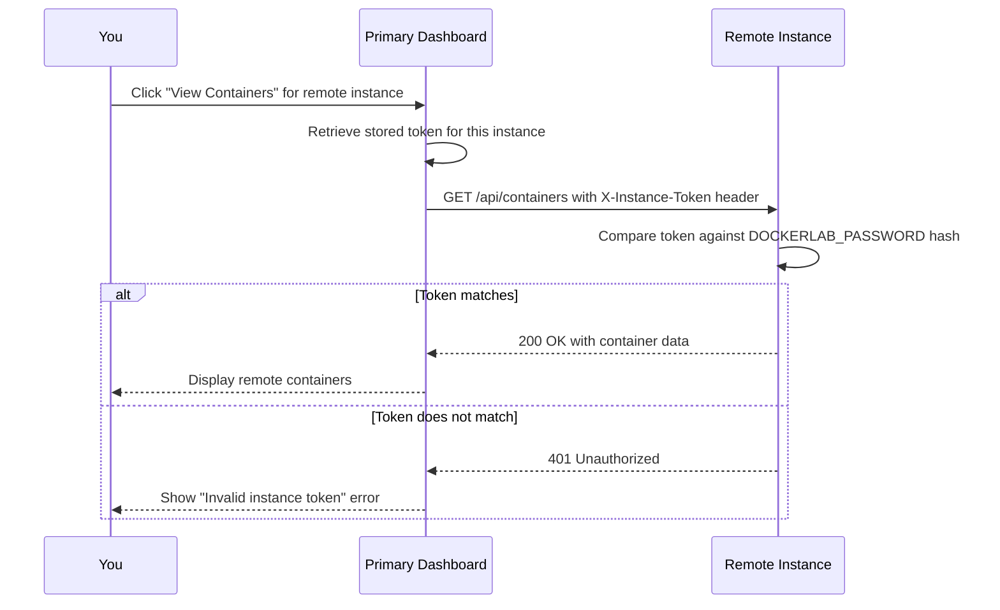
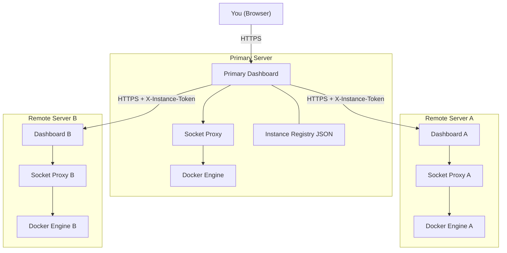

# Chapter 9: Multi-Instance Management

> Monitor and manage Docker Lab deployments across multiple servers from a single dashboard -- one pane of glass for your entire fleet.

## Overview

Once you have Docker Lab running on one server, a natural question follows: what happens when you have two servers? Or five? Logging into each dashboard separately to check container health, trigger deployments, and investigate issues does not scale. You need a way to see everything from one place.

Docker Lab solves this with **multi-instance management** -- the ability to register remote Docker Lab dashboards with your primary dashboard and monitor them all from a single interface. Think of it like an air traffic control tower. Each airplane has its own instruments and pilot (each server runs its own dashboard), but the tower (your primary dashboard) can see every airplane on one screen, check their status, and issue instructions.

This chapter walks you through the concepts, setup, security model, and practical scenarios for managing a fleet of Docker Lab instances. Whether you run two servers or twenty, the pattern is the same.

## What Is an Instance?

An **instance** is a single Docker Lab deployment running its own dashboard on a server. Every Docker Lab installation is already an instance -- it has an identity, a URL, and a health endpoint. Multi-instance management is the act of connecting these instances together so one dashboard can see the others.

### The Two Roles

When you connect instances together, each one plays a role:

- **Primary dashboard**: The dashboard you log into. It stores the registry of remote instances and displays their data alongside its own.
- **Remote instance**: A Docker Lab dashboard running on another server. It responds to health checks and API requests from the primary dashboard.

A server does not need any special configuration to become a remote instance. Every Docker Lab dashboard is already capable of responding to multi-instance requests. You only need to register it with your primary dashboard.

### What Your Primary Dashboard Can Do with Remote Instances

Once a remote instance is registered, your primary dashboard can:

- View the list of containers running on that remote server
- Check the health status of the remote deployment
- Trigger sync operations to pull latest images and restart services
- Display aggregate status across all instances on a single page

All of this works through the dashboard's REST API. The primary dashboard makes HTTP requests to each remote instance, authenticated with a shared token, and displays the results.

## The Instances Page

When you navigate to the Instances page, you see two types of cards.

### The "This Instance" Card

At the top of the page sits a card labeled **"This Instance."** This represents the local server -- the one running the dashboard you are currently viewing. It is not clickable because you are already looking at it. Every container, volume, and system page you see shows data from this instance.

The card displays:

- **Instance name**: Configured via `DOCKERLAB_INSTANCE_NAME` or derived from the server hostname
- **Instance ID**: A unique identifier (auto-generated or set via `DOCKERLAB_INSTANCE_ID`)
- **URL**: The public URL of this dashboard
- **Health status**: Always shows "healthy" since you can reach it
- **Environment label**: Production, staging, development, or local

### Remote Instance Cards

Below the local card, you see one card for each registered remote instance. Each card shows the same fields plus additional information:

- **Last seen**: When the most recent successful health check occurred
- **Version**: The software version running on the remote instance
- **Action buttons**: View Containers, Trigger Sync, Check Health, Remove

## Adding Your First Remote Instance

Setting up multi-instance management takes three steps: prepare the remote server, register it, and verify the connection.

### Step 1: Prepare the Remote Dashboard

The remote server must meet two requirements:

1. Docker Lab dashboard is running and accessible via a URL (for example, `https://staging.example.com`)
2. The remote dashboard uses the **same password** as your primary dashboard (configured via `DOCKERLAB_PASSWORD`)

The shared password is the foundation of instance-to-instance authentication. Both dashboards must know the same secret to communicate.

### Step 2: Register the Instance

On your primary dashboard:

1. Navigate to the Instances page
2. Click the **"Add Instance"** button
3. Fill in the registration form:

| Field | Required | Description |
|-------|----------|-------------|
| Name | Yes | A friendly label like "Staging VPS" or "Production EU" |
| URL | Yes | Full URL of the remote dashboard |
| Description | No | Notes about this instance (location, purpose) |
| Token | No | Leave blank to use the shared password, or provide a custom token |

4. Click **"Register"**

The system performs several actions behind the scenes:

- Generates a unique instance ID based on the URL
- Stores the registration in a local JSON file
- Runs an initial health check against the remote dashboard
- Adds a new card to the instances list

You can also register instances programmatically through the API:

```bash
$ curl -X POST https://dashboard.example.com/api/instances \
  -H "Content-Type: application/json" \
  -H "Cookie: session=your-session-cookie" \
  -d '{
    "name": "Staging Server",
    "url": "https://staging.example.com",
    "description": "Staging environment for pre-release testing",
    "token": ""
  }'
```

An empty `token` field tells the dashboard to use the default shared password for authentication.

### Step 3: Verify the Connection

After registration, check the new instance card:

- **Health status** should show "healthy" (green indicator)
- **Last seen** should show a recent timestamp
- **Version** should display the remote dashboard version

If the health check fails, jump to the Troubleshooting section at the end of this chapter.

## How Authentication Works Between Instances

Multi-instance communication uses a **shared secret model**. Understanding how this works helps you make informed decisions about security and troubleshoot connection problems.

The following diagram shows the authentication flow when your primary dashboard communicates with a remote instance:



Here is what happens at each step:

1. **Registration**: When you register a remote instance, the primary dashboard hashes the token (or default password) and stores the hash locally.
2. **Request**: When the primary dashboard needs data from a remote instance, it sends an HTTP request with the token in an `X-Instance-Token` header.
3. **Validation**: The remote instance receives the request and compares the token against its own configured `DOCKERLAB_PASSWORD` using a constant-time comparison to prevent timing attacks.
4. **Response**: If the token matches, the remote instance returns the requested data. If not, it returns a 401 Unauthorized error.

This model is simple by design. There are no certificates to manage, no key rotation protocols, and no external authentication services. The trade-off is that all instances in your fleet must share the same password (or you must configure custom tokens per instance).

### Permission Model

Not all users have the same access to multi-instance features:

| User Type | View Instances | Register or Remove | Health Check | Trigger Sync | View Remote Containers |
|-----------|:-:|:-:|:-:|:-:|:-:|
| Authenticated | Yes | Yes | Yes | Yes | Yes |
| Guest (demo mode) | Yes | No | Yes | No | Yes |
| Unauthenticated | No | No | No | No | No |

Guest users can see instance cards and check health, but they cannot modify the registry or trigger deployments on remote servers.

## Managing Your Fleet

Once instances are registered, the Instances page becomes your fleet management hub. Each instance card provides four actions.

### View Containers

Click **"View Containers"** to see every container running on the remote instance. This opens a modal displaying the same details you see on the local Containers page: name, image, status, health, uptime, CPU usage, and memory usage.

This is useful for quick health checks -- you can scan all your servers from one screen without opening separate browser tabs.

### Trigger Sync

Click **"Trigger Sync"** to tell the remote instance to pull the latest Docker images and restart services. The remote instance executes its configured sync script (or the default `docker compose pull`).

This is a powerful feature for coordinated deployments. Instead of SSH-ing into each server, you can trigger updates from your primary dashboard.

**Important**: Only authenticated users can trigger sync. Guest users see the button but it is disabled.

### Check Health

The dashboard automatically checks all instances every 30 seconds. Click **"Check Health"** to force an immediate check if you suspect something changed. Health checks hit the remote dashboard's `/health` endpoint and verify it responds correctly.

### Remove Instance

Click **"Remove"** to unregister an instance from your primary dashboard. This only removes the local registration. It does not affect the remote server -- that dashboard keeps running normally. You can re-register it at any time.

## Multi-Instance Topology

The following diagram shows how a typical multi-instance deployment connects together:



Each server runs a complete, independent Docker Lab stack. The primary dashboard adds a layer on top: it stores a registry of remote instances and communicates with them over HTTPS. If the primary dashboard goes down, the remote instances keep running normally -- they just lose their central monitoring point.

## Practical Scenarios

### Scenario 1: Two-Server Setup

You run a production server and a staging server. You want to monitor both from production.

**On the staging server**, ensure the dashboard is running and accessible:

```bash
$ curl -I https://staging.example.com/health
HTTP/2 200
```

**On the production server**, verify the password matches:

```bash
# Both servers should have the same DOCKERLAB_PASSWORD in their .env files
# Production .env
DOCKERLAB_PASSWORD=your-shared-secret-here

# Staging .env (must match)
DOCKERLAB_PASSWORD=your-shared-secret-here
```

**Register staging from production**:

1. Log into the production dashboard
2. Go to Instances
3. Click "Add Instance"
4. Name: "Staging Server"
5. URL: `https://staging.example.com`
6. Click "Register"

You now see both servers on one page. When you deploy a new feature to staging, you can trigger the sync from production and watch the containers restart in real time.

### Scenario 2: Five-Server Production Fleet

You manage five servers: two in Europe, two in the US, and one for staging. You designate the EU-1 server as your primary dashboard.

**Server inventory:**

| Server | Location | URL | Role |
|--------|----------|-----|------|
| EU-1 | Frankfurt | `https://eu1.example.com` | Primary |
| EU-2 | Amsterdam | `https://eu2.example.com` | Remote |
| US-1 | New York | `https://us1.example.com` | Remote |
| US-2 | San Francisco | `https://us2.example.com` | Remote |
| Staging | Frankfurt | `https://staging.example.com` | Remote |

**Setup steps:**

1. Set the same `DOCKERLAB_PASSWORD` on all five servers
2. Log into EU-1
3. Register EU-2, US-1, US-2, and Staging as remote instances
4. Verify all four show "healthy" status

**Daily workflow:**

- Open EU-1 dashboard and check the Instances page for fleet health
- If a server shows "unhealthy," investigate immediately
- To deploy updates across the fleet, trigger sync on each instance from EU-1
- Use "View Containers" to verify the correct image versions are running everywhere

**Tip**: Give each instance a descriptive name that includes the location. When you have five cards on screen, "US-2 San Francisco" is much easier to scan than "Server 4."

## Network Requirements

Multi-instance management requires network connectivity between your primary dashboard and each remote instance. Here is what you need to ensure.

### Firewall Rules

The primary dashboard must reach each remote instance over HTTPS (port 443) or HTTP (port 80). If your servers use firewalls, add rules to allow traffic:

```bash
# On each remote server, allow the primary dashboard's IP
$ sudo ufw allow from 203.0.113.10 to any port 443 proto tcp comment "Docker Lab primary dashboard"
```

Replace `203.0.113.10` with your primary server's IP address.

### VPN Considerations

For tighter security, run instance-to-instance traffic over a VPN. This keeps dashboard communication off the public internet entirely.

Common VPN options:

- **WireGuard**: Lightweight, fast, and easy to configure between two servers
- **Tailscale**: Zero-configuration mesh VPN built on WireGuard
- **Private network**: Many VPS providers offer private networking between servers in the same datacenter

When using a VPN, register instances using their private/VPN IP addresses instead of public URLs:

```text
# Instead of public URL
https://staging.example.com

# Use VPN address
https://10.0.0.5:8080
```

### Latency

Health checks and API requests are lightweight HTTP calls. They work fine across continents with typical internet latency (50-200ms). You do not need low-latency connections between instances.

However, the "View Containers" feature fetches data in real time. If latency is high, you might notice a brief delay when opening the container list for a distant server. This is normal and does not affect monitoring accuracy.

## Token and Password Rotation

Periodically changing your shared password is good security hygiene. Here is how to rotate credentials across your fleet without causing downtime.

### Rotation Procedure

1. **Generate a new password:**

```bash
$ openssl rand -base64 24
K7mP2vX9nQ4rY6wB8hJ3fL1sA5tD0eC=
```

2. **Update each remote instance first.** Change `DOCKERLAB_PASSWORD` in the `.env` file and restart the dashboard:

```bash
# On each remote server
$ nano .env  # Update DOCKERLAB_PASSWORD
$ docker compose restart dashboard
```

3. **Update the primary dashboard last.** Once all remote instances use the new password, update the primary:

```bash
# On primary server
$ nano .env  # Update DOCKERLAB_PASSWORD
$ docker compose restart dashboard
```

4. **Re-register instances if needed.** If you used custom tokens during registration, remove and re-register each instance with the new token.

### Why Update Remote Instances First?

If you update the primary first, it immediately starts sending the new token to remote instances that still expect the old one. Every health check and API call fails until you update the remotes. By updating remotes first, the transition is seamless: the primary keeps using the old token successfully until you update it, and then it switches to the new token that the remotes already accept.

## Instance Data Persistence

Instance registrations are stored in a JSON file at `/data/instances.json` inside the dashboard container. To ensure registrations survive container restarts, mount a Docker volume:

```yaml
services:
  dashboard:
    image: peermesh/docker-lab-dashboard:latest
    volumes:
      - dashboard_data:/data
    environment:
      - DOCKERLAB_PASSWORD=${DOCKERLAB_PASSWORD}
      - DOCKERLAB_INSTANCE_NAME=production-eu1

volumes:
  dashboard_data:
```

Without this volume, you must re-register all remote instances every time the dashboard container is recreated.

The instance data file has `0600` permissions (owner read/write only) and contains:

```json
[
  {
    "id": "a1b2c3d4",
    "name": "Staging Server",
    "url": "https://staging.example.com",
    "description": "Pre-release testing environment",
    "created_at": "2026-01-21T10:30:00Z",
    "last_seen": "2026-01-21T11:45:00Z",
    "health": "healthy",
    "version": "0.1.0-mvp",
    "environment": "staging"
  }
]
```

## Configuration Reference

These environment variables control multi-instance behavior:

| Variable | Description | Default |
|----------|-------------|---------|
| `DOCKERLAB_INSTANCE_NAME` | Friendly name for this instance | Server hostname |
| `DOCKERLAB_INSTANCE_ID` | Unique identifier | Auto-generated from name |
| `DOCKERLAB_INSTANCE_URL` | Public URL other instances use to reach this one | Auto-detected |
| `DOCKERLAB_INSTANCE_SECRET` | Shared secret for instance-to-instance auth | Same as `DOCKERLAB_PASSWORD` |
| `DOCKERLAB_PASSWORD` | Dashboard login password (also used as default instance token) | Required |

If you do not set `DOCKERLAB_INSTANCE_SECRET` explicitly, the dashboard uses `DOCKERLAB_PASSWORD` as the shared secret. For most deployments, this is sufficient -- you already need matching passwords for authentication.

## Multi-Instance API Reference

For automation and scripting, here are the API endpoints that power multi-instance management:

| Endpoint | Method | Description |
|----------|--------|-------------|
| `/api/instances` | GET | List all registered instances |
| `/api/instances` | POST | Register a new remote instance |
| `/api/instances/{id}` | GET | Get details for a specific instance |
| `/api/instances/{id}` | DELETE | Remove a registered instance |
| `/api/instances/{id}/health` | GET | Check health of a specific instance |
| `/api/instances/{id}/sync` | POST | Trigger sync on a remote instance |
| `/api/instances/{id}/containers` | GET | List containers on a remote instance |

All endpoints require authentication. POST and DELETE endpoints are blocked for guest users in demo mode.

## Common Gotchas

### Password Mismatch Is the Number One Issue

If a remote instance shows "unhealthy" or you see "Invalid instance token" errors, the first thing to check is whether `DOCKERLAB_PASSWORD` matches on both servers. This accounts for the vast majority of multi-instance connection failures. Copy the exact password string -- watch for trailing whitespace, different quoting in `.env` files, or shell variable expansion issues.

### Health Endpoint Is Authenticated

The `/api/health` endpoint requires authentication by design. If you test connectivity with `curl` from one server to another, you get a 401 response unless you include valid credentials. This is expected. The dashboard's internal health check sends the instance token automatically. For manual testing, use:

```bash
$ curl -I https://remote.example.com/health \
  -H "X-Instance-Token: your-shared-password"
```

### Registration Does Not Survive Container Recreation Without a Volume

If you recreate the dashboard container (for example, during a deploy), all instance registrations are lost unless you mounted `/data` as a Docker volume. Check your compose file for the `dashboard_data` volume mount.

### Firewalls Block Instance Communication by Default

Most VPS providers configure firewalls that only allow SSH, HTTP, and HTTPS from the public internet. Instance-to-instance traffic uses the same HTTPS port, but if you restrict incoming connections by IP address, you must add rules for each server in your fleet.

### Remote Sync Requires Correct Permissions

When you trigger a sync on a remote instance, the remote dashboard executes its sync script. If that script does not have execute permissions, or if the dashboard container lacks the necessary Docker socket access for `docker compose pull`, the sync fails silently. Check the remote dashboard logs:

```bash
$ docker compose logs dashboard | grep sync
```

## Key Takeaways

- **Multi-instance management lets you monitor your entire Docker Lab fleet from one dashboard.** Register remote instances and see their containers, health, and deployment status alongside your local server.
- **Authentication uses a shared password.** All instances in your fleet must have the same `DOCKERLAB_PASSWORD` (or you must configure custom per-instance tokens). This shared secret is sent in the `X-Instance-Token` header.
- **Each server runs independently.** If the primary dashboard goes down, remote instances keep running. Multi-instance is a monitoring overlay, not a dependency.
- **Persist your instance registry.** Mount a Docker volume at `/data` to ensure registrations survive container restarts.
- **Rotate passwords by updating remote instances first, then the primary.** This avoids a window where health checks fail across the fleet.

## Next Steps

With multi-instance management, you can see all your servers from one place. But seeing container status is just the beginning. In the [Observability chapter](./observability.md), you will learn how to add metrics, dashboards, and alerting to your Docker Lab deployment using Netdata, Uptime Kuma, Prometheus, and Grafana. Observability turns raw container data into actionable insights -- so you know not just what is running, but how well it is running.
