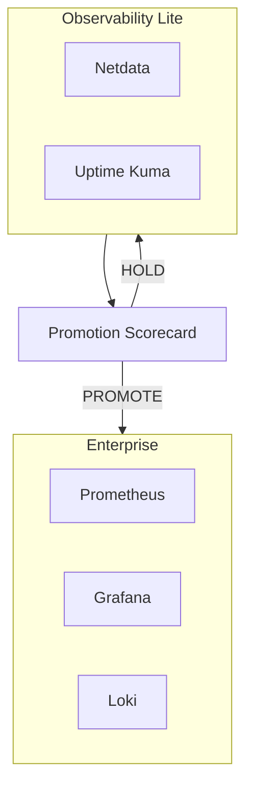
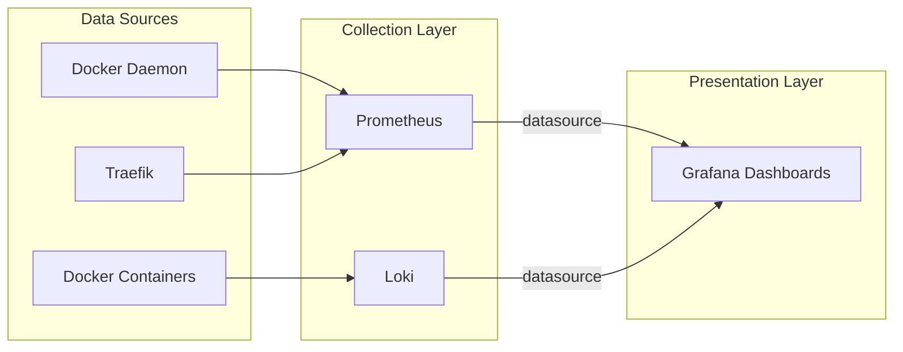
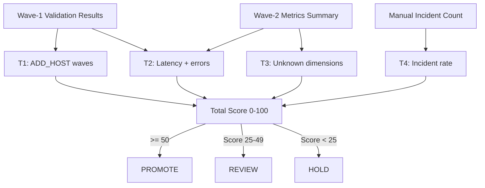

# Chapter 10: Observability

> How to monitor your Docker Lab deployment, detect problems early, and make evidence-based decisions about when to upgrade your monitoring stack.

## Overview

Running a server without monitoring is like driving at night without headlights. Everything seems fine -- until it is not, and by then you have already hit the problem. Observability gives you the headlights: real-time visibility into what your services are doing, how much of your resources they consume, and whether anything is about to go wrong.

Docker Lab takes a pragmatic approach to observability. Instead of forcing you into a heavyweight monitoring stack from day one, it provides two tiers that you activate as compose profile overlays. You start with the lightweight tier that covers the essentials, and you promote to the enterprise tier only when your deployment genuinely needs it. A built-in scorecard automates that promotion decision so you never have to guess.

This chapter covers what each tier includes, how to set them up, what to monitor, and how the promotion scorecard works. If you are running a single VPS with a handful of services, the lite tier is all you need. If you grow to handle hundreds of requests per second or manage multiple nodes, the enterprise tier is waiting.

## Why Observability Matters for Docker Lab

Before we look at the tools, it helps to understand what observability actually gives you in a containerized environment. Traditional server monitoring checks whether a machine is alive. Container observability goes deeper: it tracks individual services, their resource consumption, their response times, and their logs -- all in a system where containers can restart, scale, or disappear at any moment.

In Docker Lab specifically, observability serves three purposes:

- **Health verification** -- Confirming that your foundation stack (Traefik, socket proxy, dashboard) and any application services are running and responding correctly.
- **Resource awareness** -- Understanding how much CPU, memory, and disk your containers consume, so you can right-size your VPS and catch resource exhaustion before it causes outages.
- **Promotion evidence** -- Providing the data that Docker Lab's promotion scorecard uses to decide whether your deployment has outgrown its current monitoring tier.

Without observability, you discover problems when users report them. With it, you discover problems before users notice them.

## The Two-Tier Model

Docker Lab's observability follows a two-tier architecture. Think of it like insurance plans: the basic plan covers your essential needs at low cost, and the premium plan adds depth for situations that demand it.

The following diagram shows how the two tiers compare:



The scorecard sits between the two tiers. It evaluates real operational signals -- not opinions -- and tells you when the lite tier is no longer sufficient.

| Aspect | Observability Lite | Enterprise Observability |
|--------|-------------------|------------------------|
| Components | Netdata + Uptime Kuma | Prometheus + Grafana + Loki |
| Memory overhead | ~90 MiB idle | ~900 MiB steady-state |
| Memory limit envelope | ~350 MiB | ~2 GiB |
| Setup complexity | Minimal | Moderate |
| Retention | Netdata default (hours-days) | 7 days / 1 GB (configurable) |
| Custom dashboards | Netdata built-in | Grafana (unlimited) |
| Log aggregation | None (Docker JSON logs) | Loki with structured queries |
| Alerting | Uptime Kuma notifications | Grafana alerting + Prometheus rules |
| Query language | None | PromQL + LogQL |
| Best for | Single VPS, small deployments | Multi-service, production workloads |
| Status | Active (default) | On hold (ready when needed) |

## Observability Lite: Your Starting Point

The lite tier is the default recommendation for all Docker Lab deployments. It gives you immediate visibility into system health and service availability without adding significant resource overhead or operational complexity.

### What You Get

**Netdata** is a real-time performance monitoring tool that runs as a container with access to host system metrics. It provides:

- CPU, memory, disk, and network metrics for the host
- Per-container resource usage (CPU, memory, network I/O)
- Built-in dashboards accessible through your browser
- Anomaly detection with minimal configuration
- Zero-configuration metrics collection for common services

**Uptime Kuma** is a self-hosted uptime monitoring tool that checks whether your services are responding. It provides:

- HTTP/HTTPS endpoint monitoring with configurable intervals
- Response time tracking and history
- Notification integrations (email, Slack, Telegram, Discord, and many others)
- Status pages you can share with your team
- Certificate expiration monitoring

Together, these two tools answer the fundamental questions: "Are my services alive?" (Uptime Kuma) and "Are my services healthy?" (Netdata).

### Setting Up Observability Lite

The lite tier is a compose profile that you activate alongside your base `docker-compose.yml`. To bring it up:

```bash
docker compose \
  -f docker-compose.yml \
  -f profiles/observability-lite/docker-compose.observability-lite.yml \
  up -d
```

This starts two additional containers: `pmdl_netdata` and `pmdl_uptime-kuma`. Both are automatically routed through Traefik and accessible at their respective subdomains.

Here is the compose configuration that defines the lite profile:

```yaml
services:
  uptime-kuma:
    image: louislam/uptime-kuma@sha256:3d632903e6af34139a37f18055c4f1bfd9b7205ae1138f1e5e8940ddc1d176f9
    container_name: pmdl_uptime-kuma
    restart: unless-stopped
    volumes:
      - pmdl_uptime_kuma_data:/app/data
    networks:
      - proxy-external
      - monitoring
    healthcheck:
      test: ["CMD", "node", "/app/extra/healthcheck"]
      interval: 30s
      timeout: 10s
      retries: 5
      start_period: 60s
    labels:
      - "traefik.enable=true"
      - "traefik.http.routers.uptime-kuma.rule=Host(`uptime.${DOMAIN}`)"
      - "traefik.http.routers.uptime-kuma.entrypoints=websecure"
      - "traefik.http.routers.uptime-kuma.tls.certresolver=letsencrypt"
      - "traefik.http.services.uptime-kuma.loadbalancer.server.port=3001"

  netdata:
    image: netdata/netdata@sha256:4cbe33f6fc317a7f5c453c8b4997316e4e320a7abd8cc921cecba98f2a5cbcf5
    container_name: pmdl_netdata
    restart: unless-stopped
    hostname: "${HOSTNAME:-pmdl-host}"
    pid: host
    cap_add:
      - SYS_PTRACE
    security_opt:
      - apparmor=unconfined
    volumes:
      - pmdl_netdata_config:/etc/netdata
      - pmdl_netdata_lib:/var/lib/netdata
      - pmdl_netdata_cache:/var/cache/netdata
      - /etc/passwd:/host/etc/passwd:ro
      - /etc/group:/host/etc/group:ro
      - /proc:/host/proc:ro
      - /sys:/host/sys:ro
      - /etc/os-release:/host/etc/os-release:ro
      - /var/run/docker.sock:/var/run/docker.sock:ro
    networks:
      - proxy-external
      - monitoring
    healthcheck:
      test: ["CMD", "wget", "--no-verbose", "--tries=1", "--spider", "http://127.0.0.1:19999/api/v1/info"]
      interval: 30s
      timeout: 10s
      retries: 5
      start_period: 60s
    labels:
      - "traefik.enable=true"
      - "traefik.http.routers.netdata.rule=Host(`netdata.${DOMAIN}`)"
      - "traefik.http.routers.netdata.entrypoints=websecure"
      - "traefik.http.routers.netdata.tls.certresolver=letsencrypt"
      - "traefik.http.services.netdata.loadbalancer.server.port=19999"
```

Notice a few important details:

- Both images use digest pinning (`@sha256:...`) rather than mutable tags, ensuring you always get the exact version that was validated
- Netdata requires host PID namespace access and `SYS_PTRACE` capability to collect system-level metrics -- this is expected and necessary
- Netdata mounts the Docker socket directly (read-only) to monitor container metrics, unlike the foundation stack where only the socket proxy touches the socket
- Both services connect to the `proxy-external` and `monitoring` networks

### Accessing the Dashboards

After activation, your monitoring dashboards are available at:

| Service | URL | Purpose |
|---------|-----|---------|
| Netdata | `https://netdata.yourdomain.com` | Real-time system and container metrics |
| Uptime Kuma | `https://uptime.yourdomain.com` | Endpoint monitoring and status pages |

On first access to Uptime Kuma, you create an admin account directly in the web interface. Netdata is accessible immediately with its built-in dashboards.

### Configuring Uptime Kuma Monitors

After logging in to Uptime Kuma, set up monitors for your critical endpoints. At minimum, create these monitors:

- **Traefik health** -- HTTP monitor for `https://yourdomain.com` (verifies the reverse proxy is routing)
- **Dashboard** -- HTTP monitor for `https://dashboard.yourdomain.com` (verifies the dashboard is responding)
- **Certificate expiry** -- HTTPS monitor with certificate expiry tracking for your domain

For each monitor, configure a check interval of 60 seconds and enable notifications through your preferred channel. Uptime Kuma supports over 90 notification services out of the box.

### Validating the Profile

Docker Lab includes a validation script that confirms your observability profile is correctly configured:

```bash
$ ./scripts/validate-observability-profile.sh
```

This script verifies three things:

- The base compose file does not include observability-lite services (they belong in the overlay)
- The overlay compose file includes the expected observability-lite services
- Compose resolution succeeds in both modes (with and without the overlay)

Run this after any changes to your compose configuration to ensure the overlay remains compatible.

### Rolling Back

If you need to remove the lite profile and return to foundation-only services:

```bash
docker compose \
  -f docker-compose.yml \
  -f profiles/observability-lite/docker-compose.observability-lite.yml \
  down
```

Then bring up the foundation stack alone:

```bash
docker compose -f docker-compose.yml up -d
```

Your monitoring data persists in named volumes (`pmdl_uptime_kuma_data`, `pmdl_netdata_config`, `pmdl_netdata_lib`, `pmdl_netdata_cache`) so you can reactivate later without losing history.

## Enterprise Observability: When You Need More

The enterprise tier provides deep metrics collection, custom dashboards, and centralized log aggregation. It is designed for deployments that have outgrown what Netdata and Uptime Kuma can offer -- typically because you need longer retention, custom queries, or structured log search.

**Current status: The enterprise tier is on hold.** The compose profile and configuration files are ready to deploy, but the promotion path has not been exercised in production yet. The scorecard automation works, but no deployment has triggered a promotion to date. What follows describes the tier as designed and tested in development.

### What the Enterprise Tier Includes

**Prometheus** collects and stores time-series metrics. It scrapes endpoints at regular intervals and provides PromQL for powerful metric queries. In the Docker Lab configuration:

- Scrape interval: 30 seconds
- Retention: 7 days or 1 GB (whichever comes first)
- Scrape targets: Prometheus self-metrics, Docker daemon metrics, Traefik metrics, and Loki metrics
- Runs as non-root user (UID 65534)
- Memory limit: 1 GB (512 MB reserved)

**Grafana** provides dashboards and visualization. It connects to Prometheus for metrics and Loki for logs, giving you a single interface for all observability data:

- Auto-provisioned datasources (Prometheus + Loki pre-configured)
- Anonymous access disabled
- Accessible at `https://grafana.yourdomain.com`
- Memory limit: 512 MB (128 MB reserved)

**Loki** aggregates logs from all containers and makes them searchable using LogQL. Instead of SSH-ing into your server and running `docker compose logs | grep`, you query structured logs through Grafana:

- TSDB storage with 7-day retention
- Filesystem-backed chunks (no external object store needed for single-node)
- Compaction runs every 10 minutes
- Memory limit: 512 MB (256 MB reserved)

### How Monitoring Data Flows

The following diagram shows how metrics and logs move through the enterprise stack:



Prometheus pulls metrics from services that expose them. Loki receives logs pushed by the Docker logging driver. Grafana queries both to render dashboards and trigger alerts.

### Enterprise Tier Setup

Activating the enterprise tier follows the same compose profile pattern as the lite tier:

```bash
docker compose \
  -f docker-compose.yml \
  -f profiles/observability-full/docker-compose.observability-full.yml \
  up -d
```

The configuration files live in `profiles/observability-full/config/`:

**File: `prometheus/prometheus.yml`**

```yaml
global:
  scrape_interval: 30s
  evaluation_interval: 30s

scrape_configs:
  - job_name: "prometheus"
    static_configs:
      - targets: ["localhost:9090"]

  - job_name: "docker"
    static_configs:
      - targets: ["host.docker.internal:9323"]
    metrics_path: /metrics

  - job_name: "traefik"
    static_configs:
      - targets: ["pmdl_traefik:8080"]
    metrics_path: /metrics

  - job_name: "loki"
    static_configs:
      - targets: ["pmdl_loki:3100"]
    metrics_path: /metrics
```

**File: `grafana/provisioning/datasources/datasources.yml`**

```yaml
apiVersion: 1

datasources:
  - name: Prometheus
    type: prometheus
    access: proxy
    url: http://pmdl_prometheus:9090
    isDefault: true
    editable: false

  - name: Loki
    type: loki
    access: proxy
    url: http://pmdl_loki:3100
    editable: false
```

**File: `loki/loki-config.yml`**

```yaml
auth_enabled: false

server:
  http_listen_port: 3100

common:
  path_prefix: /loki
  storage:
    filesystem:
      chunks_directory: /loki/chunks
      rules_directory: /loki/rules
  replication_factor: 1
  ring:
    kvstore:
      store: inmemory

schema_config:
  configs:
    - from: "2024-01-01"
      store: tsdb
      object_store: filesystem
      schema: v13
      index:
        prefix: index_
        period: 24h

limits_config:
  retention_period: 168h
  max_query_series: 500

compactor:
  working_directory: /loki/compactor
  compaction_interval: 10m
  retention_enabled: true
  retention_delete_delay: 2h
```

All three enterprise services run hardened: non-root users, `cap_drop: ALL`, `no-new-privileges`, and Prometheus and Loki use read-only root filesystems with minimal tmpfs mounts.

### Resource Requirements

The enterprise tier has a significantly larger resource footprint than the lite tier. Plan your VPS accordingly:

| Component | Steady-State Memory | Memory Limit | Notes |
|-----------|-------------------|-------------|-------|
| Prometheus | ~512 MiB | 1,024 MiB | Grows with metric cardinality |
| Grafana | ~128 MiB | 512 MiB | Increases with concurrent users |
| Loki | ~256 MiB | 512 MiB | Grows with log volume |
| **Total** | **~896 MiB** | **~2,048 MiB** | Added on top of foundation services |

Combined with the foundation stack (Traefik, socket proxy, dashboard), the enterprise tier brings your total container memory usage to approximately 1 GiB steady-state with a 2.5 GiB limit envelope. A VPS with at least 4 GB of RAM is recommended when running the enterprise tier.

### Rolling Back to Lite

If the enterprise tier proves too resource-heavy or you need to free capacity:

```bash
# Tear down enterprise stack
docker compose \
  -f docker-compose.yml \
  -f profiles/observability-full/docker-compose.observability-full.yml \
  down

# Return to lite profile
docker compose \
  -f docker-compose.yml \
  -f profiles/observability-lite/docker-compose.observability-lite.yml \
  up -d
```

Enterprise data persists in named volumes (`pmdl_prometheus_data`, `pmdl_grafana_data`, `pmdl_loki_data`), so you can switch back without losing collected data.

## The Promotion Scorecard

The promotion scorecard is Docker Lab's mechanism for deciding when to upgrade from the lite tier to the enterprise tier. Instead of relying on gut feeling ("we should probably add Grafana"), the scorecard evaluates concrete operational signals and produces one of three decisions: **HOLD**, **REVIEW**, or **PROMOTE_FULL_STACK**.

Think of it like a doctor's checklist. Individual symptoms may not mean much on their own, but when enough of them appear together, the diagnosis becomes clear.

### How the Scorecard Works

The scorecard evaluates four triggers, each with a weight that reflects its importance. When a trigger fires, its weight is added to the total score. The total determines the decision.

The following diagram shows the scorecard decision flow:



### The Four Triggers

Each trigger evaluates a specific operational signal:

**T1: Consecutive ADD_HOST waves (weight: 25)**

This trigger fires when two consecutive scalability wave-1 validations both include at least one ADD_HOST recommendation. An ADD_HOST recommendation means your current VPS is nearing capacity and you should consider adding another node. If this happens twice in a row, your monitoring needs are growing beyond what a single-node lite stack can effectively cover.

**T2: Latency and error co-breach (weight: 30)**

This is the highest-weighted trigger. It fires when a single validation wave records both a p99 latency at or above 250 milliseconds and an error rate at or above 1.0%. Either metric alone is concerning; both together indicate systemic performance degradation that demands deeper observability to diagnose.

**T3: Unknown critical dimensions (weight: 20)**

After running wave-2 instrumentation, four critical metrics should have values: latency p99, error rate, RTO (recovery time objective), and RPO (recovery point objective). If any remain UNKNOWN after instrumentation, your monitoring has blind spots. The enterprise tier provides the tooling to fill those gaps.

**T4: Incident rate exceeded (weight: 25)**

This trigger fires when you log more than 3 manual incidents within a 7-day window (both thresholds are configurable). Frequent incidents mean your lite monitoring is not catching problems early enough, and you need the deeper alerting and log search that the enterprise tier provides.

### Decision Classes

| Score Range | Decision | What It Means |
|-------------|----------|---------------|
| 50 or above | PROMOTE_FULL_STACK | Strong evidence supports upgrading to the enterprise tier |
| 25 to 49 | REVIEW | Some signals are concerning; a human should evaluate before deciding |
| Below 25 | HOLD | Your lite tier is working fine; no action needed |

### Running the Scorecard

The scorecard is invoked through the `just` command runner or directly via the script:

```bash
# Minimal run with current wave-1 summary only
$ just observability-scorecard /path/to/wave1-summary.env

# Full run with previous wave, wave-2 metrics, and incident count
$ just observability-scorecard \
    /path/to/wave1-summary.env \
    /path/to/prev-wave1-summary.env \
    /path/to/wave2-metrics-summary.env \
    2
```

You can also invoke the script directly for more control:

```bash
$ ./scripts/observability/run-observability-scorecard.sh \
    --wave1-summary /path/to/wave1-summary.env \
    --wave1-summary-prev /path/to/prev-wave1-summary.env \
    --wave2-summary /path/to/wave2-metrics-summary.env \
    --incident-count 2 \
    --output-dir /tmp/scorecard-output
```

### Scorecard Output

The scorecard produces four artifacts in the output directory (default: `reports/observability/<timestamp>-scorecard/`):

| Artifact | Format | Purpose |
|----------|--------|---------|
| `scorecard.tsv` | TSV | Trigger-level results with evidence for each trigger |
| `scorecard-summary.env` | Shell env | Machine-readable decision summary for automation |
| `scorecard-findings.md` | Markdown | Human-readable findings report |
| `scorecard-audit.log` | Text | Full audit trail of all inputs, scores, and decisions |

Here is an example of what the findings report looks like:

```text
# Observability Promotion Trigger Scorecard

- Generated at: 2026-02-25T14:30:00Z
- Decision: **HOLD**
- Total score: 0/100
- Triggers fired: 0/4

## Trigger Results

| Trigger | Name                        | Fired | Weight | Score |
|---------|-----------------------------|-------|--------|-------|
| T1      | Consecutive ADD_HOST waves  | false | 25     | 0     |
| T2      | Latency + error co-breach   | false | 30     | 0     |
| T3      | Unknown critical dimensions | false | 20     | 0     |
| T4      | Incident rate exceeded      | false | 25     | 0     |
```

### Customizing Scorecard Thresholds

All trigger weights and thresholds are configurable through `scripts/observability/scorecard-config.env`:

```bash
# Trigger 1: How many consecutive ADD_HOST waves trigger promotion
TRIGGER1_CONSECUTIVE_ADD_HOST_WAVES=2
TRIGGER1_WEIGHT=25

# Trigger 2: Latency and error thresholds for co-breach
TRIGGER2_LATENCY_P99_MS_THRESHOLD=250
TRIGGER2_ERROR_RATE_PCT_THRESHOLD=1.0
TRIGGER2_WEIGHT=30

# Trigger 3: Maximum allowed unknown critical dimensions
TRIGGER3_MAX_UNKNOWN_CRITICAL=0
TRIGGER3_WEIGHT=20

# Trigger 4: Incident threshold and evaluation window
TRIGGER4_INCIDENT_THRESHOLD=3
TRIGGER4_EVALUATION_WINDOW_DAYS=7
TRIGGER4_WEIGHT=25

# Decision boundaries
PROMOTE_THRESHOLD=50
REVIEW_THRESHOLD=25
```

Override these defaults by passing a custom config file:

```bash
$ ./scripts/observability/run-observability-scorecard.sh \
    --config /path/to/custom-config.env \
    --wave1-summary /path/to/wave1-summary.env
```

### Integration with Scalability Waves

The scorecard consumes outputs from Docker Lab's scalability wave pipeline. The workflow is:

1. Run wave-1 validation to produce `wave1-summary.env`
2. Optionally run wave-2 metrics capture to produce `wave2-metrics-summary.env`
3. Feed both summaries into the scorecard

```bash
# Step 1: Run wave-1 validation
$ ./scripts/scalability/run-wave1-validation.sh

# Step 2: Optionally capture wave-2 metrics (requires VPS access)
$ ./scripts/scalability/capture-wave2-metrics.sh \
    --ssh-host root@your-vps-ip \
    --output-dir /tmp/pmdl-wave2

# Step 3: Run scorecard with collected evidence
$ just observability-scorecard \
    /tmp/pmdl-wave1/wave1-summary.env \
    /tmp/pmdl-prev-wave1/wave1-summary.env \
    /tmp/pmdl-wave2/aggregated/wave2-metrics-summary.env \
    0
```

This creates a repeatable evidence chain from metric collection through the promotion decision. Every step is auditable.

## Practical Monitoring Recipes

Regardless of which tier you use, certain things should always be monitored. These recipes cover the most important checks.

### Essential Monitors for Every Deployment

**Container health status** -- Every Docker Lab service defines a healthcheck. Monitor for containers that are not in the "healthy" state:

```bash
$ docker compose ps --format "table {{.Name}}\t{{.Status}}"
NAME                  STATUS
pmdl_socket-proxy     running
pmdl_traefik          running (healthy)
pmdl_dashboard        running (healthy)
```

A container showing "unhealthy" or stuck in "starting" for more than 5 minutes indicates a problem.

**Resource consumption** -- Check that no container is approaching its memory limit:

```bash
$ docker stats --no-stream --format "table {{.Name}}\t{{.MemUsage}}\t{{.MemPerc}}\t{{.CPUPerc}}"
NAME                  MEM USAGE / LIMIT     MEM %     CPU %
pmdl_traefik          45MiB / 256MiB        17.58%    0.12%
pmdl_socket-proxy     12MiB / 32MiB         37.50%    0.01%
pmdl_dashboard        22MiB / 64MiB         34.38%    0.05%
```

Sustained memory usage above 80% of the limit means the container is at risk of being OOM-killed.

**TLS certificate expiry** -- Let's Encrypt certificates expire after 90 days. Traefik renews them automatically, but you should verify:

```bash
$ echo | openssl s_client -servername yourdomain.com \
    -connect yourdomain.com:443 2>/dev/null | \
    openssl x509 -noout -enddate
notAfter=May 26 00:00:00 2026 GMT
```

Set up a weekly cron job or an Uptime Kuma HTTPS monitor with certificate expiry tracking.

**Disk usage** -- Docker volumes and container logs can fill a disk over time:

```bash
$ docker system df
TYPE            TOTAL     ACTIVE    SIZE      RECLAIMABLE
Images          8         5         1.2GB     450MB (37%)
Containers      5         5         12MB      0B (0%)
Local Volumes   6         6         850MB     0B (0%)
Build Cache     0         0         0B        0B
```

Run `docker system prune` periodically (with caution) to reclaim space from unused images and stopped containers.

### Recommended Thresholds

| Metric | Warning | Critical | Action |
|--------|---------|----------|--------|
| Container memory usage | Above 70% of limit | Above 85% of limit | Increase memory limit or optimize the service |
| Host disk usage | Above 75% | Above 90% | Clean up logs, prune images, expand disk |
| Container restart count | More than 2 in 1 hour | More than 5 in 1 hour | Check container logs for crash cause |
| HTTP response time (p99) | Above 250 ms | Above 500 ms | Investigate service performance |
| HTTP error rate | Above 0.5% | Above 1.0% | Check service logs and upstream dependencies |
| Certificate days remaining | Below 30 days | Below 14 days | Verify Traefik ACME renewal is working |

### Automated Health Checks

For deployments without Uptime Kuma or as a fallback, add a cron-based health check:

```bash
# Add to deploy user's crontab (crontab -e)
# Check service health every 5 minutes
*/5 * * * * /opt/peer-mesh-docker-lab/scripts/health-check.sh >> /var/log/pmdl-health.log 2>&1
```

## Log Management

Docker Lab uses JSON-file logging with rotation by default. Every service in the foundation stack includes this logging configuration:

```yaml
x-logging: &default-logging
  driver: json-file
  options:
    max-size: "10m"
    max-file: "3"
```

This means each container produces at most 30 MiB of logs (3 files of 10 MiB each) before rotation kicks in. Logs are accessible through `docker compose logs`:

```bash
# View recent logs for all services
$ docker compose logs --tail=50

# Follow logs for a specific service
$ docker compose logs -f --tail=100 traefik

# Filter for errors across all services
$ docker compose logs --tail=1000 | grep -i "error"
```

### Traefik Access Logs

Traefik produces structured JSON access logs when access logging is enabled:

```yaml
command:
  - "--accesslog=true"
  - "--accesslog.format=json"
```

These logs record every HTTP request that passes through the reverse proxy, including status codes, response times, and client IPs. They are invaluable for debugging routing issues and identifying traffic patterns.

### When You Need More: Log Aggregation with Loki

The lite tier relies on Docker's built-in log driver and manual `docker compose logs` commands. For most small deployments, this is sufficient. You outgrow it when:

- You need to search logs from multiple services simultaneously with structured queries
- You want log-based alerting (for example, alert when more than 10 HTTP 500 errors occur in 5 minutes)
- You need log retention beyond what the JSON-file driver provides
- You want to correlate logs with metrics in the same dashboard

The enterprise tier addresses all of these needs with Loki and Grafana. Loki ingests container logs and makes them queryable using LogQL. Grafana provides a unified interface where you can view metrics and logs side by side.

### Security Monitoring Recommendations

The security architecture documentation recommends monitoring these specific signals:

- **Failed authentication attempts** -- Watch for unusual volumes of 401/403 responses in Traefik access logs
- **Rate limit triggers** -- Track when Traefik rate limiting middleware activates, which may indicate brute-force attempts
- **Container restart patterns** -- Frequent restarts of the same container may indicate crash loops caused by configuration errors or resource exhaustion
- **Unexpected network traffic** -- Netdata tracks network I/O per interface; sudden spikes warrant investigation

## Dashboard-Native Monitoring

Docker Lab's built-in dashboard provides basic monitoring without any observability profile activated. The dashboard displays:

- Container status (running, stopped, unhealthy)
- Basic resource usage per container
- Service count and overall stack health

This dashboard-native monitoring covers the absolute minimum: knowing whether your containers are running. It does not replace the observability profiles, but it gives you a baseline even when no monitoring profile is active.

| Capability | Dashboard (Built-in) | Observability Lite | Enterprise |
|------------|---------------------|-------------------|------------|
| Container status | Yes | Yes (via Netdata) | Yes (via Grafana) |
| Resource metrics | Basic | Detailed with history | Full time-series |
| Endpoint monitoring | No | Yes (Uptime Kuma) | Yes (Grafana alerts) |
| Log search | No | No (manual CLI) | Yes (Loki + LogQL) |
| Custom dashboards | No | Netdata built-in | Yes (Grafana) |
| Alerting | No | Yes (Uptime Kuma) | Yes (Grafana + Prometheus) |
| Historical data | No | Hours to days | 7 days (configurable) |

For most operators, the lite tier is the right starting point. The built-in dashboard confirms services are running; Netdata shows you how they are performing; Uptime Kuma alerts you when they stop.

## Common Gotchas

**Netdata requires host access that looks alarming.** Netdata mounts `/proc`, `/sys`, the Docker socket, and runs with `SYS_PTRACE` capability. This is expected behavior for a system monitoring tool -- it needs access to host metrics that are not visible from inside a container namespace. The Docker socket mount is read-only, but unlike the foundation stack's socket proxy approach, Netdata does have direct socket access. If this concerns you, restrict Netdata's network exposure by removing its Traefik labels and accessing it only through an SSH tunnel.

**Uptime Kuma state is stored in SQLite.** The `pmdl_uptime_kuma_data` volume contains an SQLite database with all your monitors, notifications, and history. Back this volume up regularly. Losing it means reconfiguring all your monitors from scratch.

**Enterprise tier Loki needs a Docker logging driver change for full functionality.** The default JSON-file logging driver stores logs locally. To send them to Loki, you need either the Loki Docker logging driver plugin or a log shipping agent like Promtail. The current enterprise compose file configures Loki but does not install the logging driver. This is a known gap that will be addressed when the enterprise tier is promoted from hold status.

**The scorecard requires wave validation data.** You cannot run the promotion scorecard without first running at least one wave-1 validation (`./scripts/scalability/run-wave1-validation.sh`). The scorecard reads the `wave1-summary.env` file that the validation produces. Running the scorecard without this input will result in an error.

**Memory budgeting matters.** On a 2 GB VPS, the foundation stack uses approximately 90 MiB. Adding the lite tier adds another 90 MiB. Adding the enterprise tier instead would add approximately 900 MiB. On a small VPS, the enterprise tier may leave too little memory for your application services. The scorecard exists precisely to prevent premature promotion.

## Key Takeaways

- Docker Lab provides two observability tiers: **lite** (Netdata + Uptime Kuma) for everyday use and **enterprise** (Prometheus + Grafana + Loki) for advanced needs. Start with lite.
- The **promotion scorecard** evaluates four operational triggers to produce a data-driven decision about when to upgrade from lite to enterprise. Never promote based on gut feeling alone.
- Observability profiles are **compose overlays** that you activate and deactivate without modifying your base compose file. Rolling back is always possible.
- The enterprise tier is **on hold** -- the configuration is ready and tested, but no production deployment has triggered a promotion yet. This is by design: most single-VPS deployments do not need it.
- Monitor at minimum: container health, resource usage, TLS certificate expiry, and disk consumption. Set up alerting through Uptime Kuma so problems reach you before users notice them.

## Next Steps

With observability in place, you know what your deployment is doing. The next chapter, [Extending Docker Lab](./extending.md), covers how to add your own services to the stack -- how to write compose overlays, integrate with Traefik routing, connect to shared databases, and follow Docker Lab conventions so your custom services work seamlessly alongside the foundation stack.
