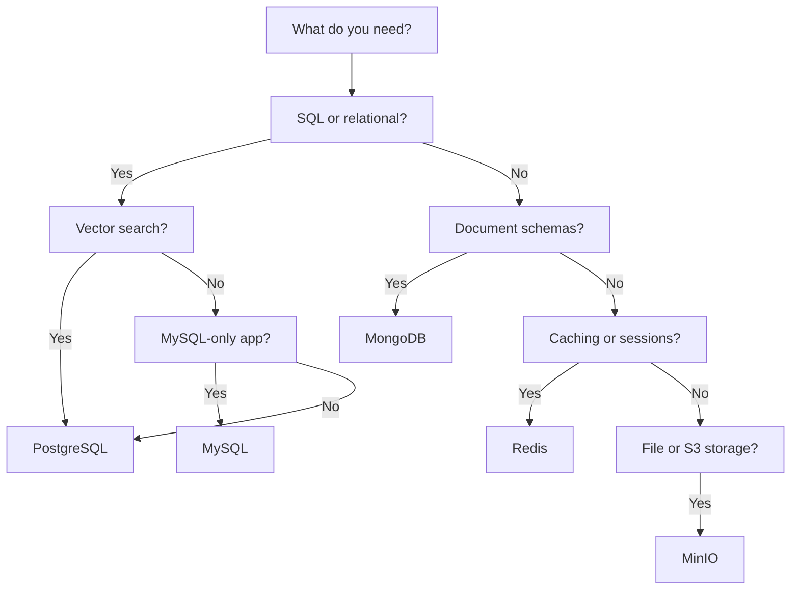
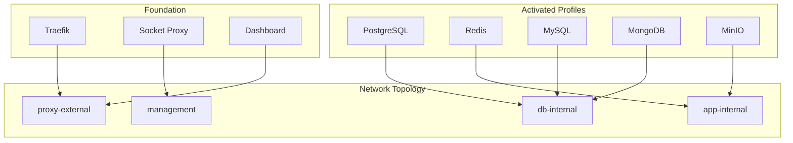

# Chapter 5: Profiles and Supporting Tech

> Docker Lab uses a profile system to let you activate only the databases and infrastructure services you need, keeping resource usage predictable and your attack surface small.

## Overview

Most applications need more than a reverse proxy and a dashboard. They need databases to store data, caches to speed up responses, and object storage to handle file uploads. But different applications need different combinations of these services. A blogging platform requires MySQL. A federated chat server requires PostgreSQL. An AI assistant needs both PostgreSQL and MongoDB.

Docker Lab solves this with **profiles** -- optional service groups that you enable through a single environment variable. Think of profiles like circuit breakers on an electrical panel. Every breaker controls a different part of the building. You flip on the ones you need and leave the rest off. If a kitchen appliance trips its breaker, the bedroom lights stay on. Each profile is independent, isolated, and consumes resources only when activated.

This chapter covers two types of profiles. **Resource profiles** control how much memory and CPU your containers receive. **Supporting tech profiles** add databases and infrastructure services to your deployment. By the end of this chapter, you will know how to choose the right database for your application, activate and combine profiles, and tune each service for your environment.

## Two Types of Profiles

Before we dive into specifics, it helps to understand the distinction between the two profile types.

**Resource profiles** answer the question: "How much power does each container get?" They set memory limits, CPU allocations, and performance tuning parameters. You choose one resource profile based on your server size and workload.

**Supporting tech profiles** answer the question: "Which services do I need running?" They activate database engines, caches, and storage services. You enable as many as your applications require.

These two profile types work together. When you activate the PostgreSQL supporting tech profile, the resource profile determines whether PostgreSQL receives 256 MB or 2 GB of memory.

## Resource Profiles: Sizing Your Deployment

Docker Lab ships with three resource profiles: `lite`, `core`, and `full`. Each one defines memory limits and CPU allocations for every service in the stack.

### lite -- Minimal Resources

The `lite` profile is designed for CI/CD pipelines, automated testing, and local development on laptops. It allocates the bare minimum resources each service needs to function.

| Service | Memory Limit | Memory Reserved | CPU Limit |
|---------|:------------:|:---------------:|:---------:|
| Traefik | 128 MB | 64 MB | 0.25 |
| Authelia | 128 MB | 64 MB | 0.25 |
| Redis | 64 MB | 32 MB | 0.1 |
| PostgreSQL | 256 MB | 128 MB | 0.5 |
| MySQL | 256 MB | 128 MB | 0.5 |

- **Total envelope**: approximately 512 MB RAM, 0.5 CPU cores
- **Best for**: CI/CD pipelines, local testing, resource-constrained machines

With `lite`, database performance is limited. Queries that take 50 ms under `core` may take 200 ms here. That is acceptable for tests and development -- you are validating behavior, not benchmarking performance.

### core -- Balanced Resources

The `core` profile strikes a balance between resource efficiency and performance. It is the right choice for development servers, staging environments, and small production deployments.

| Service | Memory Limit | Memory Reserved | CPU Limit |
|---------|:------------:|:---------------:|:---------:|
| Traefik | 256 MB | 128 MB | 0.5 |
| Authelia | 256 MB | 128 MB | 0.5 |
| Redis | 128 MB | 64 MB | 0.25 |
| PostgreSQL | 512 MB | 256 MB | 1.0 |
| MySQL | 512 MB | 256 MB | 1.0 |

- **Total envelope**: approximately 2 GB RAM, 2 CPU cores
- **Best for**: development servers, staging environments, small production deployments

The `core` profile gives databases enough memory to maintain reasonable buffer pools and handle concurrent connections without swapping.

### full -- Production Resources

The `full` profile allocates generous resources for production workloads. It includes headroom for monitoring services like Prometheus and Grafana.

| Service | Memory Limit | Memory Reserved | CPU Limit |
|---------|:------------:|:---------------:|:---------:|
| Traefik | 512 MB | 256 MB | 1.0 |
| Authelia | 512 MB | 256 MB | 1.0 |
| Redis | 256 MB | 128 MB | 0.5 |
| PostgreSQL | 2 GB | 1 GB | 2.0 |
| MySQL | 2 GB | 1 GB | 2.0 |
| Prometheus | 1 GB | 512 MB | 1.0 |
| Grafana | 512 MB | 256 MB | 0.5 |

- **Total envelope**: approximately 8 GB RAM, 4 CPU cores
- **Best for**: production deployments, high-availability requirements, workloads with monitoring

### Activating a Resource Profile

Set the `RESOURCE_PROFILE` variable in your `.env` file:

```bash
RESOURCE_PROFILE=core
```

Or pass it directly on the command line:

```bash
docker compose --profile core up -d
```

You activate exactly one resource profile at a time. Docker Lab defaults to `core` if you do not specify one.

## Supporting Tech Profiles: Your Service Toolbox

Supporting tech profiles add database engines, caches, and storage services to your deployment. Each profile is a self-contained compose fragment with its own configuration, health checks, backup scripts, and initialization logic.

### Available Profiles at a Glance

| Profile | Service | Version | Purpose | Default Network |
|---------|---------|---------|---------|-----------------|
| `postgresql` | PostgreSQL 16 + pgvector | 16 | Relational data, vector embeddings | `db-internal` |
| `mysql` | MySQL | 8.0 | Traditional web databases | `db-internal` |
| `mongodb` | MongoDB | 7.0 | Document storage | `db-internal` |
| `redis` | Redis | 7 | Caching, sessions, queues | `app-internal` |
| `minio` | MinIO | Latest | S3-compatible object storage | `app-internal` |

Every supporting tech profile follows the same structure inside the `profiles/` directory:

```text
profiles/postgresql/
  PROFILE-SPEC.md             # Complete specification and tuning guide
  docker-compose.postgresql.yml  # Compose service definition
  init-scripts/               # Database initialization (runs once)
  backup-scripts/             # Backup and restore procedures
  healthcheck-scripts/        # Health check implementations
```

This consistency means that once you understand one profile, you understand them all.

## When to Use Which Database

Choosing the right database is one of the first decisions you make when deploying an application. Here is a decision guide based on the workloads Docker Lab supports.

### Decision Guide

| If your application needs... | Use | Why |
|------------------------------|-----|-----|
| Relational data with SQL queries | **PostgreSQL** | Full SQL support, ACID transactions, mature ecosystem |
| Vector similarity search (AI/RAG) | **PostgreSQL** (pgvector) | Vector operations alongside relational data in one database |
| A CMS like Ghost | **MySQL** | Ghost officially supports only MySQL |
| Document storage with flexible schemas | **MongoDB** | Native JSON documents, aggregation pipeline |
| Fast session storage or caching | **Redis** | Sub-millisecond reads, built-in expiry, data structures |
| File uploads or S3-compatible storage | **MinIO** | Drop-in S3 replacement, runs on your own server |

### The "Start with PostgreSQL" Rule

If you are unsure, start with PostgreSQL. It handles relational data, full-text search, JSON documents (via `jsonb`), and vector embeddings (via pgvector) in a single engine. You only need MySQL if your application explicitly requires it (like Ghost CMS, which dropped PostgreSQL support). You only need MongoDB if your application was built specifically for document databases (like LibreChat's conversation storage).

The following diagram shows how to choose a database profile based on your application requirements:



This flowchart is a starting point, not a rigid rule. Many deployments combine multiple profiles. LibreChat, for example, requires both PostgreSQL (for relational data and vector embeddings) and MongoDB (for conversation storage).

## Profile Deep-Dive: PostgreSQL

PostgreSQL is the primary relational database in Docker Lab. The profile uses the `pgvector/pgvector:pg16` image, which includes the pgvector extension pre-installed for vector similarity search.

### Why pgvector Instead of a Separate Vector Database?

AI and RAG (Retrieval-Augmented Generation) applications need to store and query vector embeddings. You have two choices: run a dedicated vector database like Pinecone or Weaviate, or use pgvector inside PostgreSQL.

Docker Lab chose pgvector because it eliminates an extra container (saving 500 MB to 2 GB of RAM), keeps vector data alongside relational data in one database, and uses familiar PostgreSQL tooling for backups and management. For VPS deployments under 10 million vectors, pgvector provides excellent performance without additional infrastructure.

### Configuration

The PostgreSQL profile reads credentials from file-based secrets:

```yaml
services:
  postgres:
    image: pgvector/pgvector:pg16
    container_name: pmdl_postgres
    secrets:
      - postgres_password
    environment:
      POSTGRES_USER: postgres
      POSTGRES_DB: postgres
      POSTGRES_PASSWORD_FILE: /run/secrets/postgres_password
      POSTGRES_INITDB_ARGS: "--encoding=UTF8 --locale=en_US.UTF-8"
    networks:
      - db-internal
    deploy:
      resources:
        limits:
          memory: 2G
        reservations:
          memory: 1G
```

Notice the `POSTGRES_PASSWORD_FILE` variable. The `_FILE` suffix tells the PostgreSQL image to read the password from a file instead of an environment variable. This prevents credentials from appearing in `docker inspect` output or container logs.

### Performance Tuning

PostgreSQL performance depends heavily on memory settings. The profile passes tuning parameters through the `command` directive:

```yaml
command:
  - "postgres"
  - "-c"
  - "shared_buffers=512MB"
  - "-c"
  - "effective_cache_size=1536MB"
  - "-c"
  - "work_mem=8MB"
  - "-c"
  - "maintenance_work_mem=128MB"
  - "-c"
  - "max_connections=100"
```

Here is how these settings scale with resource profiles:

| Setting | lite (256 MB) | core (512 MB) | full (2 GB) |
|---------|:-------------:|:-------------:|:-----------:|
| `shared_buffers` | 64 MB | 256 MB | 512 MB |
| `effective_cache_size` | 192 MB | 768 MB | 1536 MB |
| `work_mem` | 2 MB | 4 MB | 8 MB |
| `maintenance_work_mem` | 32 MB | 64 MB | 128 MB |
| `max_connections` | 25 | 50 | 100 |

The `shm_size` parameter is set to 256 MB because PostgreSQL uses shared memory for inter-process communication. Docker defaults to 64 MB, which is insufficient under load.

### Backup

PostgreSQL backups use `pg_dumpall` for full backups and `pg_dump` for individual databases:

```bash
# Full backup of all databases
$ ./profiles/postgresql/backup-scripts/backup.sh all

# Backup a specific database
$ ./profiles/postgresql/backup-scripts/backup.sh database -d synapse

# Pre-deployment backup (kept separately for rollback)
$ ./profiles/postgresql/backup-scripts/backup.sh predeploy

# Encrypted backup for off-site storage
$ AGE_RECIPIENT="age1ql3z7hjy54pw3hyww5ayf..." \
    ./profiles/postgresql/backup-scripts/backup.sh all -e
```

### Vector Storage Sizing

For applications using pgvector with OpenAI embeddings (1536 dimensions):

| Vector Count | Storage Required |
|:------------:|:----------------:|
| 10,000 | ~60 MB |
| 100,000 | ~600 MB |
| 1,000,000 | ~6 GB |

Each vector occupies approximately 6 KB (4 bytes per dimension times 1536 dimensions, plus 8 bytes of overhead).

## Profile Deep-Dive: MySQL

MySQL serves applications that require it specifically. In Docker Lab, the primary consumer is Ghost CMS, which dropped PostgreSQL support and officially supports only MySQL.

### Configuration

The MySQL profile follows the same secrets pattern as PostgreSQL:

```yaml
services:
  mysql:
    image: mysql:8.0
    container_name: pmdl_mysql
    secrets:
      - mysql_root_password
      - mysql_app_password
    environment:
      MYSQL_ROOT_PASSWORD_FILE: /run/secrets/mysql_root_password
      MYSQL_PASSWORD_FILE: /run/secrets/mysql_app_password
      MYSQL_DATABASE: ghost
      MYSQL_USER: ghost
    networks:
      - db-internal
    deploy:
      resources:
        limits:
          memory: 1536M
        reservations:
          memory: 768M
```

### Performance Tuning

MySQL performance centers on the InnoDB buffer pool. The profile disables features that consume memory without benefiting single-server deployments:

```yaml
command:
  - "--innodb-buffer-pool-size=1073741824"  # 1 GB (70% of container limit)
  - "--performance-schema=OFF"              # Saves ~400 MB
  - "--max-connections=50"
  - "--innodb-flush-log-at-trx-commit=2"   # Balanced durability
  - "--skip-log-bin"                        # No replication needed
  - "--character-set-server=utf8mb4"
  - "--collation-server=utf8mb4_unicode_ci"
  - "--skip-name-resolve"                   # Faster connections
```

The `performance-schema=OFF` flag is significant: it saves approximately 400 MB of memory. On a commodity VPS, that is the difference between MySQL fitting in its container limit or getting killed by the OOM killer.

### Backup

```bash
# Full backup of all databases
$ ./profiles/mysql/backup-scripts/backup.sh all

# Backup Ghost database only
$ ./profiles/mysql/backup-scripts/backup.sh database -d ghost
```

## Profile Deep-Dive: MongoDB

MongoDB handles document-oriented workloads where data does not fit neatly into rows and columns. In Docker Lab, it primarily serves LibreChat's conversation storage.

### Configuration

```yaml
services:
  mongodb:
    image: mongo:7.0
    container_name: pmdl-mongodb
    secrets:
      - mongodb_root_password
    environment:
      MONGO_INITDB_ROOT_USERNAME: mongo
      MONGO_INITDB_ROOT_PASSWORD_FILE: /run/secrets/mongodb_root_password
    command:
      - "mongod"
      - "--auth"
      - "--wiredTigerCacheSizeGB=0.5"
      - "--quiet"
    networks:
      - db-internal
    deploy:
      resources:
        limits:
          memory: 1G
        reservations:
          memory: 512M
```

### The WiredTiger Cache Size Rule

This is the most critical MongoDB tuning parameter for containers. By default, MongoDB's WiredTiger storage engine uses a formula of `(total RAM - 1 GB) / 2` for its cache. Inside a container, "total RAM" means the host machine's total RAM, not the container limit. On a 16 GB host with a 1 GB container limit, MongoDB would try to use 7.5 GB of cache and immediately exceed its memory limit.

Always set `--wiredTigerCacheSizeGB` explicitly:

| Container Limit | wiredTigerCacheSizeGB |
|:---------------:|:---------------------:|
| 512 MB | 0.25 |
| 1 GB | 0.5 |
| 2 GB | 1.0 |
| 4 GB | 2.0 |

The profile also sets `mem_swappiness: 0` to prevent the WiredTiger cache from being swapped to disk, which would destroy performance.

### Backup

```bash
# Full backup
$ ./profiles/mongodb/backup-scripts/backup.sh all

# Single database
$ ./profiles/mongodb/backup-scripts/backup.sh database -d rocketchat
```

## Profile Deep-Dive: Redis

Redis provides sub-millisecond in-memory data access for caching, sessions, and job queues. Docker Lab includes two Redis configurations: **persistent** for data that must survive restarts, and **ephemeral** for pure caching.

### Persistent Redis (Default)

Persistent Redis uses RDB snapshots to save data to disk. Session data, job queues, and rate-limiting counters survive container restarts.

```yaml
services:
  redis:
    image: redis:7
    container_name: pmdl_redis
    entrypoint: ["/bin/sh", "/init-scripts/01-init-redis.sh"]
    secrets:
      - redis_password
    volumes:
      - pmdl_redis_data:/data
      - ./profiles/redis/init-scripts:/init-scripts:ro
    networks:
      - app-internal
    deploy:
      resources:
        limits:
          memory: 512M
        reservations:
          memory: 256M
```

The entrypoint uses an init script instead of passing the password directly on the command line. This reads the password from `/run/secrets/redis_password` at startup, keeping credentials out of process listings and `docker inspect` output.

### Ephemeral Redis (Cache-Only)

When you only need Redis as a cache and data loss on restart is acceptable, the ephemeral configuration skips persistence entirely:

```yaml
services:
  redis-ephemeral:
    image: redis:7
    container_name: pmdl_redis_ephemeral
    command:
      - redis-server
      - --maxmemory
      - "400mb"
      - --maxmemory-policy
      - "allkeys-lru"
      - --save
      - ""
      - --appendonly
      - "no"
    tmpfs:
      - /data:size=512M,mode=1777
    networks:
      - app-internal
```

The `allkeys-lru` eviction policy automatically removes the least-recently-used keys when memory fills up. The `tmpfs` mount means no data touches the disk at all.

### Backup

Redis backups trigger a point-in-time RDB snapshot:

```bash
$ ./profiles/redis/backup-scripts/backup.sh
```

This uses the `BGSAVE` command, which creates a snapshot in the background without blocking operations.

## Profile Deep-Dive: MinIO

MinIO provides S3-compatible object storage that runs on your own server. Instead of paying for AWS S3 or configuring complex distributed storage, you get a familiar S3 API endpoint running inside Docker Lab.

### Use Cases

MinIO serves several roles in a Docker Lab deployment:

- **Backup destination**: Database dumps are stored as objects in MinIO buckets
- **File uploads**: Application media and user uploads stored via the S3 API
- **Static assets**: CSS, JavaScript, and image files served through MinIO
- **Development S3**: Test S3-dependent code against a local endpoint

### Configuration

```yaml
services:
  minio:
    image: minio/minio
    container_name: pmdl_minio
    command: server /data --console-address ":9001"
    secrets:
      - minio_root_user
      - minio_root_password
    environment:
      MINIO_ROOT_USER_FILE: /run/secrets/minio_root_user
      MINIO_ROOT_PASSWORD_FILE: /run/secrets/minio_root_password
      MINIO_BROWSER: "on"
    volumes:
      - pmdl_minio_data:/data
    networks:
      - app-internal
      - backend
    deploy:
      resources:
        limits:
          memory: 512M
        reservations:
          memory: 256M
```

MinIO exposes two ports: 9000 for the S3 API and 9001 for the web console. In development, both are exposed on localhost. In production, you route through Traefik and disable direct port exposure.

### Web Console

MinIO includes a built-in web console for managing buckets and objects. In development, access it at `http://localhost:9001`. For production, disable the console by setting `MINIO_BROWSER: "off"` and route the API endpoint through Traefik with TLS.

### Backup

MinIO backups use the `mc` (MinIO Client) tool to mirror buckets:

```bash
# Mirror all buckets locally
$ ./profiles/minio/backup-scripts/backup.sh local

# Mirror specific buckets
$ ./profiles/minio/backup-scripts/backup.sh local -b uploads,backups

# Full backup with encryption
$ AGE_RECIPIENT="age1ql3z7hjy54pw3hyww5ayf..." \
    ./profiles/minio/backup-scripts/backup.sh full -e
```

## Activating and Combining Profiles

Now that you understand each profile individually, here is how to put them together.

### Activating Profiles

The simplest way to activate profiles is through the `COMPOSE_PROFILES` variable in your `.env` file:

```bash
# Enable PostgreSQL and Redis
COMPOSE_PROFILES=postgresql,redis

# Enable the full stack for a complex application
COMPOSE_PROFILES=postgresql,mysql,mongodb,redis,minio
```

Then start your services normally:

```bash
docker compose up -d
```

Docker Compose reads `COMPOSE_PROFILES` from `.env` and starts only the services assigned to those profiles, plus the foundation stack (which has no profile and always runs).

You can also activate profiles from the command line:

```bash
docker compose --profile postgresql --profile redis up -d
```

To see which profiles are available:

```bash
$ docker compose config --profiles
backup
cache
ephemeral-cache
minio
monitoring
mongodb
mysql
postgresql
redis
```

### Common Profile Combinations

Here are the profile combinations for applications included in Docker Lab's examples:

**Ghost CMS** (blogging platform):

```bash
COMPOSE_PROFILES=mysql,redis
```

Ghost requires MySQL for its database and benefits from Redis for caching.

**Matrix Synapse** (federated chat):

```bash
COMPOSE_PROFILES=postgresql
```

Matrix Synapse uses PostgreSQL for all its data storage. It does not require additional caching services.

**LibreChat** (AI assistant interface):

```bash
COMPOSE_PROFILES=postgresql,mongodb,redis,minio
```

LibreChat uses PostgreSQL for relational data and vector embeddings, MongoDB for conversation storage, Redis for sessions and caching, and MinIO for file uploads.

### How Profile Composition Works

The following diagram shows how profiles activate services and connect them to the network topology:



The foundation stack is always running and connects to the `proxy-external` and `management` networks. Database profiles (PostgreSQL, MySQL, MongoDB) connect to the `db-internal` network, which has no external access. Application-level services (Redis, MinIO) connect to `app-internal`. This layered network isolation means that even if an application container is compromised, the attacker cannot reach databases on a different network.

## Network Positioning of Supporting Tech

Understanding which network each profile connects to is essential for security and for configuring application access.

| Profile | Network | External Access | Why |
|---------|---------|:---------------:|-----|
| PostgreSQL | `db-internal` | No | Databases should never be reachable from the internet |
| MySQL | `db-internal` | No | Same isolation as PostgreSQL |
| MongoDB | `db-internal` | No | Same isolation as PostgreSQL |
| Redis | `app-internal` | No | Application-level service, not directly exposed |
| MinIO | `app-internal` + `backend` | Via Traefik only | S3 API and console routed through reverse proxy |

The `db-internal` network is marked `internal: true`, which means Docker does not create any iptables rules allowing external access. Containers on this network can talk to each other but cannot reach the internet and the internet cannot reach them. Applications that need database access must join the `db-internal` network in their own compose configuration.

## Overriding Profile Defaults

Sometimes the default profile configuration does not match your needs. Docker Lab provides two approaches for customization.

### Override Resource Limits

Create a `docker-compose.override.yml` file to adjust resource limits without modifying profile files:

```yaml
services:
  postgres:
    deploy:
      resources:
        limits:
          memory: 4G
          cpus: '4'
        reservations:
          memory: 2G
    command:
      - "postgres"
      - "-c"
      - "shared_buffers=1024MB"
      - "-c"
      - "effective_cache_size=3072MB"
      - "-c"
      - "work_mem=16MB"
      - "-c"
      - "maintenance_work_mem=256MB"
      - "-c"
      - "max_connections=200"
    shm_size: 512mb
```

Docker Compose automatically merges `docker-compose.override.yml` with the base compose file. No additional command-line flags needed.

### Extend a Profile

For more significant changes, create a custom compose file that includes the base profile:

```yaml
# docker-compose.custom-postgres.yml
include:
  - path: profiles/postgresql/docker-compose.postgresql.yml

services:
  postgres:
    environment:
      POSTGRES_MAX_CONNECTIONS: 200
    volumes:
      - ./my-init-scripts:/docker-entrypoint-initdb.d:ro
```

Activate it by including both files:

```bash
docker compose -f docker-compose.yml \
               -f docker-compose.custom-postgres.yml \
               up -d
```

## Creating a New Profile

Docker Lab includes a profile template to help you add services that are not yet included. Follow these steps to create a new profile from scratch.

Copy the template:

```bash
cp -r profiles/_template profiles/my-service
```

Edit the compose file at `profiles/my-service/docker-compose.my-service.yml`:

```yaml
services:
  my-service:
    image: my-image:1.0.0
    container_name: pmdl_my_service
    secrets:
      - my_service_password
    environment:
      MY_SERVICE_PASSWORD_FILE: /run/secrets/my_service_password
    volumes:
      - pmdl_my_service_data:/data
      - ./profiles/my-service/init-scripts:/docker-entrypoint-initdb.d:ro
      - ./profiles/my-service/healthcheck-scripts/healthcheck.sh:/healthcheck.sh:ro
    healthcheck:
      test: ["CMD", "/healthcheck.sh"]
      interval: 30s
      timeout: 10s
      retries: 3
      start_period: 60s
    networks:
      - db-internal
    deploy:
      resources:
        limits:
          memory: ${MY_SERVICE_MEMORY_LIMIT:-256M}
    restart: unless-stopped

secrets:
  my_service_password:
    file: ./secrets/my_service_password

volumes:
  pmdl_my_service_data:
    driver: local

networks:
  db-internal:
    internal: true
    name: pmdl_db-internal
```

Follow these rules when building your profile:

1. **Secrets via files**: Use `_FILE` environment variables, never hardcoded passwords
2. **Health checks**: Every service must define a health check
3. **Resource limits**: Always set memory limits and reservations
4. **Network isolation**: Connect only to the networks your service needs
5. **Named volumes**: Use the `pmdl_` prefix to avoid collisions

Validate the configuration before starting:

```bash
docker compose -f docker-compose.yml \
               -f profiles/my-service/docker-compose.my-service.yml \
               config
```

This command merges and validates all compose files without starting any containers.

## Common Gotchas

These are the non-obvious issues that will save you hours of debugging if you know about them in advance.

### Database Containers Fail with cap_drop ALL

Database entrypoints (PostgreSQL, MySQL, MongoDB) require specific Linux capabilities to change file ownership during first-time initialization. If you apply `cap_drop: ALL` without adding back the required capabilities, the container exits immediately with `chown: Operation not permitted`.

**Required capabilities for database profiles:**

- `CHOWN` -- change file ownership
- `DAC_OVERRIDE` -- bypass file permission checks
- `FOWNER` -- bypass ownership checks
- `SETGID` -- set group ID
- `SETUID` -- set user ID

**Solution:** Use the hardening overlay, which applies `cap_drop: ALL` and then adds back the required capabilities:

```bash
docker compose -f docker-compose.yml \
               -f docker-compose.hardening.yml \
               up -d
```

### read_only Databases Need tmpfs for Runtime Paths

Setting `read_only: true` on database containers works only if you map runtime write paths (PID files, sockets, temp files) to `tmpfs` mounts. Without this, databases fail with `Read-only file system` errors on startup.

Docker Lab's hardening overlay handles this automatically by mapping paths like `/tmp`, `/var/run/postgresql`, and `/var/run/mysqld` to tmpfs.

### MinIO user Override Breaks /data Writes

Forcing MinIO to run with `user: "1000:1000"` causes write failures if the `/data` volume is owned by root. MinIO's image handles its own user management. Keep MinIO without an explicit `user:` override and rely on `no-new-privileges` plus `cap_drop: ALL` for hardening.

### MongoDB WiredTiger Cache Ignores Container Limits

As covered in the MongoDB section above, always set `--wiredTigerCacheSizeGB` explicitly. The default formula uses host RAM, not container RAM, and will cause your container to exceed its memory limit.

### MySQL performance_schema Memory Overhead

MySQL's performance schema consumes approximately 400 MB of memory by default. On a VPS with limited RAM, this can cause the MySQL container to hit its memory limit and get killed. The Docker Lab MySQL profile disables it with `--performance-schema=OFF`. Only re-enable it if you have at least 4 GB allocated to MySQL and need detailed query performance data.

## Key Takeaways

- Docker Lab uses two profile types: **resource profiles** (lite/core/full) control how much memory and CPU each service receives, and **supporting tech profiles** (postgresql/mysql/mongodb/redis/minio) activate the services you need.
- Activate profiles through the `COMPOSE_PROFILES` environment variable in `.env`. The foundation stack always runs; profiles are additive.
- Start with PostgreSQL if you are unsure which database to use. It handles relational data, JSON documents, and vector embeddings in a single engine.
- Every database profile connects to the `db-internal` network, which is isolated from the internet. Applications must join this network to access databases.
- Always set explicit memory cache sizes for databases running inside containers. Default auto-detection formulas use host RAM, not container limits, and will cause out-of-memory failures.

## Next Steps

With your profiles configured and your databases running, the next priority is securing them. In [the Security and Hardening chapter](./security.md), you will learn about Docker Lab's four-network security topology, the hardening overlay that applies defense-in-depth to every container, file-based secret management, and how the socket proxy protects the Docker engine from unauthorized access.
