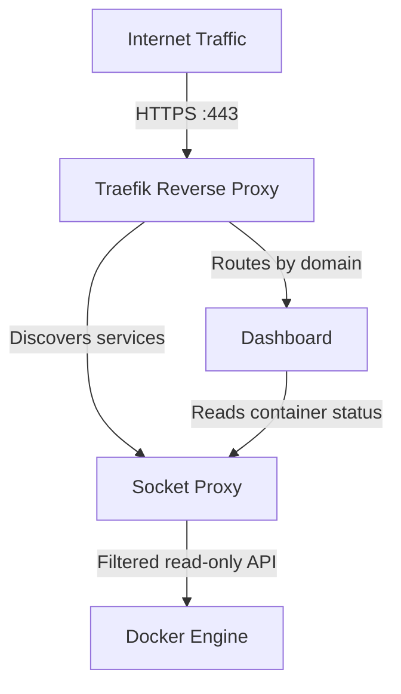

# Chapter 3: Quick Start

> Get Docker Lab running on your server in five minutes, then understand what you just deployed.

## Overview

This chapter is your first hands-on experience with Docker Lab. Think of it like following a recipe: we will list the ingredients you need (prerequisites), walk through each step with expected results, and finish with a taste test (verification). By the end, you will have a working foundation stack with a reverse proxy, a security layer, and a monitoring dashboard -- all running on your own server.

Why does this matter? Docker Lab is infrastructure you operate, not a managed service you sign up for. The fastest way to understand what it provides is to see it running. Everything in this guide is reversible -- if something goes wrong, you can tear it down and start fresh in seconds.

## Prerequisites

Before you begin, gather your ingredients. You need three things: Docker, a server with two open ports, and a domain name pointing to that server.

### Software Requirements

| Requirement | Minimum Version | Check Command |
|-------------|-----------------|---------------|
| Docker Engine | 24.0 | `docker --version` |
| Docker Compose | 2.20 | `docker compose version` |
| Git | Any recent version | `git --version` |

Run these commands to verify your versions:

```bash
$ docker --version
Docker version 27.4.1, build b9d17ea

$ docker compose version
Docker Compose version v2.32.4

$ git --version
git version 2.43.0
```

If any command fails or shows a version below the minimum, install or update before continuing. Docker Compose v2 ships as a plugin with Docker Engine -- if `docker compose` works (no hyphen), you have the right version.

### Server Requirements

| Requirement | Details |
|-------------|---------|
| Operating System | Linux (Ubuntu 22.04+, Debian 12+, or similar) |
| RAM | 2 GB minimum, 4 GB recommended |
| Ports | 80 (HTTP) and 443 (HTTPS) open to the internet |
| Domain | An A record pointing to your server IP |

Docker Lab uses Let's Encrypt for automatic TLS certificates. Let's Encrypt validates your domain by connecting to port 80, so both ports must be reachable from the public internet before you start.

### Local Development Alternative

If you do not have a VPS yet, you can run Docker Lab locally with `DOMAIN=localhost`. TLS certificates will not work in this mode, but everything else functions identically. This is useful for exploring the stack before deploying to a real server.

## Step 1: Clone the Repository

Start by cloning the Docker Lab repository and entering the project directory:

```bash
$ git clone https://github.com/peermesh/docker-lab.git
Cloning into 'docker-lab'...
remote: Enumerating objects: 847, done.
remote: Counting objects: 100% (847/847), done.
Receiving objects: 100% (847/847), 245.18 KiB | 2.15 MiB/s, done.
Resolving deltas: 100% (412/412), done.

$ cd docker-lab
```

You now have the full project. The directory contains compose files, configuration templates, scripts, and documentation.

## Step 2: Configure Your Environment

Docker Lab reads its configuration from a `.env` file at the project root. Start by copying the template:

```bash
$ cp .env.example .env
```

Open `.env` in your editor and set the two required variables:

```bash
# Required: Your domain (services will be available at this domain and its subdomains)
DOMAIN=yourdomain.com

# Required: Email for Let's Encrypt certificate registration
ADMIN_EMAIL=you@yourdomain.com
```

Replace `yourdomain.com` with your actual domain and `you@yourdomain.com` with your real email address. Let's Encrypt uses this email to send certificate expiry warnings -- it never shares it with third parties.

Everything else in `.env` has sensible defaults. You do not need to change any other values for your first deployment. The `COMPOSE_PROFILES` variable is empty by default, which means only the foundation stack starts -- exactly what we want for this quick start.

## Step 3: Generate Secrets

Docker Lab stores credentials as files in a `secrets/` directory, not as environment variables. This prevents passwords from leaking into process listings or container logs. The included script generates all required secrets automatically:

```bash
$ ./scripts/generate-secrets.sh

==========================================
  Peer Mesh Docker Lab - Secrets
==========================================

[INFO] Active profiles: none (foundation-only)

[INFO] Generating required secrets...
[OK] [CREATED] dashboard_username
[OK] [CREATED] dashboard_password
[OK] [CREATED] dashboard_auth

[OK] Secret generation complete
Secrets directory: /opt/peer-mesh-docker-lab/secrets
Validate with: ./scripts/generate-secrets.sh --validate
```

The script is safe to run multiple times -- it only creates secrets that do not already exist. For the foundation stack, it generates three files: a dashboard username (defaults to `admin`), a random password, and an authentication hash that Traefik uses internally.

You can verify everything is in order:

```bash
$ ./scripts/generate-secrets.sh --validate

[INFO] Validating environment configuration...
[OK] DOMAIN=yourdomain.com

[INFO] Validating required secrets...
[OK] [EXISTS] dashboard_username (5 chars)
[OK] [EXISTS] dashboard_password (33 chars)
[OK] [EXISTS] dashboard_auth (72 chars)

[OK] Validation passed
```

## Step 4: Start the Foundation Stack

Launch the services:

```bash
$ docker compose up -d
[+] Running 4/4
 ✔ Network pmdl_socket-proxy    Created
 ✔ Network pmdl_proxy-external  Created
 ✔ Container pmdl_socket-proxy  Started
 ✔ Container pmdl_traefik       Started
 ✔ Container pmdl_dashboard     Started
```

The `-d` flag runs containers in the background. Docker Compose creates the networks first, then starts the containers in dependency order: the socket proxy starts first, then Traefik (which depends on the socket proxy), then the dashboard (which depends on both).

## Step 5: Verify Everything is Running

Check that all three services are healthy:

```bash
$ docker compose ps
NAME                STATUS              PORTS
pmdl_socket-proxy   running             2375/tcp
pmdl_traefik        running (healthy)   0.0.0.0:80->80/tcp, 0.0.0.0:443->443/tcp
pmdl_dashboard      running (healthy)   8080/tcp
```

All services should show `running` or `running (healthy)`. Traefik exposes ports 80 and 443 to the public internet. The dashboard listens on port 8080 internally, but Traefik handles all external routing -- you never access the dashboard port directly.

Now test that your domain responds:

```bash
$ curl -I https://yourdomain.com
HTTP/2 401
server: Traefik
content-type: text/plain
strict-transport-security: max-age=31536000; includeSubDomains; preload
```

A `401 Unauthorized` response is correct -- it means Traefik is running, your TLS certificate was issued, and the dashboard is requiring authentication. Open `https://yourdomain.com` in your browser and log in with the credentials from your secrets directory:

```bash
# View your generated dashboard password
$ cat secrets/dashboard_password
```

The username is `admin` by default. After logging in, you will see the Docker Lab dashboard showing your running services, resource usage, and system health.

## What Just Happened?

You just deployed three services that form the foundation of every Docker Lab deployment. Here is what each one does and why it exists.

The following diagram shows how the three foundation stack components connect:



Traefik receives all incoming HTTPS traffic and routes it to the correct service based on the domain name in the request. It discovers which services exist by querying the Docker engine through the socket proxy. The dashboard also reads container information through the socket proxy to display your system status.

### The Socket Proxy: Your Security Gatekeeper

The Docker socket (`/var/run/docker.sock`) is the master key to your entire container environment. Any service with direct socket access can create containers, delete volumes, or even escape to the host operating system. That is a serious security risk.

The socket proxy sits between your services and the Docker socket, acting as a filter. It allows read-only operations (listing containers, inspecting networks) but blocks anything destructive (creating containers, modifying volumes). Traefik and the dashboard get exactly the access they need and nothing more.

### Traefik: Your Traffic Director

Traefik is a reverse proxy that automatically discovers your Docker services and routes traffic to them. Think of it as a smart receptionist in a building lobby -- when a visitor arrives asking for `yourdomain.com`, Traefik checks its directory and sends them to the dashboard. When you add more services later, Traefik discovers them automatically through Docker labels. You never edit routing configuration files by hand.

Traefik also handles TLS certificates through Let's Encrypt. It requested and installed your HTTPS certificate during startup, and it will renew it automatically before it expires.

### The Dashboard: Your Control Panel

The dashboard gives you a web interface to monitor your Docker Lab deployment. It shows running containers, resource consumption, and system health. Authentication is handled by the dashboard itself -- the password you generated in Step 3 protects it from unauthorized access.

### Network Isolation

Docker Lab creates separate networks to isolate traffic:

| Network | Purpose | Accessible From |
|---------|---------|-----------------|
| `pmdl_socket-proxy` | Docker API communication | Socket proxy, Traefik, dashboard only |
| `pmdl_proxy-external` | HTTP traffic routing | Traefik and web-facing services |
| `pmdl_db-internal` | Database connections | Databases and their client applications |
| `pmdl_app-internal` | Application-to-application communication | Internal services only |

The `socket-proxy` and `db-internal` networks are marked as `internal`, which means containers on those networks cannot reach the internet. This limits the damage if any single service is compromised.

## Using the CLI

Docker Lab includes a unified command-line tool called `launch_peermesh.sh` that wraps common Docker Compose operations. You already used `docker compose` directly in the quick start, but for ongoing management the CLI provides shortcuts:

```bash
# Check deployment status (services, networks, volumes)
$ ./launch_peermesh.sh status

# View Traefik logs in real time
$ ./launch_peermesh.sh logs traefik -f

# Run health checks with endpoint verification
$ ./launch_peermesh.sh health -v

# Stop all services
$ ./launch_peermesh.sh down
```

The CLI also provides an interactive menu when you run it without arguments:

```bash
$ ./launch_peermesh.sh
```

Both approaches -- direct `docker compose` commands and the CLI -- work equally well. Use whichever fits your workflow.

## Stopping and Restarting

To stop all services while keeping your data and certificates:

```bash
$ docker compose down
[+] Running 4/4
 ✔ Container pmdl_dashboard     Removed
 ✔ Container pmdl_traefik       Removed
 ✔ Container pmdl_socket-proxy  Removed
 ✔ Network pmdl_proxy-external  Removed
 ✔ Network pmdl_socket-proxy    Removed
```

To restart, run `docker compose up -d` again. Your TLS certificates and configuration persist in Docker volumes.

To stop and delete all data (including TLS certificates and any database volumes):

```bash
$ docker compose down -v
```

Use the `-v` flag with caution -- it removes all named volumes, which means you will need to re-generate TLS certificates and re-populate any databases on the next start.

## Common Gotchas

### Port 80 or 443 Already in Use

If another service (Apache, Nginx, or another Traefik instance) is already using port 80 or 443, Docker Compose will fail to start:

```text
Error response from daemon: Ports are not available: listen tcp 0.0.0.0:80: bind: address already in use
```

Find and stop the conflicting service:

```bash
$ sudo lsof -i :80
$ sudo systemctl stop nginx  # or apache2, or whatever is using the port
```

### TLS Certificate Not Issued

If you see browser warnings about an invalid certificate, Let's Encrypt could not reach your server on port 80. Verify that:

1. Your domain's A record points to your server's IP address
2. Port 80 is open in your firewall (`sudo ufw allow 80/tcp`)
3. No other service is intercepting port 80

Check Traefik's logs for specific error messages:

```bash
$ docker compose logs traefik | grep -i acme
```

### Dashboard Shows "Unhealthy" After Start

The dashboard depends on both the socket proxy and Traefik. It can take up to 90 seconds for all health checks to pass after a fresh start. Wait a moment and check again:

```bash
$ docker compose ps
```

If the dashboard remains unhealthy after two minutes, check its logs:

```bash
$ docker compose logs dashboard
```

## Key Takeaways

- Docker Lab's foundation stack consists of three services: a socket proxy for security, Traefik for traffic routing and TLS, and a dashboard for monitoring
- Configuration lives in two places: `.env` for environment variables and `secrets/` for credentials
- The `generate-secrets.sh` script handles credential creation and is safe to run repeatedly
- Network isolation separates Docker API traffic, database traffic, and public web traffic into distinct networks
- Everything you deployed is reversible with `docker compose down`

## Next Steps

You now have a running foundation stack, but Docker Lab is designed to do much more. In [Chapter 4: Foundation Stack](./foundation-stack.md), we will take a deeper look at each foundation service -- how Traefik discovers services through Docker labels, how the socket proxy filters API calls, and how to customize the foundation for your specific deployment needs. You will learn to add your own services on top of this foundation and understand the configuration patterns that make Docker Lab composable.
