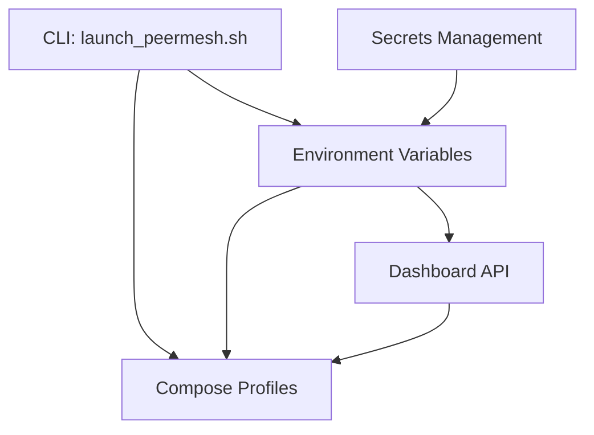
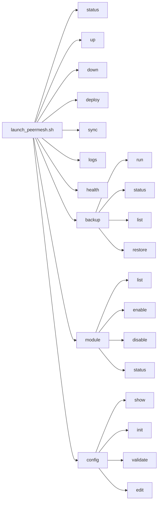
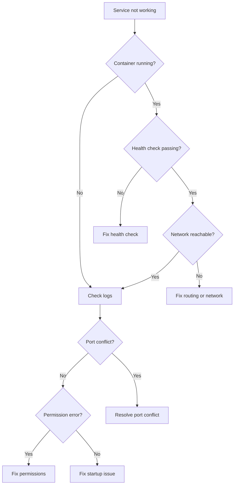

# Chapter 14: Reference

> Your single lookup destination for every CLI command, environment variable, compose profile, API endpoint, and troubleshooting procedure in Docker Lab.

## Overview

Every other chapter in this manual teaches you how Docker Lab works and why it works that way. This chapter is different. It exists so you can find an exact command, check a variable name, or resolve an error message -- fast.

That said, a pure reference dump is hard to navigate if you have no context. Each section in this chapter opens with a short paragraph explaining *when* you would reach for that particular tool or setting. If you are reading this chapter for the first time, skim those paragraphs first; they will save you time later when you are looking something up in the middle of a deployment.

The following diagram shows how the major reference categories in this chapter connect to actual Docker Lab components:



The CLI reads environment variables, activates compose profiles, and can trigger the dashboard API. Secrets feed into environment variables. Profiles determine which services run. Everything connects.

## CLI Reference

### When to Use the CLI

The `launch_peermesh.sh` script is the single entry point for managing Docker Lab deployments. Use it instead of running `docker compose` commands directly. It handles profile selection, configuration validation, environment setup, and deployment orchestration so you do not need to remember the right combination of `-f` flags and compose files.

### Installation

The CLI ships with the repository. No separate installation is needed:

```bash
$ chmod +x launch_peermesh.sh
$ ./launch_peermesh.sh --version
```

For tab completion, install the shell-specific completion scripts:

```bash
# Bash
source scripts/completions/launch_peermesh.bash

# Zsh
fpath=(scripts/completions $fpath)
autoload -Uz compinit && compinit
```

### Command Tree

The following diagram shows every command and its subcommands at a glance:



Ten top-level commands, three of which (`backup`, `module`, `config`) have their own subcommands. Running the script with no arguments launches an interactive menu.

### Command Details

#### status

Show the current deployment status including environment, Docker state, services, networks, and volumes.

```bash
$ ./launch_peermesh.sh status
```

No options. Use this as your first diagnostic step whenever you need to understand what is currently running.

#### up

Start services with optional profiles.

```bash
# Start with default profiles
$ ./launch_peermesh.sh up

# Start with specific profiles
$ ./launch_peermesh.sh up --profile=postgresql,redis

# Build images before starting
$ ./launch_peermesh.sh up --profile=postgresql --build

# Wait until all services report healthy
$ ./launch_peermesh.sh up --wait

# Include an additional compose file
$ ./launch_peermesh.sh up -f docker-compose.webhook.yml
```

| Option | Description |
|--------|-------------|
| `--profile=NAME` | Enable profiles (comma-separated) |
| `-p NAME` | Short form for `--profile` |
| `--build` | Build images before starting |
| `--wait` | Wait for services to be healthy |
| `--no-detach` | Run in foreground (do not daemonize) |
| `-f FILE` | Include additional compose file |

#### down

Stop services and optionally remove volumes.

```bash
# Stop services
$ ./launch_peermesh.sh down

# Stop and remove volumes (destroys data)
$ ./launch_peermesh.sh down --volumes

# Custom shutdown timeout
$ ./launch_peermesh.sh down --timeout=30
```

| Option | Description |
|--------|-------------|
| `-v, --volumes` | Remove volumes |
| `--timeout=N` | Timeout in seconds (default: 10) |
| `--keep-orphans` | Keep orphan containers |

#### deploy

Deploy to a target environment.

```bash
# Deploy locally (default)
$ ./launch_peermesh.sh deploy

# Deploy to staging
$ ./launch_peermesh.sh deploy --target=staging

# Deploy to production
$ ./launch_peermesh.sh deploy --target=production

# Skip pre-deployment backup
$ ./launch_peermesh.sh deploy --target=prod --skip-backup
```

| Option | Description |
|--------|-------------|
| `--target=TARGET` | Target: `local`, `staging`, `prod` |
| `-t TARGET` | Short form for `--target` |
| `--skip-backup` | Skip pre-deployment backup |
| `--profile=NAME` | Override target profiles |

Deploy targets:

- `local` -- runs `docker compose` directly on the current machine
- `staging` -- triggers deployment via webhook
- `production` / `prod` -- triggers production deployment via webhook

#### sync

Trigger synchronization on a remote target. Use this to pull updated images and restart services on a remote server without SSH access.

```bash
# Sync using a configured target
$ ./launch_peermesh.sh sync --target=staging

# Direct webhook call
$ ./launch_peermesh.sh sync --url=https://webhook.example.com/hooks/deploy --secret=TOKEN
```

| Option | Description |
|--------|-------------|
| `--target=TARGET` | Target name from config |
| `-t TARGET` | Short form for `--target` |
| `--url=URL` | Direct webhook URL |
| `--secret=TOKEN` | Webhook authentication token |

#### logs

View service logs. Wraps `docker compose logs` with sensible defaults.

```bash
# All services
$ ./launch_peermesh.sh logs

# Specific service
$ ./launch_peermesh.sh logs traefik

# Follow logs in real time
$ ./launch_peermesh.sh logs traefik -f

# Last 50 lines with timestamps
$ ./launch_peermesh.sh logs traefik -n 50 -t
```

| Option | Description |
|--------|-------------|
| `-f, --follow` | Follow log output |
| `-n, --tail N` | Number of lines (default: 100) |
| `-t, --timestamps` | Show timestamps |

#### health

Run health checks on services. A quick way to confirm everything is running correctly after a deployment.

```bash
# Basic health check
$ ./launch_peermesh.sh health

# Verbose with endpoint checks
$ ./launch_peermesh.sh health -v

# Check a specific service
$ ./launch_peermesh.sh health postgres
```

| Option | Description |
|--------|-------------|
| `-v, --verbose` | Show detailed endpoint checks |

#### backup

Manage backups. Requires the backup module to be enabled.

```bash
# Run a full backup
$ ./launch_peermesh.sh backup run

# Backup PostgreSQL only
$ ./launch_peermesh.sh backup run --target=postgres

# Backup volumes only
$ ./launch_peermesh.sh backup run --target=volumes

# Show backup status
$ ./launch_peermesh.sh backup status

# List available backups
$ ./launch_peermesh.sh backup list
```

| Subcommand | Description |
|------------|-------------|
| `run` | Run backup now |
| `status` | Show backup status |
| `list` | List available backups |
| `restore` | Show restore instructions |

| Option | Description |
|--------|-------------|
| `--target=TYPE` | `postgres`, `volumes`, or `all` |

#### module

Manage optional modules (backup, monitoring, and others).

```bash
# List available modules
$ ./launch_peermesh.sh module list

# Enable a module
$ ./launch_peermesh.sh module enable backup

# Disable a module
$ ./launch_peermesh.sh module disable backup

# Show module status
$ ./launch_peermesh.sh module status backup
```

| Subcommand | Description |
|------------|-------------|
| `list` | List available modules |
| `enable NAME` | Enable a module |
| `disable NAME` | Disable a module |
| `status NAME` | Show module status |

#### config

Manage configuration files. Use this before your first deployment and whenever you need to verify settings.

```bash
# Show current configuration
$ ./launch_peermesh.sh config show

# Initialize configuration files
$ ./launch_peermesh.sh config init

# Validate configuration
$ ./launch_peermesh.sh config validate

# Edit configuration
$ ./launch_peermesh.sh config edit
$ ./launch_peermesh.sh config edit config/targets.yml
```

| Subcommand | Description |
|------------|-------------|
| `show` | Show current configuration |
| `init` | Initialize configuration files |
| `validate` | Validate configuration |
| `edit [FILE]` | Edit configuration file |

### Configuration File Precedence

The CLI reads configuration from these locations in order of precedence (first match wins):

1. `.peermesh.yml` -- project root (preferred)
2. `config/targets.yml` -- project config directory
3. `~/.config/peermesh/targets.yml` -- user config directory

Copy from the provided examples to get started:

```bash
$ cp .peermesh.yml.example .peermesh.yml
$ cp config/targets.yml.example config/targets.yml
```

## Environment Variables

### When to Use Environment Variables

Environment variables control how every Docker Lab service behaves. You set them in a `.env` file at the project root, and Docker Compose injects them into container environments at startup. When something is not working as expected, the `.env` file is the first place to check.

Copy the template to get started:

```bash
$ cp .env.example .env
```

### Required Variables

These two variables must be set before starting any services. Without them, Traefik cannot obtain TLS certificates and services will not route correctly.

| Variable | Description | Example |
|----------|-------------|---------|
| `DOMAIN` | Base domain for all services | `dockerlab.example.com` |
| `ADMIN_EMAIL` | Email for Let's Encrypt certificates | `admin@example.com` |

### Core Settings

General settings that affect the entire deployment.

| Variable | Default | Description |
|----------|---------|-------------|
| `ENVIRONMENT` | `development` | Environment: `development`, `staging`, `production` |
| `COMPOSE_PROJECT_NAME` | `peermesh` | Docker Compose project prefix for container names |
| `TZ` | `UTC` | Timezone for all containers |
| `RESOURCE_PROFILE` | `core` | Resource allocation profile: `lite`, `core`, `full` |
| `COMPOSE_PROFILES` | (none) | Active tech profiles (comma-separated) |
| `DEBUG` | (unset) | Set to `true` to enable debug output from CLI |

### Traefik (Reverse Proxy)

| Variable | Default | Description |
|----------|---------|-------------|
| `TRAEFIK_DASHBOARD_ENABLED` | `true` | Enable Traefik web dashboard |
| `TRAEFIK_LOG_LEVEL` | `ERROR` | Log level: `DEBUG`, `INFO`, `WARN`, `ERROR` |
| `TRAEFIK_ACME_STAGING` | `true` | Use Let's Encrypt staging server (set `false` for production) |

### Network

| Variable | Default | Description |
|----------|---------|-------------|
| `HTTP_PORT` | `80` | HTTP port (redirects to HTTPS) |
| `HTTPS_PORT` | `443` | HTTPS port |
| `TRAEFIK_DASHBOARD_PORT` | `8080` | Dashboard port (development only) |

### Dashboard

| Variable | Default | Description |
|----------|---------|-------------|
| `DOCKERLAB_USERNAME` | `admin` | Dashboard login username |
| `DOCKERLAB_PASSWORD` | (none, required) | Dashboard login password |
| `DOCKERLAB_DEMO_MODE` | `false` | Enable demo mode with guest access |
| `DOCKERLAB_INSTANCE_NAME` | hostname | Name for this dashboard instance |
| `DOCKERLAB_INSTANCE_ID` | auto-generated | Unique instance identifier |
| `DOCKERLAB_INSTANCE_URL` | auto-detected | Public URL of this dashboard |
| `DOCKERLAB_INSTANCE_SECRET` | same as password | Shared secret for instance-to-instance auth |
| `DOCKER_HOST` | `http://socket-proxy:2375` | Docker socket proxy URL |
| `PORT` | `8080` | Dashboard HTTP port inside the container |
| `APP_VERSION` | `0.1.0-mvp` | Application version string |
| `SYNC_SCRIPT` | (uses `docker compose pull`) | Custom sync script path |

Deprecated dashboard variables (still supported):

| Old Variable | Use Instead |
|-------------|-------------|
| `DASHBOARD_USERNAME` | `DOCKERLAB_USERNAME` |
| `DASHBOARD_PASSWORD` | `DOCKERLAB_PASSWORD` |
| `DEMO_MODE` | `DOCKERLAB_DEMO_MODE` |
| `INSTANCE_NAME` | `DOCKERLAB_INSTANCE_NAME` |

### Authelia (Authentication)

| Variable | Default | Description |
|----------|---------|-------------|
| `AUTHELIA_JWT_SECRET_FILE` | `/run/secrets/authelia_jwt` | Path to JWT secret file |
| `AUTHELIA_SESSION_SECRET_FILE` | `/run/secrets/authelia_session` | Path to session secret file |
| `AUTHELIA_DEFAULT_2FA_METHOD` | `totp` | Default 2FA method: `totp`, `webauthn` |

### Database Profiles

#### PostgreSQL

| Variable | Default | Description |
|----------|---------|-------------|
| `POSTGRES_VERSION` | `16` | PostgreSQL version |
| `POSTGRES_USER` | `postgres` | Superuser username |
| `POSTGRES_PASSWORD_FILE` | `/run/secrets/postgres_password` | Password file path |
| `POSTGRES_MAX_CONNECTIONS` | `100` | Maximum connections |
| `POSTGRES_SHARED_BUFFERS` | `256MB` | Shared memory buffers |

#### MySQL

| Variable | Default | Description |
|----------|---------|-------------|
| `MYSQL_VERSION` | `8.0` | MySQL version |
| `MYSQL_ROOT_PASSWORD_FILE` | `/run/secrets/mysql_root_password` | Root password file |
| `MYSQL_INNODB_BUFFER_POOL_SIZE` | `256M` | InnoDB buffer pool |

#### MongoDB

| Variable | Default | Description |
|----------|---------|-------------|
| `MONGO_VERSION` | `7.0` | MongoDB version |
| `MONGO_INITDB_ROOT_USERNAME` | `admin` | Admin username |
| `MONGO_INITDB_ROOT_PASSWORD_FILE` | `/run/secrets/mongo_password` | Password file path |

#### Redis

| Variable | Default | Description |
|----------|---------|-------------|
| `REDIS_VERSION` | `7` | Redis version |
| `REDIS_PASSWORD_FILE` | `/run/secrets/redis_password` | Password file path |
| `REDIS_MAXMEMORY` | `128mb` | Maximum memory |
| `REDIS_MAXMEMORY_POLICY` | `allkeys-lru` | Eviction policy |

#### MinIO (Object Storage)

| Variable | Default | Description |
|----------|---------|-------------|
| `MINIO_ROOT_USER` | `minio` | Admin username |
| `MINIO_ROOT_PASSWORD_FILE` | `/run/secrets/minio_password` | Password file path |
| `MINIO_BROWSER` | `on` | Enable web console |

### Backup

| Variable | Default | Description |
|----------|---------|-------------|
| `BACKUP_ENABLED` | `true` | Enable automated backups |
| `BACKUP_RETENTION_DAYS` | `7` | Days to keep local backups |
| `BACKUP_SCHEDULE` | `0 2 * * *` | Cron schedule (2 AM daily) |
| `BACKUP_ENCRYPTION_KEY_FILE` | `/run/secrets/backup_key` | Encryption key file |

### Development vs Production Quick Reference

For development, use these settings in your `.env`:

```bash
ENVIRONMENT=development
TRAEFIK_DASHBOARD_ENABLED=true
TRAEFIK_ACME_STAGING=true
TRAEFIK_LOG_LEVEL=DEBUG
```

For production, switch to:

```bash
ENVIRONMENT=production
TRAEFIK_DASHBOARD_ENABLED=false
TRAEFIK_ACME_STAGING=false
TRAEFIK_LOG_LEVEL=ERROR
```

The key difference is `TRAEFIK_ACME_STAGING`. In development, this setting uses Let's Encrypt staging certificates to avoid hitting rate limits. In production, real certificates are issued.

## Compose Profiles

### When to Use Profiles

Compose profiles let you pick which services run in a given deployment. The foundation stack (socket proxy, Traefik, dashboard) always runs. Profiles add optional infrastructure on top: databases, caching, object storage, and monitoring. Instead of maintaining separate compose files for every combination, you activate the profiles you need.

### Resource Profiles

Resource profiles control memory and CPU allocation for services. Choose the profile that matches your deployment target.

#### lite -- CI/CD and Testing

Total envelope: approximately 512 MB RAM, 0.5 CPU

| Service | Memory Limit | Memory Reserved | CPU Limit |
|---------|-------------|-----------------|-----------|
| Traefik | 128 MB | 64 MB | 0.25 |
| Authelia | 128 MB | 64 MB | 0.25 |
| Redis | 64 MB | 32 MB | 0.1 |
| PostgreSQL | 256 MB | 128 MB | 0.5 |
| MySQL | 256 MB | 128 MB | 0.5 |

Use `lite` for CI/CD pipelines, local development on resource-constrained machines, and quick validation.

#### core -- Development and Staging

Total envelope: approximately 2 GB RAM, 2 CPU

| Service | Memory Limit | Memory Reserved | CPU Limit |
|---------|-------------|-----------------|-----------|
| Traefik | 256 MB | 128 MB | 0.5 |
| Authelia | 256 MB | 128 MB | 0.5 |
| Redis | 128 MB | 64 MB | 0.25 |
| PostgreSQL | 512 MB | 256 MB | 1.0 |
| MySQL | 512 MB | 256 MB | 1.0 |

Use `core` for development servers, staging environments, and small production deployments.

#### full -- Production with Monitoring

Total envelope: approximately 8 GB RAM, 4 CPU

| Service | Memory Limit | Memory Reserved | CPU Limit |
|---------|-------------|-----------------|-----------|
| Traefik | 512 MB | 256 MB | 1.0 |
| Authelia | 512 MB | 256 MB | 1.0 |
| Redis | 256 MB | 128 MB | 0.5 |
| PostgreSQL | 2 GB | 1 GB | 2.0 |
| MySQL | 2 GB | 1 GB | 2.0 |
| Prometheus | 1 GB | 512 MB | 1.0 |
| Grafana | 512 MB | 256 MB | 0.5 |

Use `full` for production deployments that need monitoring, metrics, and higher resource headroom.

Set your resource profile in `.env`:

```bash
RESOURCE_PROFILE=core
```

### Tech Profiles (Supporting Services)

Tech profiles add infrastructure services to your deployment. Each profile is self-contained with its own compose file, health checks, and initialization scripts.

| Profile | Service | Purpose | Default Port |
|---------|---------|---------|--------------|
| `postgresql` | PostgreSQL 16 | Relational database with pgvector | 5432 |
| `mysql` | MySQL 8.0 | Traditional web database | 3306 |
| `mongodb` | MongoDB 7.0 | Document database | 27017 |
| `redis` | Redis 7 | Caching and sessions | 6379 |
| `minio` | MinIO | S3-compatible object storage | 9000 / 9001 |

Planned profiles (not yet available):

| Profile | Service | Purpose |
|---------|---------|---------|
| `monitoring` | Prometheus + Grafana | Metrics and dashboards |
| `backup` | Restic + rclone | Automated backups |
| `dev` | Dev tools | Hot reload and debugging |

### Profile Activation

Activate tech profiles through the CLI or directly with `docker compose`:

```bash
# Via CLI (recommended)
$ ./launch_peermesh.sh up --profile=postgresql,redis

# Via docker compose directly
$ docker compose -f docker-compose.yml \
                 -f .dev/profiles/postgresql/docker-compose.postgresql.yml \
                 -f .dev/profiles/redis/docker-compose.redis.yml \
                 up -d
```

### Service-to-Profile Matrix

This matrix shows which services are included with each profile and which network they connect to.

| Service | Profile | Network |
|---------|---------|---------|
| socket-proxy | foundation (always on) | `socket-internal` |
| Traefik | foundation (always on) | `proxy-external`, `socket-internal` |
| dashboard | foundation (always on) | `proxy-external` |
| PostgreSQL | `postgresql` | `db-internal` |
| MySQL | `mysql` | `db-internal` |
| MongoDB | `mongodb` | `db-internal` |
| Redis | `redis` | `db-internal` |
| MinIO | `minio` | `db-internal`, `proxy-external` |
| Prometheus | `monitoring` (planned) | `monitoring` |
| Grafana | `monitoring` (planned) | `monitoring`, `proxy-external` |

### Network Topology

Docker Lab uses four dedicated networks to isolate traffic:

| Network | Purpose | Who Connects |
|---------|---------|-------------|
| `proxy-external` | Services accessible through Traefik | Traefik, dashboard, MinIO console, Grafana |
| `db-internal` | Database access (not internet-exposed) | Databases, application services |
| `socket-internal` | Docker socket proxy access | Traefik, socket-proxy |
| `monitoring` | Metrics collection | Prometheus, Grafana, exporters |

### Profile Directory Structure

Each profile follows a standard layout:

```text
profiles/postgresql/
  PROFILE-SPEC.md                          # Complete specification
  docker-compose.postgresql.yml            # Compose definition
  init-scripts/                            # Database initialization
  backup-scripts/                          # Backup procedures
  healthcheck-scripts/                     # Health checks
```

### Overriding Resource Limits

Create a `docker-compose.override.yml` to customize resource limits without editing profile files:

```yaml
services:
  postgres:
    deploy:
      resources:
        limits:
          memory: 4G
          cpus: '4'
        reservations:
          memory: 2G
```

## Dashboard API

### When to Use the API

The dashboard API powers the web interface, but you can also call it directly for scripting, monitoring integration, or automation. All endpoints return JSON. Write operations require authentication; read operations require authentication unless demo mode is enabled.

### Core Endpoints

| Endpoint | Method | Description | Auth Required |
|----------|--------|-------------|--------------|
| `/api/system` | GET | Host system information (hostname, OS, CPU, memory) | Yes |
| `/api/containers` | GET | Container list with resource usage | Yes |
| `/api/volumes` | GET | Docker volume inventory | Yes |
| `/api/alerts` | GET | System health alerts | Yes |
| `/api/events` | GET | Server-Sent Events stream (real-time updates) | Yes |
| `/api/session` | GET | Current session info | Yes |
| `/api/login` | POST | Authenticate user | No |
| `/api/logout` | POST | End session | Yes |
| `/health` | GET | Liveness probe | Yes |

### Multi-Instance Endpoints

These endpoints support managing multiple Docker Lab deployments from a single dashboard.

| Endpoint | Method | Description | Auth Required |
|----------|--------|-------------|--------------|
| `/api/instances` | GET | List all registered instances | Yes |
| `/api/instances` | POST | Register a new remote instance | Yes (non-guest) |
| `/api/instances/{id}` | GET | Get instance details | Yes |
| `/api/instances/{id}` | DELETE | Remove a registered instance | Yes (non-guest) |
| `/api/instances/{id}/health` | GET | Check instance health | Yes |
| `/api/instances/{id}/sync` | POST | Trigger sync on remote instance | Yes (non-guest) |
| `/api/instances/{id}/containers` | GET | Get containers from remote instance | Yes |

### SSE Event Types

The `/api/events` endpoint streams three event types:

| Event Type | Interval | Data |
|------------|----------|------|
| `containers` | Every 10 seconds | Updated container list with CPU and memory metrics |
| `system` | Every 10 seconds | System resource statistics |
| `error` | On occurrence | Errors fetching data from Docker API |

A keepalive comment is sent every 30 seconds to prevent connection timeouts.

### Authentication

The dashboard uses session-based authentication with bcrypt password hashing. Rate limiting is set to 10 requests per minute per IP address.

Security headers applied to all responses:

- HSTS (HTTP Strict Transport Security)
- X-Frame-Options
- XSS protection
- Not indexed by search engines

### Example: Register a Remote Instance

```bash
$ curl -X POST https://dockerlab.example.com/api/instances \
  -H "Content-Type: application/json" \
  -H "Cookie: session=your-session-cookie" \
  -d '{
    "name": "Staging Server",
    "url": "https://staging.example.com",
    "description": "Staging environment",
    "token": "shared-secret"
  }'
```

### Example: Check Health

```bash
$ curl https://dockerlab.example.com/api/instances/abc123/health \
  -H "Cookie: session=your-session-cookie"
```

### Permission Matrix (Multi-Instance)

| User Type | View Instances | Register / Remove | Health Check | Trigger Sync | View Remote Containers |
|-----------|---------------|-------------------|--------------|--------------|----------------------|
| Authenticated | Yes | Yes | Yes | Yes | Yes |
| Guest | Yes | No | Yes | No | Yes |
| Unauthenticated | No | No | No | No | No |

## Secrets Management

### When to Use Secrets

Every password, API key, and encryption token in Docker Lab is stored as a file in the `secrets/` directory, never as a plain environment variable. This prevents accidental exposure in logs, process listings, or `docker inspect` output. Docker Compose mounts these files into containers at `/run/secrets/`.

### Secret Files

Generate all required secrets in one step:

```bash
$ ./scripts/generate-secrets.sh
```

| File | Purpose |
|------|---------|
| `secrets/authelia_jwt` | Authelia JWT signing key |
| `secrets/authelia_session` | Authelia session encryption |
| `secrets/postgres_password` | PostgreSQL superuser password |
| `secrets/mysql_root_password` | MySQL root password |
| `secrets/redis_password` | Redis authentication |
| `secrets/backup_key` | Backup encryption key |

To regenerate a single secret:

```bash
$ openssl rand -base64 32 > secrets/my_secret
$ chmod 600 secrets/my_secret
```

### SOPS + age Encryption

For team-based secrets management, Docker Lab uses SOPS with age encryption. Encrypted files live in git; only team members with the correct private key can decrypt them.

The secrets directory structure:

```text
secrets/
  .sops.yaml              # Key configuration (committed to git)
  production.enc.yaml     # Encrypted production secrets
  staging.enc.yaml        # Encrypted staging secrets
  development.enc.yaml    # Encrypted development secrets
  justfile                # All secrets management commands
  lib/secrets-lib.sh      # Helper functions
  keys/public/            # Team member public keys
  audit.log               # Local operation log (gitignored)
```

### Key SOPS Commands

| Command | Description |
|---------|-------------|
| `just init` | Check dependencies and key configuration |
| `just verify` | Verify you can decrypt secrets |
| `just view production` | View secrets (masked values) |
| `just view production --reveal` | View secrets (full values) |
| `just edit staging` | Edit secrets (auto-encrypts on save) |
| `just add DATABASE_URL "value" production` | Add a secret to an environment |
| `just rotate DB_PASSWORD production` | Rotate a secret interactively |
| `just deploy production` | Decrypt and inject into `docker compose` |
| `just show-pubkey` | Display your public key |
| `just list-members` | Show who has access |
| `just audit 50` | View last 50 audit log entries |

### Secrets Handling Patterns

Different applications expect secrets in different formats. Using the wrong method causes silent authentication failures. Docker Lab recognizes three patterns:

**Pattern A: File Path (_FILE suffix)** -- The application reads a secret from a file. Docker mounts the secret at `/run/secrets/` and you point the app to that path via an environment variable ending in `_FILE`. This is the most secure method because the secret never appears in environment variable listings or `docker inspect` output.

```yaml
services:
  postgres:
    image: postgres:16
    environment:
      POSTGRES_PASSWORD_FILE: /run/secrets/db_password
    secrets:
      - db_password

secrets:
  db_password:
    file: ./secrets/db_password.txt
```

**Pattern B: Direct Environment Variable** -- The application reads the secret from a standard environment variable. Simple and universal, but the secret is visible in `docker inspect` and `/proc/<pid>/environ`.

**Pattern C: Docker Secrets Native** -- The application reads directly from `/run/secrets/` without any environment variable. The most secure method, but requires explicit application support.

**Which pattern does your application use?** Consult this lookup table:

| Application | Pattern | Variable | Notes |
|-------------|---------|----------|-------|
| PostgreSQL | A or B | `POSTGRES_PASSWORD_FILE` or `POSTGRES_PASSWORD` | Official image supports `_FILE` |
| MySQL | A or B | `MYSQL_ROOT_PASSWORD_FILE` or `MYSQL_ROOT_PASSWORD` | Official image supports `_FILE` |
| MariaDB | A or B | `MARIADB_ROOT_PASSWORD_FILE` or `MARIADB_ROOT_PASSWORD` | Official image supports `_FILE` |
| MongoDB | A or B | `MONGO_INITDB_ROOT_PASSWORD_FILE` or `MONGO_INITDB_ROOT_PASSWORD` | Official image supports `_FILE` |
| Redis | B | `REDIS_PASSWORD` | No `_FILE` support |
| Node.js apps | B | Varies | Typically direct env vars |
| Go apps | B | Varies | Typically direct env vars |
| Django | B | `DJANGO_SECRET_KEY` | Typically direct env vars |
| GoToSocial | B | `GTS_DB_PASSWORD` | Direct env vars |

**Rule of thumb**: Always try Pattern A first. If the app does not support `_FILE`, fall back to Pattern B. Watch for trailing whitespace in secret files -- a stray newline causes authentication failures that are difficult to diagnose:

```bash
# Create secret without trailing newline
$ echo -n "mysecret" > secrets/db_password.txt

# Verify no newline
$ wc -c secrets/db_password.txt
```

## Patterns Reference

### When to Use This Section

Docker Lab documents four reusable patterns that apply across all services and applications. Consult these patterns when you are adding a new service, writing health checks, configuring proxy trust, or managing volumes. Each pattern captures lessons from real-world deployment failures.

### Reverse Proxy Application Pattern

Every application behind Traefik needs to trust the proxy so it can see the real client IP address instead of the Docker internal IP. Without this, rate limiting targets the proxy itself, federation protocols fail, and logs show useless `172.x.x.x` addresses.

**When this applies**: Any service with `traefik.enable=true` labels that has rate limiting, client IP logging, federation (ActivityPub, Matrix), or OAuth callbacks.

**The fix**: Add Docker network CIDRs to the application's trusted proxy configuration:

```yaml
environment:
  TRUSTED_PROXIES: "172.16.0.0/12,10.0.0.0/8"
```

Common per-application variable names:

| Application | Variable |
|-------------|----------|
| GoToSocial | `GTS_TRUSTED_PROXIES` |
| Mastodon | `TRUSTED_PROXY_IP` |
| FreshRSS | `TRUSTED_PROXY` |
| Express.js (Node) | `TRUST_PROXY` (set to `"1"`) |
| Laravel / PHP | `TRUSTED_PROXIES` |

**Headers Traefik forwards automatically:**

| Header | Purpose | Example |
|--------|---------|---------|
| `X-Forwarded-For` | Original client IP | `203.0.113.50` |
| `X-Forwarded-Proto` | Original protocol | `https` |
| `X-Forwarded-Host` | Original hostname | `app.example.com` |
| `X-Forwarded-Port` | Original port | `443` |
| `X-Real-IP` | Client IP (single value) | `203.0.113.50` |

**Symptoms of missing proxy trust:**

| Symptom | Cause |
|---------|-------|
| Rate limiting blocks your own users | App sees Traefik IP, not client IP |
| Federation requests rejected | HTTP signatures fail on proxied requests |
| HTTPS redirect loops | App sees HTTP from proxy, redirects endlessly |
| OAuth callback failures | Wrong protocol in redirect URLs |

**Validation**: Check what IP the application sees in its logs. You should see external IP addresses, not `172.x.x.x`:

```bash
$ docker logs pmdl_myapp 2>&1 | tail -20
```

Find your actual Docker network CIDR:

```bash
$ docker network inspect pmdl_proxy-external --format '{{range .IPAM.Config}}{{.Subnet}}{{end}}'
```

### Volume Management Pattern

Failed deployments can corrupt Docker volumes, leaving directories where files should exist. Subsequent deployments fail with cryptic "is a directory" errors. This pattern prevents and recovers from volume corruption.

**Pre-deployment check**: Run `./scripts/init-volumes.sh` before every first deployment. This script verifies volume ownership matches what each container expects.

**Non-root container volume ownership:**

| Application | Container UID | Required Ownership |
|-------------|---------------|--------------------|
| Synapse | 991 | `991:991` |
| PeerTube | 1000 | `1000:1000` |
| Redis | 999 | `999:999` |
| PostgreSQL | 999 | `999:999` |
| MongoDB | 999 | `999:999` |

**Recovery when corruption is detected:**

```bash
# 1. Stop containers
$ docker compose down

# 2. Identify corrupted paths (directories where files should be)
$ VOLUME_PATH=$(docker volume inspect pmdl_synapse_data --format '{{ .Mountpoint }}')
$ ls -la "$VOLUME_PATH"

# 3. Remove corrupted directories
$ sudo rm -rf "$VOLUME_PATH/homeserver.yaml"

# 4. Redeploy
$ docker compose up -d
```

**Complete reset (destroys all data in the volume):**

```bash
$ docker compose down
$ docker volume rm pmdl_synapse_data
$ docker compose up -d
$ ./scripts/init-volumes.sh
```

### Alpine Container Pattern

Many Docker Lab services use Alpine Linux-based images for their minimal footprint. Alpine containers differ from standard Linux containers in ways that cause subtle failures if you are not aware of them.

**Key differences from standard containers:**

| Standard Linux | Alpine Linux |
|---------------|-------------|
| `curl` available | Only `wget` is available |
| `bash` available | Only `sh` (ash) is available |
| `localhost` resolves to IPv4 | `localhost` may resolve to IPv6 |
| `#!/bin/bash` works | Use `#!/bin/sh` |
| `set -o pipefail` works | Not supported in ash |
| `[[ ]]` test syntax works | Use `[ ]` instead |

**Health check pattern for Alpine containers:**

```yaml
# WRONG -- curl not available, localhost may resolve to IPv6
healthcheck:
  test: ["CMD-SHELL", "curl -f http://localhost:3000/health || exit 1"]

# CORRECT -- wget with explicit IPv4
healthcheck:
  test: ["CMD-SHELL", "wget -q --spider http://127.0.0.1:3000/health || exit 1"]
  interval: 30s
  timeout: 10s
  retries: 3
  start_period: 60s
```

**Before deploying an Alpine-based service, verify:**

1. Health checks use `wget` instead of `curl`
2. Health checks target `127.0.0.1` instead of `localhost`
3. Any custom scripts use `#!/bin/sh` and avoid bash-specific syntax
4. Required tools are either present in the image or added via a custom Dockerfile

## Troubleshooting

### When to Use This Section

Come here when something is broken. Each entry follows a pattern: symptom, cause, fix. Start with the quick diagnostics, then look for your specific symptom.

### Quick Diagnostics

Run these four commands before anything else. They answer the four most common questions: "What is running?", "What happened recently?", "Are resources exhausted?", and "Is the configuration valid?"

```bash
# What is running?
$ docker compose ps

# What happened recently?
$ docker compose logs --tail=50

# Are resources exhausted?
$ docker stats --no-stream

# Is the configuration valid?
$ docker compose config
```

### Troubleshooting Decision Tree

The following flowchart helps you narrow down the problem category quickly:



Start at the top. Is the container running? If not, check logs and look for port conflicts or permission errors. If it is running but unhealthy, fix the health check. If it is running and healthy but not responding, check network and routing.

### Container Will Not Start

**Symptom**: Container status shows "Restarting" or "Exit 1."

**Common causes and fixes:**

1. **Missing secrets** -- secret files do not exist.

```bash
$ ls -la secrets/
# If empty:
$ ./scripts/generate-secrets.sh
```

2. **Permission denied on secrets** -- file permissions too open or too restrictive.

```bash
$ chmod 700 secrets/
$ chmod 600 secrets/*
```

3. **Missing environment variables** -- `.env` file is absent or incomplete.

```bash
$ cat .env | grep -E "DOMAIN|ADMIN_EMAIL"
```

4. **Volume permission issues** -- database containers need specific ownership.

```bash
# PostgreSQL (uid 70)
$ sudo chown -R 70:70 ./data/postgres/

# MySQL (uid 999)
$ sudo chown -R 999:999 ./data/mysql/

# MongoDB (uid 999)
$ sudo chown -R 999:999 ./data/mongodb/
```

### Port Conflicts

**Symptom**: Error message "bind: address already in use."

Find what is using the port:

```bash
$ lsof -i :80
$ lsof -i :443
```

| Port | Common Conflicts |
|------|------------------|
| 80 | Apache, nginx, other web servers |
| 443 | Apache, nginx, other web servers |
| 5432 | Local PostgreSQL installation |
| 3306 | Local MySQL installation |
| 6379 | Local Redis installation |

Fix by either stopping the conflicting service or changing the port in `.env`:

```bash
HTTP_PORT=8080
HTTPS_PORT=8443
```

### Health Check Failures

**Symptom**: Container status shows "(unhealthy)" and dependent services refuse to start.

Increase timeouts for slow systems with a `docker-compose.override.yml`:

```yaml
services:
  postgres:
    healthcheck:
      start_period: 120s
      interval: 30s
      timeout: 15s
      retries: 5
```

Run a health check manually to see the actual error:

```bash
$ docker compose exec postgres pg_isready -U postgres
```

### Database Connection Failures

**Symptom**: Application logs show "connection refused."

1. Check the database container is healthy: `docker compose ps postgres`
2. Verify network connectivity: `docker network inspect db-internal`
3. Confirm credentials: verify the secret file exists and has content
4. Check initialization: look for "database system is ready to accept connections" in logs

### TLS Certificate Issues

**Symptom**: Browser shows "connection not secure" or certificate errors.

For development, confirm you are using staging certificates:

```bash
TRAEFIK_ACME_STAGING=true
```

For production, verify the certificate is from a real CA:

```bash
$ echo | openssl s_client -connect your-domain:443 -servername your-domain 2>/dev/null \
  | openssl x509 -noout -subject -issuer
```

If the issuer shows "TRAEFIK DEFAULT CERT", the ACME certificate was not obtained. Check:

- `ADMIN_EMAIL` is a real email address (not `example.com`)
- Ports 80 and 443 are publicly accessible
- The domain resolves to your server

### Memory Issues

**Symptom**: Containers killed (OOMKilled) or "cannot allocate memory" errors.

```bash
$ docker stats --no-stream
```

Switch to a smaller resource profile:

```bash
RESOURCE_PROFILE=lite
```

Or reduce the number of running services:

```bash
$ docker compose up -d traefik postgres
```

### Traefik Routing Issues

**Symptom**: 404 errors or "Bad Gateway" (502) for configured services.

1. Verify Traefik sees the service:

```bash
$ curl http://localhost:8080/api/http/routers
```

2. Check labels include `traefik.enable=true` (the most common omission)

3. Confirm the service is on the `proxy-external` network:

```bash
$ docker network inspect proxy-external
```

### Dashboard-Specific Issues

**Empty resource charts**: Wait 10-15 seconds for the first SSE data poll. If charts remain empty, check the browser console for SSE errors and verify `/api/events` is accessible.

**Repeated login redirects**: Session cookies require HTTPS. Verify the dashboard is served over HTTPS. Check for browser extensions blocking cookies.

**Volume sizes show as 0**: This is expected behavior. Docker does not always report volume size through the API; it depends on the storage driver.

### Collecting Debug Information

When asking for help, gather this information first:

```bash
$ docker version
$ docker compose version
$ uname -a
$ docker compose ps
$ docker compose logs --tail=100 > debug-logs.txt
$ docker compose config > debug-config.txt
```

Remove any secrets from `debug-config.txt` before sharing.

## Gotchas

### When to Read This Section

Read this section before your first deployment. These are the issues that waste the most time because they are not obvious from reading configuration files or error messages alone. Each gotcha was discovered through real-world deployment and testing.

### Gotcha 1: Directory Instead of File Mounts

When a bind-mounted file path does not exist on the host, Docker creates a directory at that path instead of a file. Services that expect a configuration file find a directory and crash.

**Symptoms**: Container exits with file parse errors, or logs report "is a directory" for a config path.

**Prevention**: Run `./scripts/init-volumes.sh` before first startup.

**Fix**:

```bash
$ rm -rf examples/matrix/config/homeserver.yaml
$ touch examples/matrix/config/homeserver.yaml
```

### Gotcha 2: Non-Root Volume Permissions

Some images run as non-root users (PostgreSQL as uid 70, Redis as uid 999, PeerTube as uid 1000). If volume ownership does not match, startup fails.

**Prevention**: Run `./scripts/init-volumes.sh` and re-run it after adding new services.

### Gotcha 3: Database Init Script Collisions

Reusing data volumes with changed application setup causes migration collisions like "relation already exists."

**Fix for disposable environments**:

```bash
$ ./launch_peermesh.sh down --volumes
$ ./launch_peermesh.sh up --profile=postgresql
```

### Gotcha 4: URL / Domain Mismatch

Services require URLs that match Traefik host routing. Mismatches cause redirect loops, callback failures, and broken absolute URLs.

**Prevention**: Set `DOMAIN` and all service-specific URL variables in `.env`, then validate:

```bash
$ ./scripts/generate-secrets.sh --validate
```

### Gotcha 5: SCP / Deploy File Permissions

Copied files can end up with wrong ownership or insecure mode bits on the target server.

**Fix**:

```bash
$ find secrets -type f -exec chmod 600 {} \;
$ find secrets -type d -exec chmod 700 {} \;
$ chmod +x scripts/*.sh
```

### Gotcha 6: Compose Drift Between Override Files

Multiple `-f` compose files can silently override values. Always inspect the merged config before deploying:

```bash
$ ./scripts/deploy.sh --validate -f docker-compose.dc.yml
```

### Gotcha 7: Traefik Entrypoints Not Binding

Some Traefik image builds rewrite command arguments and drop entrypoint flags. Port 80 works but 443/8448/8080 do not.

**Prevention**: Keep an explicit Traefik entrypoint in your compose file:

```yaml
entrypoint: ["traefik"]
```

**Validation**:

```bash
$ docker inspect pmdl_traefik --format '{{json .Config.Cmd}}'
$ docker exec pmdl_traefik sh -lc 'netstat -tln'
```

Expected: listeners on ports 80, 443, 8448, and 8080.

### Gotcha 8: ACME Certificate Stuck on Default Cert

Let's Encrypt can fail silently, falling back to "TRAEFIK DEFAULT CERT." Common causes: `ADMIN_EMAIL` uses a placeholder domain, or the domain family is rate-limited.

**Validation**:

```bash
$ echo | openssl s_client -connect your-domain:443 -servername your-domain 2>/dev/null \
  | openssl x509 -noout -subject -issuer
```

### Gotcha 9: Database cap_drop ALL Without cap_add

Database entrypoints need specific Linux capabilities (`CHOWN`, `DAC_OVERRIDE`, `FOWNER`, `SETGID`, `SETUID`) for first-time initialization. Using `cap_drop: ALL` without adding these back causes "chown: Operation not permitted."

**Fix**: Use the hardening overlay that includes the correct `cap_add` set:

```bash
$ docker compose -f docker-compose.yml -f docker-compose.hardening.yml up -d
```

### Gotcha 10: read_only Database Containers

Setting `read_only: true` on database containers works only if you map runtime write paths (`/tmp`, PID files, sockets) to tmpfs and use a wrapper entrypoint. Without this, startup fails with "Read-only file system."

**Fix**: The `docker-compose.hardening.yml` overlay configures this correctly.

### Gotcha 11: Traefik Non-Root Breaks ACME

Setting `user: "65534:65534"` on Traefik v2.11 prevents ACME certificate storage from working because the certificate volume is owned by root.

**Resolution**: Keep Traefik running as root until the v3 migration. Use `cap_drop: ALL` + `cap_add: NET_BIND_SERVICE` for capability hardening instead.

### Gotcha 12: Socket Proxy read_only Breaks Config Generation

The `docker-socket-proxy` image generates `haproxy.cfg` from a template at startup. Setting `read_only: true` blocks the write. Mounting tmpfs on the config directory wipes the template.

**Prevention**: Do NOT apply `read_only: true` to the socket proxy. Use `cap_drop: ALL` + `no-new-privileges` instead.

### Gotcha 13: MinIO Explicit User Override

Forcing MinIO to run with `user: "1000:1000"` breaks `/data` writes unless the data volume is pre-owned to that UID/GID.

**Prevention**: Keep MinIO without an explicit `user:` override. Retain `no-new-privileges` + `cap_drop: ALL` as baseline hardening.

## Architecture Decision Records

When you need to understand *why* Docker Lab is designed a certain way, consult the Architecture Decision Records (ADRs). Each ADR documents a specific design choice, the alternatives considered, and the reasoning behind the final decision.

### ADR Index

#### Foundation (0000-0099)

| ADR | Title | Status |
|-----|-------|--------|
| 0001 | Traefik as Reverse Proxy | Accepted |
| 0002 | Four-Network Topology | Accepted |
| 0003 | File-Based Secrets Management | Accepted |
| 0004 | Docker Socket Proxy | Accepted |

#### Databases (0100-0199)

| ADR | Title | Status |
|-----|-------|--------|
| 0100 | Multi-Database Profiles | Accepted |
| 0101 | PostgreSQL with pgvector Extension | Accepted |
| 0102 | Backup Architecture | Accepted |

#### Security (0200-0299)

| ADR | Title | Status |
|-----|-------|--------|
| 0200 | Non-Root Container Execution | Accepted |
| 0201 | Security Anchors Pattern | Accepted |
| 0202 | SOPS and Age Secrets Encryption | Accepted |

#### Operations (0300-0399)

| ADR | Title | Status |
|-----|-------|--------|
| 0300 | Health Check Strategy | Accepted |
| 0301 | Deployment Scripts | Accepted |

#### Structure (0400-0499)

| ADR | Title | Status |
|-----|-------|--------|
| 0400 | Docker Compose Profile System | Accepted |
| 0401 | Example Application Pattern | Accepted |

## Capability Model

### When to Use This Section

The capability model maps every feature Docker Lab provides (or plans to provide) to one of four architectural layers. Consult this section when you need to understand what the system can do today, what is designed but not yet built, and where the gaps are.

### The Four Capability Layers

Docker Lab organizes its features into four layers. Each layer provides primitives that services and applications consume.

| Layer | Purpose | Examples |
|-------|---------|---------|
| **Identity** | Authentication, authorization, service trust | Dashboard session auth, multi-instance token auth, Authelia middleware |
| **State** | Data persistence, caching, object storage | PostgreSQL, MySQL, MongoDB, Redis, MinIO |
| **Events** | Async messaging between services | CloudEvents schema, module event declarations |
| **Interface** | API gateway, health endpoints, developer surface | Traefik, dashboard UI, security headers, rate limiting |

### Implementation Status Summary

| Layer | Implemented | Designed (Not Built) | Undefined |
|-------|------------|---------------------|-----------|
| Identity | 2 | 3 | 1 |
| State | 6 | 1 | 1 |
| Events | 2 | 4 | 0 |
| Interface | 6 | 1 | 0 |
| Cross-cutting | 9 | 0 | 0 |

**Overall**: 36 capabilities tracked. 25 implemented, 9 designed but not yet built, 2 undefined.

The State and Interface layers are the most mature -- databases, Traefik, and the dashboard are fully operational. The Identity layer (JWT/OIDC, RBAC) and Events layer (runtime event bus) represent the largest design debt. Cross-cutting capabilities (backups, secrets, resource profiles, container security) are fully implemented.

### Cross-Cutting Capabilities

These capabilities span multiple layers and are all implemented:

| Capability | Description |
|------------|-------------|
| Automated backups | Restic deduplication with age encryption, S3/MinIO off-site sync, cron-scheduled |
| Secret management | File-based secrets with SOPS + age team encryption |
| Resource profiles | Three tiers: `lite` (256-512 MB), `core` (1-2 GB), `full` (4-8 GB) |
| Dev/staging/prod parity | Environment-driven configuration; only differences are secrets, domains, and resource limits |
| Offline operation | All services self-contained; no external network calls required |
| Container security | Non-root execution, network isolation, resource limits, health checks |
| Module system | Full manifest schema with lifecycle hooks, connection requirements, and dashboard registration |
| Infrastructure as Code | OpenTofu pilot with preflight checks, state backup, apply-readiness validation |
| Supply chain security | Image policy validation, SBOM generation, supply chain validation scripts |

## Glossary

Docker Lab uses several terms with specific meanings. This glossary defines each term as it applies in this project.

- **Alpine container**: A Docker container based on Alpine Linux, a minimal distribution (5-10 MB). Alpine containers use `wget` instead of `curl`, `sh` instead of `bash`, and require POSIX-compliant scripts. See the Alpine Container Pattern in this chapter.

- **Architecture Decision Record (ADR)**: A short document that captures one architectural decision, why the alternatives were rejected, and what consequences follow. Docker Lab maintains ADRs in the `docs/decisions/` directory.

- **Capability layer**: One of four architectural categories (Identity, State, Events, Interface) that organize Docker Lab's features. Each layer provides primitives that hosted services consume.

- **Capability model**: The complete inventory of Docker Lab's features mapped to the four capability layers, with implementation status tracking. See the Capability Model section in this chapter.

- **Compose profile**: A Docker Compose mechanism that groups optional services. You activate a profile to include its services in your deployment. Docker Lab uses profiles for databases, caching, and monitoring.

- **Evidence bundle**: A collection of deployment verification artifacts (health check output, container status, certificate validation, log excerpts) that together prove a deployment is functioning correctly. Used during release and promotion decisions.

- **Foundation stack**: The three services that every Docker Lab deployment runs: socket proxy, Traefik (reverse proxy), and the dashboard. These form the base layer that all other profiles build on top of.

- **Gotcha**: A non-obvious deployment issue discovered through real-world testing. Docker Lab documents 13 gotchas covering file mounts, permissions, capability handling, and service-specific quirks.

- **Hardening overlay**: The `docker-compose.hardening.yml` file that applies security restrictions (capability dropping, read-only filesystems, tmpfs mounts) to all services. Applied as an additional `-f` file.

- **Module**: An optional functional unit that can be enabled or disabled through the CLI. Modules extend Docker Lab with capabilities like automated backup. Each module has a manifest schema defining lifecycle hooks, connection requirements, and event declarations. Managed with `./launch_peermesh.sh module`.

- **Overlay**: An additional Docker Compose file applied with the `-f` flag that extends or overrides the base configuration. Examples: `docker-compose.hardening.yml`, `docker-compose.override.yml`.

- **Pattern**: A documented, reusable solution to a common deployment problem. Docker Lab maintains four patterns: reverse proxy application trust, volume management, secrets handling, and Alpine container compatibility. See the Patterns Reference section in this chapter.

- **Profile** (resource): A predefined set of memory and CPU limits (`lite`, `core`, `full`) that scale service resources to match the deployment target.

- **Profile** (tech): A supporting infrastructure service (PostgreSQL, Redis, MinIO) packaged as a self-contained compose file with health checks, init scripts, and backup procedures.

- **Reverse proxy**: A server that sits between the internet and your services, routing incoming requests to the correct container. Docker Lab uses Traefik as its reverse proxy.

- **Scorecard**: The observability scorecard (`just observability-scorecard`) that evaluates monitoring coverage and gates promotion decisions.

- **Secrets pattern**: One of three methods for injecting secrets into containers: Pattern A (file path with `_FILE` suffix, most secure), Pattern B (direct environment variable, simplest), or Pattern C (Docker Secrets native). See the Secrets Handling Patterns section.

- **Socket proxy**: A lightweight filter (`tecnativa/docker-socket-proxy`) that sits between services and the Docker socket, restricting which Docker API calls are allowed. Prevents compromised services from gaining full Docker control.

- **SOPS**: Secrets OPerationS -- a tool for encrypting and managing secret files. Docker Lab uses SOPS with age encryption for team-based secrets management.

- **Tier**: A layer in Docker Lab's architecture. The foundation tier provides the base infrastructure, the database tier adds persistence, and the application tier adds user-facing services.

- **Trusted proxy**: A configuration that tells an application which IP ranges belong to reverse proxies so it can extract the real client IP from forwarded headers. Required for rate limiting, logging, and federation protocols. See the Reverse Proxy Application Pattern.

- **Universal Container**: The design concept behind Docker Lab -- a production-grade Docker infrastructure benchmark providing four foundational capability layers that all hosted modules and applications consume.

## Key Takeaways

- The `launch_peermesh.sh` CLI wraps all common operations into ten commands. Use it instead of calling `docker compose` directly.
- Two variables are mandatory before any deployment: `DOMAIN` and `ADMIN_EMAIL`. Everything else has sensible defaults.
- Resource profiles (`lite`, `core`, `full`) control memory and CPU. Tech profiles (`postgresql`, `redis`, `minio`) control which services run.
- Secrets are always files, never environment variables. Use `./scripts/generate-secrets.sh` to create them. When adding a new service, check whether it supports the `_FILE` suffix pattern before using direct environment variables.
- Four reusable patterns (reverse proxy trust, volume management, secrets handling, Alpine containers) prevent the most common deployment failures. Consult them before adding any new service.
- When troubleshooting, start with `docker compose ps` and `docker compose logs --tail=50`. Read the gotchas section before your first deployment.

## Next Steps

This reference chapter is designed to be bookmarked and revisited. As you work with Docker Lab, you will find yourself returning here for specific details.

If you want to understand the reasoning behind any design decision, consult the Architecture Decision Records listed in the ADR Index section above.

For hands-on setup, start with the [Quick Start chapter](./quick-start.md), which walks you through your first deployment step by step.

For deployment to a production server, see the [Deployment chapter](./deployment.md), which covers VPS setup, TLS certificates, and ongoing operations.

For security hardening, see the [Security and Hardening chapter](./security.md), which explains capability dropping, read-only filesystems, and the hardening overlay in depth.
