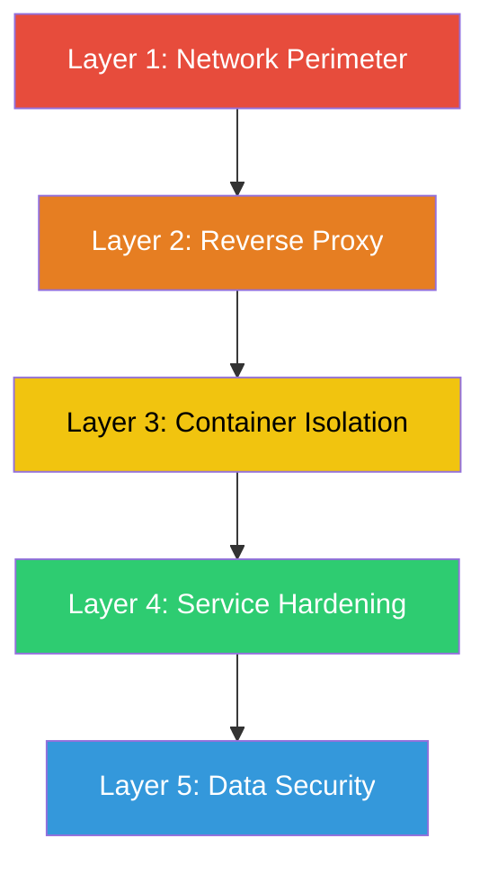
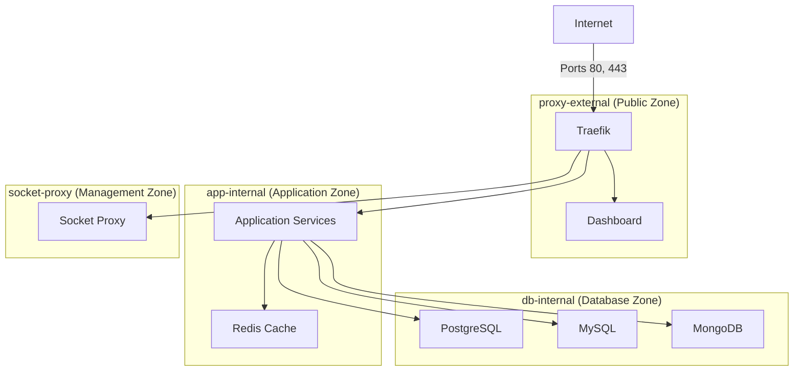
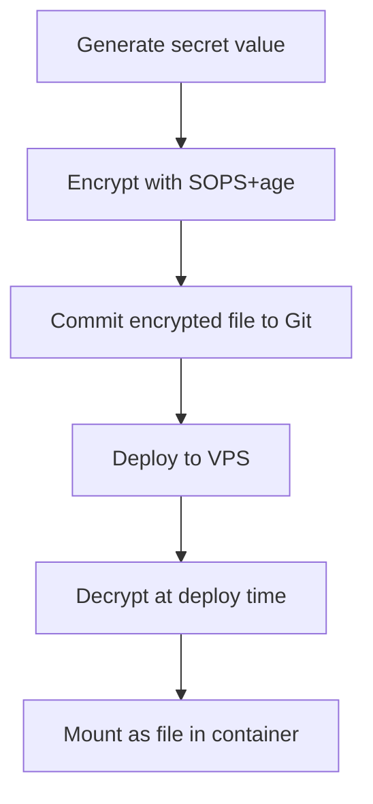

# Chapter 6: Security and Hardening

> Docker Lab protects your services through layered defenses -- from network isolation and container hardening to encrypted secrets and automatic TLS -- so that a breach in one layer does not compromise your entire system.

## Overview

Security is not something you bolt on at the end. Docker Lab treats security as a foundational concern, woven into every layer of the system from the first line of configuration. The result is a defense-in-depth architecture where each layer independently limits what an attacker can do, even if they compromise the layer above it.

Think of it like a medieval castle. The outer wall (network isolation) keeps most threats out. The inner wall (container hardening) limits movement for anyone who gets past the first barrier. The locked vault (secrets management) protects the crown jewels even if someone reaches the inner courtyard. And the sentries on the watchtower (TLS and monitoring) ensure that every visitor is verified and every movement is recorded. No single wall makes the castle impregnable, but together they make a successful attack extraordinarily difficult.

This chapter walks you through each of these defensive layers. You will learn what threats Docker Lab protects against, how each protection works in practice, and how to extend the same protections to your own services. By the end, you will understand the security model well enough to evaluate it, extend it, and explain it to others.

### What Docker Lab Protects Against

Before diving into implementation, here is a summary of the threat categories and how Docker Lab addresses them:

| Threat | Defense Layer | How It Works |
|--------|--------------|--------------|
| Unauthorized network access | Network isolation | Four internal networks restrict which containers can communicate |
| Container escape to host | Container hardening | Non-root users, dropped capabilities, read-only filesystems |
| Credential theft | Secrets management | File-based secrets, never in environment variables or logs |
| Man-in-the-middle attacks | TLS everywhere | Automatic HTTPS via Let's Encrypt with HTTP-to-HTTPS redirect |
| Privilege escalation | Capability controls | `no-new-privileges` flag and `cap_drop: ALL` on every service |
| Docker API abuse | Socket proxy | Filtered, read-only access to the Docker socket |

## Defense in Depth: The Layer Model

Docker Lab implements five distinct security layers. Each layer operates independently, so a failure in one does not cascade to the others.

The following diagram shows how these layers stack from the outermost perimeter down to the data level:



- **Layer 1 (Network Perimeter)** controls which ports are exposed to the internet and segments internal traffic into isolated zones.
- **Layer 2 (Reverse Proxy)** terminates TLS, applies security headers, enforces rate limits, and routes traffic to the correct service.
- **Layer 3 (Container Isolation)** ensures that each service runs in its own namespace with its own network membership, resource limits, and filesystem restrictions.
- **Layer 4 (Service Hardening)** drops Linux capabilities, prevents privilege escalation, and enforces non-root execution.
- **Layer 5 (Data Security)** manages secrets through files with strict permissions, encrypted at rest with SOPS+age, and never exposed through environment variables or logs.

The rest of this chapter explores each layer in detail.

## Layer 1: Network Isolation

### Why Networks Matter

By default, all Docker containers on the same bridge network can talk to each other freely. That means if an attacker compromises your public-facing web application, they can immediately reach your database, your cache server, and every other container. Network isolation prevents this lateral movement.

Docker Lab applies a **zero-trust networking** model: no container is trusted by default, even on internal networks. Every container must have explicit network membership to communicate with other containers. Internal networks block internet access entirely. There is no implicit trust between services -- each connection path must be deliberately configured.

Docker Lab enforces this model by splitting containers into four separate networks, each with a specific purpose and strict boundaries.

### The Four-Zone Architecture

The following diagram shows how traffic flows between the four network zones:



Each zone has a clear purpose and a clear boundary:

- **proxy-external** is the only network reachable from the internet. Traefik lives here, along with any service that needs a public-facing domain name. This is the DMZ -- the only zone exposed to external traffic.
- **app-internal** is marked `internal: true`, which means Docker blocks all internet access for containers on this network. Application services live here. They can reach databases but cannot make outbound internet requests.
- **db-internal** is also marked `internal: true`. Database containers live here with no internet access and no direct public ports. The only way to reach a database is through an application container on `app-internal`.
- **socket-proxy** is a highly isolated network connecting only the socket proxy container and Traefik. This keeps Docker API access on a separate, locked-down channel.

### How This Looks in Configuration

Here is how the four networks are defined in the compose file:

```yaml
networks:
  proxy-external:
    name: pmdl_proxy-external
    # NOT internal -- can reach internet for TLS challenges

  app-internal:
    name: pmdl_app-internal
    internal: true  # Blocks all internet access

  db-internal:
    name: pmdl_db-internal
    internal: true  # Blocks all internet access

  socket-proxy:
    name: pmdl_socket-proxy
    internal: true  # Blocks all internet access
```

The `internal: true` flag is the key security control. When Docker creates an internal network, it does not add a masquerade rule to the host's iptables, which means containers on that network have no route to the outside world. This is a simple, effective way to prevent data exfiltration and unauthorized outbound connections.

### Network Access Rules

This table summarizes exactly which zones can communicate with which:

| Source | proxy-external | app-internal | db-internal | socket-proxy |
|--------|:-:|:-:|:-:|:-:|
| Internet | Ports 80, 443 | No | No | No |
| proxy-external | Yes | Yes | No | Traefik only |
| app-internal | Yes | Yes | Yes | No |
| db-internal | No | No | Yes | No |
| socket-proxy | No | No | No | Yes |

The most important row is `db-internal`. Database containers can only talk to other containers on `db-internal`. They cannot reach the internet, the proxy zone, or the socket proxy. Even if an attacker gains code execution inside a database container, they are trapped in a network with no outbound connectivity.

## Layer 2: The Reverse Proxy (Traefik)

Traefik is the single entry point for all external traffic. Every request from the internet passes through Traefik before reaching any service. This central point of control allows Docker Lab to enforce security policies uniformly.

### What Traefik Does for Security

Traefik provides four security functions:

1. **TLS termination** -- Traefik handles HTTPS certificates from Let's Encrypt automatically. All traffic between the internet and your server is encrypted.
2. **HTTP-to-HTTPS redirect** -- Any request on port 80 is redirected to port 443. Unencrypted HTTP traffic is never served.
3. **Security headers** -- Traefik injects headers like Strict-Transport-Security, X-Content-Type-Options, and X-Frame-Options into every response.
4. **Rate limiting** -- Middleware limits request rates to prevent brute-force attacks and denial-of-service attempts.

### Security Headers

Traefik applies the following security headers to all responses:

```yaml
labels:
  # Force HTTPS for one year, including subdomains
  - "traefik.http.middlewares.security.headers.stsSeconds=31536000"
  - "traefik.http.middlewares.security.headers.stsIncludeSubdomains=true"
  - "traefik.http.middlewares.security.headers.stsPreload=true"

  # Prevent XSS attacks
  - "traefik.http.middlewares.security.headers.browserxssfilter=true"

  # Prevent MIME-type sniffing
  - "traefik.http.middlewares.security.headers.contenttypenosniff=true"

  # Prevent clickjacking
  - "traefik.http.middlewares.security.headers.frameDeny=true"

  # Block search engine indexing
  - "traefik.http.middlewares.security.headers.customResponseHeaders.X-Robots-Tag=noindex,nofollow"
```

These headers instruct browsers to enforce HTTPS, block cross-site scripting attempts, prevent content-type confusion attacks, and reject iframe embedding. Every service behind Traefik inherits these protections automatically.

### TLS Configuration

Traefik obtains and renews TLS certificates from Let's Encrypt without any manual intervention:

```yaml
command:
  # Certificate resolver configuration
  - "--certificatesresolvers.letsencrypt.acme.email=${ADMIN_EMAIL}"
  - "--certificatesresolvers.letsencrypt.acme.storage=/acme/acme.json"
  - "--certificatesresolvers.letsencrypt.acme.httpchallenge.entrypoint=web"

  # Redirect all HTTP to HTTPS
  - "--entrypoints.web.http.redirections.entrypoint.to=websecure"
  - "--entrypoints.web.http.redirections.entrypoint.scheme=https"
```

The certificate store (`acme.json`) is persisted on a Docker volume so certificates survive container restarts. Traefik automatically renews certificates before they expire, and it enforces TLS 1.2 as the minimum version with TLS 1.3 preferred.

## Layer 3: Container Hardening

### The Security Anchor Pattern

Applying security settings to every container individually is tedious and error-prone. Miss one service, and you have a gap in your defenses. Docker Lab solves this with **YAML anchors** -- a native YAML feature that lets you define a security configuration once and apply it everywhere.

Think of a security anchor like a rubber stamp at a factory. Instead of hand-writing the safety specifications on every product label, you create a stamp and press it onto each one. Every product gets the same label, and if you update the stamp, every future product gets the updated specifications automatically.

Here is the security baseline anchor used in Docker Lab:

```yaml
x-secured-service: &secured-service
  security_opt:
    - no-new-privileges:true
  cap_drop:
    - ALL
  restart: unless-stopped
```

Every service in the compose file inherits this anchor with a single line:

```yaml
services:
  dashboard:
    image: peermesh/docker-lab-dashboard:latest
    <<: *secured-service
    user: "1000:1000"
    # ... rest of service configuration
```

The `<<: *secured-service` line merges the anchor's settings into the service definition. The dashboard now has `no-new-privileges`, all capabilities dropped, and a restart policy -- without repeating any of those settings.

### What Each Setting Does

Let us break down the three core hardening controls:

**`cap_drop: ALL`** removes every Linux capability from the container. Linux capabilities are fine-grained permissions that break up root's power into individual pieces -- things like binding to low ports (NET_BIND_SERVICE), changing file ownership (CHOWN), or overriding file permissions (DAC_OVERRIDE). By dropping all capabilities, you ensure the container process cannot perform any privileged operation, even if it somehow runs as root.

**`no-new-privileges: true`** prevents any process inside the container from gaining additional privileges after it starts. Without this flag, a process could use a setuid binary to escalate to root. With this flag set, setuid bits are ignored, and privilege escalation through execve is blocked.

**`restart: unless-stopped`** ensures that containers restart automatically after crashes but stay stopped if you manually stop them. This is a reliability control rather than a security control, but it contributes to defense by ensuring services recover from transient failures.

### Non-Root Execution

Running containers as non-root is one of the most impactful security controls available. If an attacker escapes a container running as root, they land on the host as root. If the container runs as a regular user, the attacker lands as an unprivileged user with limited ability to do damage.

Docker Lab runs the following services as non-root users:

| Service | User:Group | Why This UID |
|---------|------------|--------------|
| Traefik | root (deferred) | ACME certificate storage requires root in v2.11 |
| Dashboard | 1000:1000 | Standard application user |
| PostgreSQL | 70:70 | Official postgres user in the image |
| Redis | 999:999 | Official redis user in the image |

The socket proxy is the only container that runs as root by design. It must access `/var/run/docker.sock`, which is owned by root on the host. This exception is documented and mitigated by dropping all capabilities and setting `no-new-privileges`.

### Read-Only Filesystems

Setting `read_only: true` on a container makes its entire root filesystem immutable. If an attacker gains code execution inside the container, they cannot write malware to disk, modify configuration files, or tamper with application binaries. Any write attempt fails with a "Read-only file system" error.

Of course, applications need to write somewhere -- log files, temporary data, PID files. Docker Lab handles this by mounting `tmpfs` volumes at specific paths where writes are needed:

```yaml
services:
  dashboard:
    read_only: true
    tmpfs:
      - /tmp:size=16m,noexec,nosuid,nodev
```

The `tmpfs` mount creates a small, in-memory filesystem at `/tmp`. The flags `noexec`, `nosuid`, and `nodev` prevent executing binaries, using setuid bits, and creating device files on that filesystem. The size limit (16MB) prevents a compromised container from consuming all available memory.

### Resource Limits

Every service in Docker Lab has a memory limit that prevents any single container from consuming all available host resources:

```yaml
deploy:
  resources:
    limits:
      memory: 256M     # Hard ceiling -- container is killed above this
    reservations:
      memory: 64M      # Guaranteed minimum allocation
```

Without resource limits, a memory leak or deliberate resource exhaustion attack in one container could starve every other container on the host. Memory limits ensure that the blast radius of any single container failure is bounded.

## Layer 4: Docker Socket Protection

### Why the Docker Socket Is Dangerous

The Docker socket (`/var/run/docker.sock`) is the master key to your entire container environment. Any service with direct access to the socket can:

- Create new containers with arbitrary configuration
- Execute commands inside running containers
- Mount host directories (including `/etc/shadow`)
- Delete volumes, networks, and images
- Effectively gain root access to the host machine

Traefik needs Docker socket access to discover running containers and route traffic to them. Giving Traefik direct socket access means that if Traefik is compromised, the attacker controls your entire Docker environment.

### The Socket Proxy Solution

Docker Lab solves this with a **socket proxy** -- a lightweight filtering layer between Traefik and the Docker socket. Instead of giving Traefik the master key, you give it a restricted pass that only allows reading container information.

Here is how the socket proxy is configured:

```yaml
services:
  socket-proxy:
    image: tecnativa/docker-socket-proxy:0.2
    user: "0:0"  # Required for socket access
    environment:
      # Allowed: read-only service discovery
      CONTAINERS: 1
      NETWORKS: 1
      INFO: 1
      VERSION: 1

      # Blocked: all write operations
      POST: 0
      SERVICES: 0
      TASKS: 0
      EXEC: 0
      IMAGES: 0
      VOLUMES: 0
      BUILD: 0
      COMMIT: 0
    volumes:
      - /var/run/docker.sock:/var/run/docker.sock:ro
    networks:
      - socket-proxy  # Internal network only
```

Traefik connects to the proxy instead of the socket directly:

```yaml
services:
  traefik:
    environment:
      DOCKER_HOST: tcp://socket-proxy:2375
    networks:
      - socket-proxy
      - proxy-external
```

With this configuration, Traefik can list containers and read their labels to build routing rules, but it cannot create, delete, modify, or exec into any container. If Traefik is compromised, the attacker gets a read-only view of container metadata -- not the master key.

The socket proxy runs on the isolated `socket-proxy` network, which is marked `internal: true`. No other service can reach the socket proxy, and the socket proxy cannot reach the internet. The attack surface is minimal.

## Layer 5: Secrets Management

### The Problem with Environment Variables

Many Docker tutorials show database passwords passed as environment variables:

```yaml
# DANGEROUS -- do not do this
services:
  postgres:
    environment:
      POSTGRES_PASSWORD: my-secret-password
```

This is convenient but insecure for several reasons:

- **Visible in `docker inspect`** -- anyone with Docker access can read every environment variable of every container.
- **Visible in process listings** -- `ps aux` on the host shows environment variables in the process table.
- **Leaked in logs** -- applications that dump their environment on startup (a common debugging pattern) write passwords to log files.
- **Stored in image layers** -- if set in a Dockerfile, the secret becomes part of the image history.

### File-Based Secrets

Docker Lab uses file-based secrets instead. Secrets are stored as individual files on the host, mounted read-only into containers, and referenced with the `_FILE` suffix convention:

```yaml
secrets:
  postgres_password:
    file: ./secrets/postgres_password

services:
  postgres:
    secrets:
      - postgres_password
    environment:
      POSTGRES_PASSWORD_FILE: /run/secrets/postgres_password
```

With this approach:

- Secrets are mounted at `/run/secrets/` inside the container -- a path that is not included in `docker inspect` output.
- The `_FILE` suffix tells the application to read the password from a file instead of expecting it as an environment variable value.
- The secret files on the host have permission `600` (owner read/write only), and the secrets directory has permission `700` (owner only).
- Containers mount the secrets read-only, so a compromised container cannot modify them.

### Three Secrets Patterns

Not every application handles secrets the same way. Docker Lab recognizes three patterns for how services consume credentials:

| Pattern | How It Works | When to Use |
|---------|-------------|-------------|
| **A: `_FILE` suffix** | App reads secret from a file path at `/run/secrets/` | Preferred. Use whenever the app supports it (PostgreSQL, MySQL, MongoDB, MinIO) |
| **B: Direct env var** | App reads secret directly from an environment variable | Fallback only. Use when the app has no `_FILE` support (Redis, most Node.js/Go apps) |
| **C: Native Docker Secrets** | App automatically reads from `/run/secrets/` directory | Rare. Use when the app has built-in Docker Secrets support |

Docker Lab prefers Pattern A because secrets never appear in environment variable listings, process tables, or `docker inspect` output. When an application does not support `_FILE`, Pattern B is acceptable -- but you should be aware that the secret value becomes visible through `docker inspect` and process listings.

To determine which pattern an application supports, check its documentation for references to `_FILE` suffix support or `/run/secrets/`. You can also inspect the image entrypoint:

```bash
$ docker run --rm postgres:16 cat /docker-entrypoint.sh | grep "_FILE"
```

If the entrypoint handles `_FILE` variables, use Pattern A. If not, fall back to Pattern B.

> **Warning: Watch for trailing whitespace in secret files.**
>
> A common cause of silent authentication failures is a trailing newline in a secret file. When generating secrets manually, use `echo -n` to avoid adding a newline:
>
> ```bash
> $ echo -n "my-secret-value" > secrets/my_secret
> ```

### Generating Secrets

Docker Lab provides a script that generates cryptographically secure secrets for all services:

```bash
$ ./scripts/generate-secrets.sh
Generating postgres_password... done
Generating mysql_root_password... done
Generating mongodb_root_password... done
Generating minio_root_user... done
Generating minio_root_password... done
Generating dashboard_password... done
Generating webhook_secret... done

$ ls -la secrets/
drwx------  2 user user 4096 Jan 15 10:00 .
-rw-------  1 user user   65 Jan 15 10:00 postgres_password
-rw-------  1 user user   65 Jan 15 10:00 mysql_root_password
-rw-------  1 user user   65 Jan 15 10:00 mongodb_root_password
-rw-------  1 user user   33 Jan 15 10:00 minio_root_user
-rw-------  1 user user   65 Jan 15 10:00 minio_root_password
-rw-------  1 user user   33 Jan 15 10:00 dashboard_password
-rw-------  1 user user   65 Jan 15 10:00 webhook_secret
```

Each secret is generated using `openssl rand` with appropriate lengths: 32 bytes hex for passwords, 16 characters alphanumeric for usernames, and 24 bytes base64 for tokens.

### SOPS+age: Encrypted Secrets at Rest

File-based secrets solve the runtime problem, but what about storing secrets in version control? You do not want plaintext passwords in your Git repository. Docker Lab uses **SOPS** (Secrets OPerationS) with **age** encryption to encrypt secrets before they are committed.

Think of SOPS+age like a shared safe deposit box. Each team member has their own personal key (an age keypair). The safe (the encrypted file) can be opened by any authorized key. When someone leaves the team, you change the lock (re-encrypt) so their old key no longer works.

### The Secrets Lifecycle

The following diagram shows how a secret moves from creation through encryption to deployment:



At each stage, the secret is protected differently: generated locally with cryptographic randomness, encrypted at rest in Git, transmitted over SSH or HTTPS during deployment, decrypted only on the target server, and mounted read-only into the container that needs it. Plaintext secrets never touch disk on the deployment server -- they flow through process substitution directly into Docker Compose.

### SOPS+age Walkthrough

Here is how to set up and use SOPS+age from scratch.

**Step 1: Install the tools**

```bash
# macOS
$ brew install sops age jq

# Verify installation
$ sops --version
sops 3.8.1

$ age --version
v1.1.1
```

**Step 2: Generate your personal key**

```bash
$ mkdir -p ~/.config/sops/age
$ age-keygen -o ~/.config/sops/age/keys.txt
$ chmod 600 ~/.config/sops/age/keys.txt

# Display your public key (this is safe to share)
$ grep "public key" ~/.config/sops/age/keys.txt
# public key: age1ql3z7hjy54pw3hyww5ayyfg7zqgvc7w3j2elw8zmrj2kg5sfn9aqmcac8p
```

Your private key stays in `~/.config/sops/age/keys.txt` and never leaves your machine. Your public key is shared with the team and stored in the repository.

**Step 3: Configure SOPS**

The `.sops.yaml` file in the `secrets/` directory defines which keys can decrypt which files:

```yaml
creation_rules:
  - path_regex: production\.enc\.yaml$
    age: >-
      age1abc...(ops-lead),
      age1def...(deploy-key)
  - path_regex: staging\.enc\.yaml$
    age: >-
      age1abc...(ops-lead),
      age1ghi...(developer-1),
      age1jkl...(developer-2)
```

Production secrets are encrypted to only the ops lead and the deploy key. Staging secrets are encrypted to the entire development team. This separation ensures that developers cannot accidentally (or intentionally) decrypt production credentials.

**Step 4: Edit encrypted secrets**

```bash
# Opens in your editor, auto-encrypts on save
$ just edit staging

# Add a specific secret
$ just add DATABASE_URL "postgres://app:secret@db:5432/myapp" staging
```

When you save and close the editor, SOPS automatically re-encrypts the file. The encrypted version is safe to commit to Git.

**Step 5: Deploy with secrets**

```bash
# Decrypt and inject into Docker Compose
$ just deploy production
```

Behind the scenes, this uses process substitution to decrypt secrets without writing plaintext to disk:

```bash
docker compose --env-file <(sops -d secrets/production.enc.yaml) up -d
```

### Team Onboarding and Offboarding

Adding a new team member:

```bash
# 1. New member generates their key and shares their public key
# 2. Admin adds them to the repository
$ just member-add jane-doe age1ql3z7hjy54pw3hyww5ayyfg7zqgvc7w3j2elw8zmrj2kg5sfn9aqmcac8p

# 3. Re-encrypt files so the new key can decrypt them
$ sops updatekeys staging.enc.yaml --yes

# 4. Commit and push
```

Removing a team member:

```bash
# 1. Remove their key
$ just member-remove jane-doe

# 2. Re-encrypt all files (their old key can no longer decrypt)
$ sops updatekeys production.enc.yaml --yes
$ sops updatekeys staging.enc.yaml --yes

# 3. CRITICAL: Rotate all secrets within 24 hours
#    The removed member may have decrypted copies
```

The 24-hour rotation window is important. Re-encryption prevents the removed member from decrypting future versions of the secrets file, but they may have decrypted and saved the current values while they still had access. Rotating every credential ensures that any cached values become useless.

### Secrets Lifecycle: Five Required Phases

Docker Lab treats secret management as a five-phase lifecycle. Each phase has specific procedures and validation steps. These are required controls, not optional suggestions.

| Phase | Purpose | Key Command |
|-------|---------|-------------|
| **Create** | Generate and encrypt new secrets | `just add SECRET_KEY "value" production` |
| **Validate** | Pre-deploy parity checks across docs, scripts, and compose files | `./scripts/validate-secret-parity.sh --environment production` |
| **Rotate** | Scheduled or incident-triggered credential rotation | `just rotate DB_PASSWORD production` |
| **Recover** | Rollback to last known-good encrypted bundle | `git checkout <commit> -- secrets/production.enc.yaml` |
| **Audit** | Review operation history with timestamps and operator identity | `just audit 50` |

The **validate** phase is mandatory before every deployment. It checks three things: that all canonical runtime keys exist in the encrypted bundle, that the compose file's `secrets:` block matches the canonical keyset, and that per-app `secrets-required.txt` files are satisfied. Running `./scripts/generate-secrets.sh --validate` confirms that all expected secret files exist on disk with correct permissions.

The **rotate** phase includes an auditable drill script for testing the rotation and recovery workflow without affecting production:

```bash
# Non-destructive simulation
$ ./scripts/secrets-rotation-recovery-drill.sh \
    --environment staging \
    --key postgres_password

# Destructive drill (applies candidate, validates, restores backup)
$ ./scripts/secrets-rotation-recovery-drill.sh \
    --environment staging \
    --key postgres_password \
    --apply
```

Drill artifacts are written to `/tmp/pmdl-secrets-drills/` and provide evidence for audit purposes.

### Canonical vs Compatibility Keysets

Docker Lab explicitly separates its secrets into two categories with different governance rules:

- **Canonical keys** are the baseline deployment contract. Every standard deployment requires them. If a canonical key is missing or misaligned, the deployment is blocked. Drift in canonical keys has CRITICAL severity.
- **Compatibility keys** support optional profiles and applications. They are documented separately and cannot silently become canonical. Drift in compatibility keys has WARNING severity.

The keyset definitions live in the `secrets/keysets/` directory:

| File | Purpose | Drift Severity |
|------|---------|----------------|
| `canonical-runtime-keys.txt` | Keys required for any standard deployment | CRITICAL |
| `canonical-compose-keys.txt` | Keys declared in root compose `secrets:` block | CRITICAL |
| `compatibility-only-keys.txt` | Keys for optional profiles and apps | WARNING |

This separation ensures that adding a new optional profile does not accidentally introduce new mandatory secrets into the baseline deployment contract.

## Supply-Chain Security

Before any deployment reaches production, Docker Lab runs a three-gate supply-chain validation. These gates verify that the container images you are about to deploy are trustworthy.

**Gate 1: Image Policy Validation** checks that every image in the compose file declares an explicit version tag or digest. Untagged images or the use of `:latest` produce warnings (or failures in strict mode).

**Gate 2: SBOM Generation** creates a CycloneDX Software Bill of Materials for every image. This records exactly what software is inside each container, providing an inventory for vulnerability analysis.

**Gate 3: Vulnerability Threshold** scans images for known security vulnerabilities using Docker Scout. You configure a severity threshold (typically CRITICAL), and the gate blocks deployment if any image exceeds it.

Run the full supply-chain validation with:

```bash
$ ./scripts/security/validate-supply-chain.sh \
    --severity-threshold CRITICAL
```

Supply-chain validation runs automatically as part of the deployment preflight sequence. You do not need to remember to run it manually -- the deploy script calls it before pulling images.

## The Hardening Overlay

### What It Is

Docker Lab ships a separate overlay file called `docker-compose.hardening.yml` that applies additional security controls on top of the base compose file. This overlay adds read-only filesystems, tmpfs mounts, capability restrictions, and security options to services that do not have them in the base configuration.

### Why a Separate File

The hardening overlay exists as a separate file for two reasons:

1. **Stability** -- The base `docker-compose.yml` works out of the box with minimal friction. Adding strict hardening to the base file increases the chance of compatibility issues during initial setup.
2. **Progressive adoption** -- You can start with the base configuration, verify everything works, and then layer on the hardening overlay. This is easier to debug than starting with maximum restrictions.

### How to Use It

Apply the hardening overlay by passing both files to Docker Compose:

```bash
$ docker compose -f docker-compose.yml -f docker-compose.hardening.yml up -d
```

Or set the `COMPOSE_FILE` variable in your `.env` file to apply it automatically:

```text
COMPOSE_FILE=docker-compose.yml:docker-compose.hardening.yml
```

### What the Overlay Adds

Here is a summary of what the hardening overlay changes for each service:

| Service | read_only | tmpfs Paths | cap_drop | cap_add | Notes |
|---------|:-:|-----------|:-:|:-:|-------|
| socket-proxy | No | None | ALL | None | Template generation requires writable filesystem |
| traefik | Yes | /tmp | ALL (base) | NET_BIND_SERVICE | Needs to bind ports 80/443 |
| dashboard | Yes | /tmp | ALL (base) | None | Fully hardened |
| postgres | Yes | /tmp, /var/run/postgresql | ALL | CHOWN, DAC_OVERRIDE, FOWNER, SETGID, SETUID | Init requires ownership changes |
| mysql | Yes | /tmp, /var/run/mysqld | ALL | CHOWN, DAC_OVERRIDE, FOWNER, SETGID, SETUID | Init requires ownership changes |
| mongodb | Yes | /tmp, /var/run/mongodb | ALL | CHOWN, DAC_OVERRIDE, FOWNER, SETGID, SETUID | Init requires ownership changes |
| redis | Yes | /tmp | ALL (base) | None | Fully hardened |
| minio | No | None | ALL | None | Writes to /data volume |

Database containers get a special treatment: they need capabilities like CHOWN and SETUID during their first-time initialization (to set up data directories with correct ownership), but those capabilities are added back minimally rather than running with full root privileges.

## Securing a New Service: Step by Step

Let us walk through the complete process of adding a new service to Docker Lab with full security applied. We will add a hypothetical API service called `task-api`.

**Step 1: Choose the right networks**

Determine which zones your service needs:

- Does it serve public traffic? Add it to `proxy-external`.
- Does it connect to databases? Add it to `app-internal` and `db-internal`.
- Does it need internet access? If not, only use `internal: true` networks.

For our task API, it needs public traffic (through Traefik) and database access:

```yaml
services:
  task-api:
    image: myorg/task-api:1.0.0
    networks:
      - proxy-external  # Reachable by Traefik
      - db-internal     # Can reach PostgreSQL
```

**Step 2: Apply the security baseline**

Inherit the security anchor and set a non-root user:

```yaml
services:
  task-api:
    image: myorg/task-api:1.0.0
    <<: *secured-service
    user: "1000:1000"
    networks:
      - proxy-external
      - db-internal
```

This gives you `no-new-privileges`, `cap_drop: ALL`, and the restart policy in one line.

**Step 3: Add read-only filesystem with tmpfs**

Make the root filesystem read-only and provide tmpfs for paths that need writes:

```yaml
services:
  task-api:
    image: myorg/task-api:1.0.0
    <<: *secured-service
    user: "1000:1000"
    read_only: true
    tmpfs:
      - /tmp:size=32m,noexec,nosuid,nodev
    networks:
      - proxy-external
      - db-internal
```

**Step 4: Set resource limits**

Add memory limits to prevent resource exhaustion:

```yaml
services:
  task-api:
    image: myorg/task-api:1.0.0
    <<: *secured-service
    user: "1000:1000"
    read_only: true
    tmpfs:
      - /tmp:size=32m,noexec,nosuid,nodev
    deploy:
      resources:
        limits:
          memory: 256M
        reservations:
          memory: 64M
    networks:
      - proxy-external
      - db-internal
```

**Step 5: Wire up secrets**

If the service needs database credentials, use file-based secrets:

```yaml
services:
  task-api:
    image: myorg/task-api:1.0.0
    <<: *secured-service
    user: "1000:1000"
    read_only: true
    tmpfs:
      - /tmp:size=32m,noexec,nosuid,nodev
    deploy:
      resources:
        limits:
          memory: 256M
        reservations:
          memory: 64M
    secrets:
      - postgres_password
    environment:
      DATABASE_PASSWORD_FILE: /run/secrets/postgres_password
    networks:
      - proxy-external
      - db-internal
```

**Step 6: Add Traefik labels for routing and TLS**

```yaml
services:
  task-api:
    image: myorg/task-api:1.0.0
    <<: *secured-service
    user: "1000:1000"
    read_only: true
    tmpfs:
      - /tmp:size=32m,noexec,nosuid,nodev
    deploy:
      resources:
        limits:
          memory: 256M
        reservations:
          memory: 64M
    secrets:
      - postgres_password
    environment:
      DATABASE_PASSWORD_FILE: /run/secrets/postgres_password
    labels:
      - "traefik.enable=true"
      - "traefik.http.routers.task-api.rule=Host(`api.example.com`)"
      - "traefik.http.routers.task-api.entrypoints=websecure"
      - "traefik.http.routers.task-api.tls.certresolver=letsencrypt"
    networks:
      - proxy-external
      - db-internal
    logging:
      driver: json-file
      options:
        max-size: "10m"
        max-file: "3"
```

This service now has the full Docker Lab security treatment: non-root user, all capabilities dropped, no privilege escalation, read-only filesystem, memory limits, file-based secrets, network isolation, TLS encryption, and structured logging.

**Step 7: Handle Alpine-based images**

Many container images in the Docker ecosystem are based on Alpine Linux. Alpine is a minimal distribution -- excellent for security (small attack surface) but it requires awareness of a few differences:

- Alpine uses `wget` instead of `curl`. Write healthchecks with `wget -q --spider` rather than `curl -f`.
- Alpine uses `sh` (ash), not `bash`. Scripts must be POSIX-compliant: use `#!/bin/sh`, `[ ]` instead of `[[ ]]`, and avoid `set -o pipefail`.
- Alpine resolves `localhost` to IPv6 first on some configurations. Use `127.0.0.1` explicitly in healthchecks.

Here is a correct healthcheck for an Alpine-based service:

```yaml
healthcheck:
  test: ["CMD-SHELL", "wget -q --spider http://127.0.0.1:3000/health || exit 1"]
  interval: 30s
  timeout: 10s
  retries: 3
  start_period: 60s
```

**Step 8: Validate**

After starting the service, verify the security controls are applied:

```bash
# Check the running user
$ docker exec task-api id
uid=1000 gid=1000 groups=1000

# Check capabilities
$ docker exec task-api cat /proc/1/status | grep Cap
CapPrm: 0000000000000000
CapEff: 0000000000000000

# Verify read-only filesystem
$ docker exec task-api touch /test-write 2>&1
touch: /test-write: Read-only file system

# Verify tmpfs is writable
$ docker exec task-api touch /tmp/test-write && echo "tmpfs works"
tmpfs works
```

## Common Gotchas

This section covers real issues discovered during Docker Lab development. Each one cost real debugging time, and each one has a clear solution.

> **Warning: Do NOT set `read_only: true` on the socket proxy.**
>
> The `tecnativa/docker-socket-proxy` image generates its `haproxy.cfg` configuration from a template at container startup. The template and the generated config both live in `/usr/local/etc/haproxy/`. Setting `read_only: true` blocks the config write. Mounting tmpfs on that directory wipes the baked-in template. Either way, the container enters a restart loop. Use `cap_drop: ALL` and `no-new-privileges` instead -- these provide effective hardening without breaking the entrypoint.

> **Warning: Database containers fail with `cap_drop: ALL` alone.**
>
> PostgreSQL, MySQL, and MongoDB entrypoints run `chown` during first-time initialization to set correct ownership on data directories. If you drop all capabilities without adding back CHOWN, DAC_OVERRIDE, FOWNER, SETGID, and SETUID, the init script fails with `chown: Operation not permitted`. Always use the hardening overlay, which adds the correct capabilities back.

> **Warning: Traefik non-root breaks ACME certificate storage.**
>
> Setting `user: "65534:65534"` (nobody) on Traefik v2.11 causes ACME certificate operations to fail because the certificate store volume is owned by root. Keep Traefik running as root until the v3 migration. The safe incremental hardening step is `cap_drop: ALL` with `cap_add: NET_BIND_SERVICE`.

> **Warning: MinIO `user:` override breaks `/data` writes.**
>
> Forcing MinIO to run with `user: "1000:1000"` breaks object store writes when the mounted `/data` path is owned by root and not pre-chowned to that UID/GID. Keep MinIO without an explicit `user:` override. Retain `no-new-privileges` and `cap_drop: ALL` as baseline controls.

> **Warning: Secret files must have strict permissions.**
>
> If your secret files are world-readable (permission 644), any process on the host can read them. Always set secrets to permission 600 and the secrets directory to 700. The generation script does this automatically, but if you create secrets manually or copy them via SCP, verify permissions afterward:
>
> ```bash
> $ chmod 700 secrets/
> $ chmod 600 secrets/*
> ```

## Key Takeaways

- Docker Lab implements defense-in-depth with five layers: network isolation, reverse proxy, container isolation, service hardening, and data security. Each layer limits damage independently, following a zero-trust model where no container is trusted by default.
- Four internal Docker networks (proxy-external, app-internal, db-internal, socket-proxy) prevent lateral movement between containers. Databases have no internet access and no direct public ports.
- The YAML security anchor pattern (`<<: *secured-service`) applies `no-new-privileges`, `cap_drop: ALL`, and restart policies to every service from a single definition. The hardening overlay adds read-only filesystems and capability restrictions.
- Secrets follow a five-phase lifecycle (create, validate, rotate, recover, audit) with three consumption patterns (`_FILE` suffix preferred, direct env var as fallback, native Docker Secrets when available). SOPS+age encrypts secrets at rest so they can be safely stored in Git. Canonical and compatibility keysets are governed separately.
- The socket proxy gives Traefik read-only access to container metadata without exposing the full Docker API. Supply-chain gates (image policy, SBOM, vulnerability threshold) validate every image before deployment.

## Next Steps

With the security model in place, you are ready to deploy Docker Lab to a live server. The [Deployment chapter](./deployment.md) covers the complete deployment workflow: preparing your VPS, configuring DNS, running your first deployment, and setting up the pull-based webhook system that keeps your server updated without exposing SSH credentials to CI pipelines.
