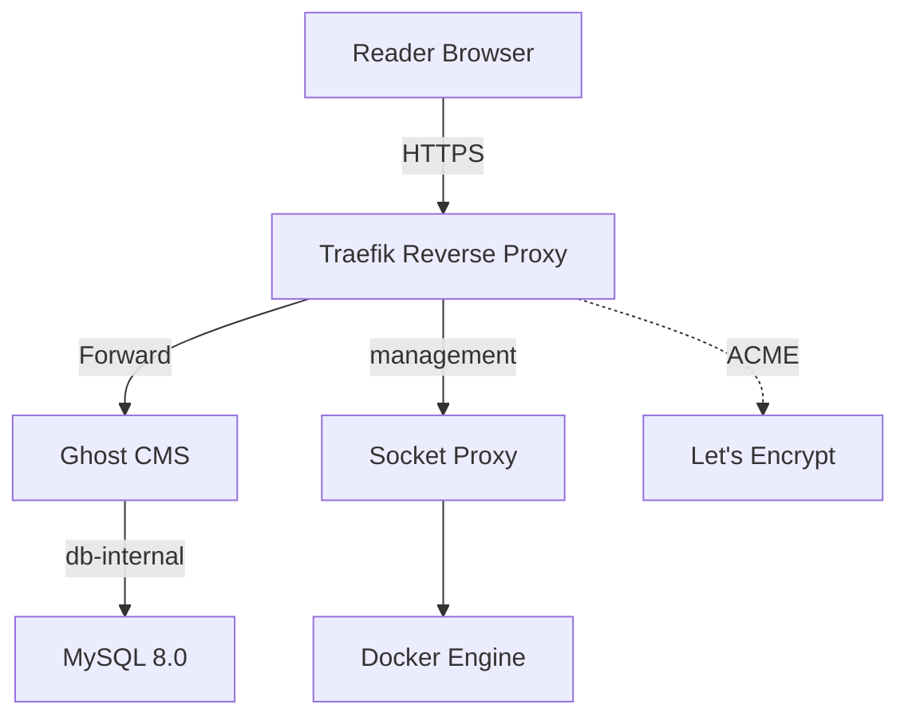
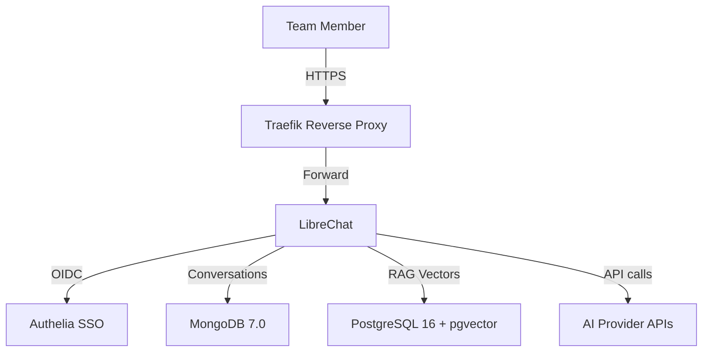
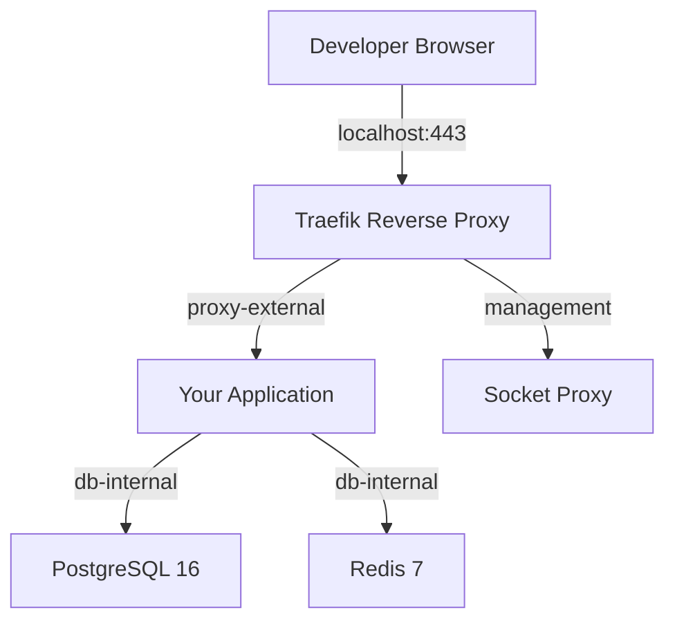
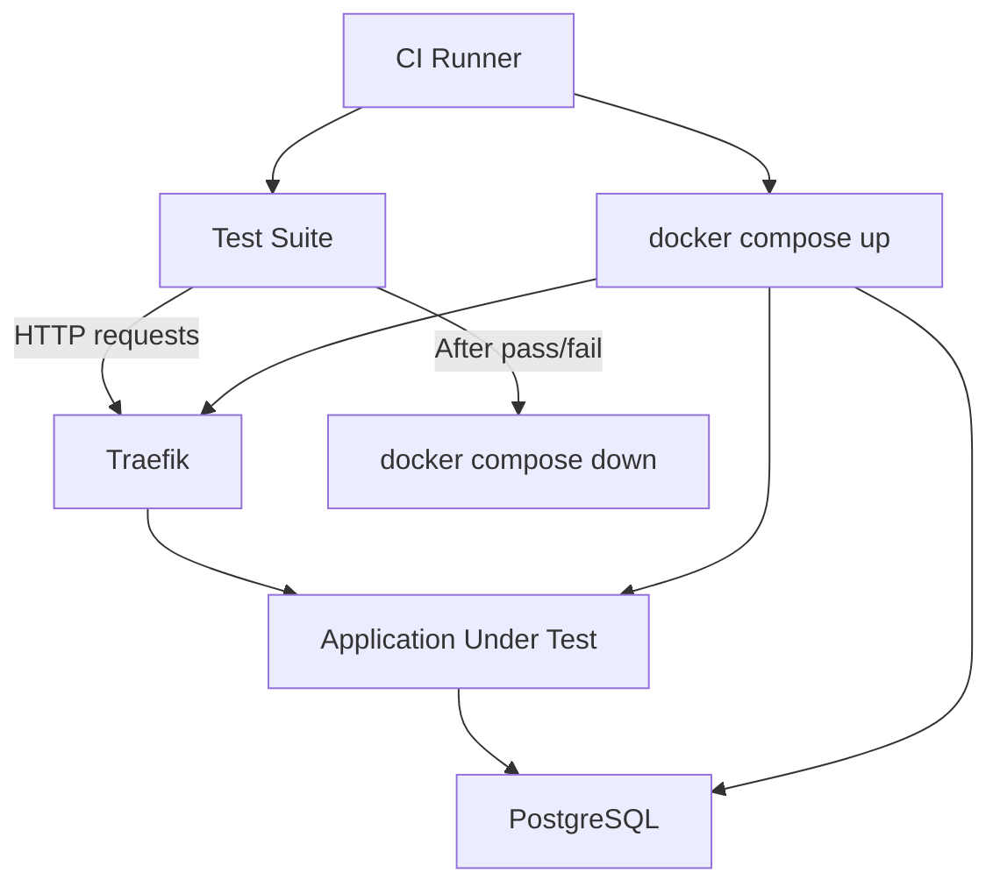
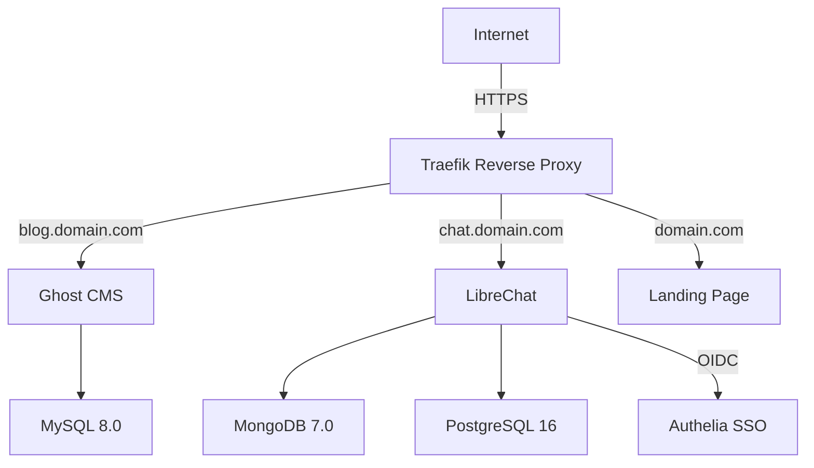

# Use Cases

> Real-world deployment scenarios that show you how Docker Lab adapts to different needs, budgets, and team sizes.

## Overview

You have read about Docker Lab's architecture, its profile system, and its security model. Now the question becomes practical: what does a real deployment look like? How much does it cost? Which profile do you choose? What services do you actually run?

This chapter walks through five concrete scenarios, each representing a common reason people reach for Docker Lab. Every scenario includes the situation that motivates it, the architecture you build, the profile and services you select, a realistic cost estimate, and the deployment steps to get it running. Think of these as deployment stories you can adapt to your own needs.

Whether you are a solo blogger who wants to own your publishing platform, a team lead evaluating self-hosted AI tools, or an engineer building a staging environment for your CI pipeline, one of these scenarios maps to your situation.

## Scenario 1: Running Ghost on a Budget VPS

### The Situation

You write regularly and you are tired of paying Substack or Medium for features you do not need. You want a professional publishing platform at a domain you control, with HTTPS, email delivery, and zero vendor lock-in. Your budget is tight -- you want this running for under $25 per month, total.

Ghost is a modern publishing platform built for exactly this purpose. It handles content management, subscriber newsletters, and membership sites. Docker Lab's foundation gives you the reverse proxy, TLS certificates, and security hardening that would otherwise take hours to configure by hand.

### Architecture

The following diagram shows how traffic flows from your readers to Ghost through the Docker Lab foundation:



Traefik terminates TLS using a certificate it obtains automatically from Let's Encrypt. Ghost handles content and subscriber management. MySQL stores posts, users, and settings on the isolated `db-internal` network, which is never exposed to the internet.

### Profile Selection

| Choice | Value | Reason |
|--------|-------|--------|
| Resource profile | `core` | 4 GB RAM handles Ghost + MySQL comfortably |
| Database profile | MySQL | Ghost requires MySQL (PostgreSQL is not supported) |
| Observability | `observability-lite` | Netdata + Uptime Kuma for basic monitoring |

### Cost Estimate

| Item | Monthly Cost |
|------|-------------|
| Hetzner CX22 VPS (2 vCPU, 4 GB RAM, 40 GB SSD) | ~$5.50 |
| Domain registration (amortized) | ~$1.00 |
| Transactional email (Mailgun/Postmark free tier) | $0.00 |
| **Total** | **~$6.50** |

Even on the most conservative budget, a self-hosted Ghost deployment costs a fraction of managed publishing platforms. If you need more headroom, a Hetzner CX32 (3 vCPU, 8 GB RAM) costs roughly $10 per month.

### Deployment Steps

1. Provision a VPS running Ubuntu 24.04 LTS with SSH key authentication.

2. Install Docker and harden the VPS following the [Deployment chapter](./deployment.md).

3. Clone Docker Lab and configure your environment:

```bash
git clone https://github.com/peermesh/docker-lab.git /opt/docker-lab
cd /opt/docker-lab
cp .env.example .env
```

4. Set your domain and resource profile in `.env`:

```env
DOMAIN=yourdomain.com
ADMIN_EMAIL=you@yourdomain.com
RESOURCE_PROFILE=core
COMPOSE_PROFILES=mysql
```

5. Generate secrets and start the foundation:

```bash
./scripts/generate-secrets.sh
docker compose up -d
```

6. Deploy Ghost on top of the foundation:

```bash
docker compose \
  -f docker-compose.yml \
  -f profiles/mysql/docker-compose.mysql.yml \
  -f examples/ghost/docker-compose.ghost.yml \
  up -d
```

7. Visit `https://ghost.yourdomain.com/ghost/` to create your admin account.

Your blog is live, secured with automatic HTTPS, and backed by a MySQL database on an isolated network. Total setup time for someone familiar with Docker: about 30 minutes.

## Scenario 2: Self-Hosted AI Chat Interface

### The Situation

Your team wants to experiment with large language models -- OpenAI, Anthropic, local models via Ollama -- but your organization's compliance policy prohibits sending data to third-party chat interfaces. You need a self-hosted AI chat platform where conversations stay on your infrastructure, users authenticate through a central identity provider, and you can connect multiple AI backends.

LibreChat solves this problem. It provides a ChatGPT-style interface that connects to any LLM provider, stores conversations in MongoDB, and supports retrieval-augmented generation (RAG) through PostgreSQL with pgvector. Docker Lab provides the security boundary, TLS termination, and authentication layer.

### Architecture

The following diagram shows how LibreChat integrates with Docker Lab's foundation and multiple database profiles:



Users authenticate through Authelia using OIDC before reaching LibreChat. Conversations are stored in MongoDB. When you enable RAG, document embeddings are stored in PostgreSQL with the pgvector extension, allowing LibreChat to search your uploaded documents for context before sending queries to the AI provider.

### Profile Selection

| Choice | Value | Reason |
|--------|-------|--------|
| Resource profile | `full` | RAG processing and multiple databases need headroom |
| Database profiles | MongoDB + PostgreSQL | MongoDB for conversations, PostgreSQL for RAG |
| Authentication | Authelia (OIDC) | Central SSO for all team members |
| Observability | `observability-lite` | Monitor resource usage during LLM workloads |

### Cost Estimate

| Item | Monthly Cost |
|------|-------------|
| Hetzner CX42 VPS (4 vCPU, 16 GB RAM, 160 GB SSD) | ~$17.50 |
| Domain registration (amortized) | ~$1.00 |
| AI API usage (varies by team size and model) | $20-200 |
| **Infrastructure total (excluding API costs)** | **~$18.50** |

The infrastructure cost is fixed. Your AI API spend depends on which models your team uses and how heavily. Even with aggressive usage of GPT-4 or Claude, the total cost is dramatically lower than per-seat SaaS AI platforms.

### Deployment Steps

1. Provision a VPS with at least 8 GB RAM (16 GB recommended for RAG workloads).

2. Clone Docker Lab and configure the environment:

```bash
git clone https://github.com/peermesh/docker-lab.git /opt/docker-lab
cd /opt/docker-lab
cp .env.example .env
```

3. Configure `.env` for multi-database deployment:

```env
DOMAIN=yourdomain.com
ADMIN_EMAIL=admin@yourdomain.com
RESOURCE_PROFILE=full
COMPOSE_PROFILES=mongodb,postgresql
```

4. Generate secrets including LibreChat-specific keys:

```bash
./scripts/generate-secrets.sh

# LibreChat encryption keys
openssl rand -hex 32 > secrets/librechat_creds_key
openssl rand -hex 16 > secrets/librechat_creds_iv
openssl rand -base64 64 > secrets/librechat_jwt_secret
openssl rand -base64 32 > secrets/oidc_client_librechat
chmod 600 secrets/librechat_*
```

5. Configure your AI provider API keys in `examples/librechat/.env`:

```env
OPENAI_API_KEY=sk-your-key-here
ANTHROPIC_API_KEY=sk-ant-your-key-here
```

6. Start the full stack:

```bash
docker compose \
  -f docker-compose.yml \
  -f profiles/mongodb/docker-compose.mongodb.yml \
  -f profiles/postgresql/docker-compose.postgresql.yml \
  -f examples/librechat/docker-compose.librechat.yml \
  up -d
```

7. Access `https://chat.yourdomain.com/` and log in through Authelia SSO.

Your team now has a private AI chat interface with conversation history, RAG capabilities, and centralized authentication. All data stays on your VPS.

## Scenario 3: Local Development Environment

### The Situation

You are building a web application that needs a reverse proxy, a database, and caching. During development, you want an environment that mirrors production as closely as possible -- same network topology, same secret management patterns, same Traefik routing. But you are running on a laptop with limited RAM, and you need the stack to start fast and use minimal resources.

Docker Lab's `lite` profile exists for exactly this purpose. It gives you the full foundation architecture with resource limits tuned for constrained environments. You get the same four-network topology, the same socket proxy security, and the same Traefik routing patterns that you will use in production, but everything fits in under 1 GB of RAM.

### Architecture

The following diagram shows a typical development setup with the foundation stack and two supporting profiles:



On your laptop, Traefik listens on `localhost` instead of a public IP. You use self-signed certificates or a local CA like `mkcert` for HTTPS during development. The network isolation and service discovery work identically to production.

### Profile Selection

| Choice | Value | Reason |
|--------|-------|--------|
| Resource profile | `lite` | Minimal footprint for laptop development |
| Database profile | PostgreSQL | Matches your production database |
| Cache profile | Redis | Session storage and caching |
| Observability | None | Not needed during development |

### Cost Estimate

| Item | Monthly Cost |
|------|-------------|
| Infrastructure | $0.00 (runs on your existing machine) |
| **Total** | **$0.00** |

This is one of Docker Lab's biggest advantages for development teams. Every developer gets a production-equivalent environment on their own machine at zero infrastructure cost.

### Deployment Steps

1. Clone Docker Lab to your development machine:

```bash
git clone https://github.com/peermesh/docker-lab.git ~/docker-lab
cd ~/docker-lab
cp .env.example .env
```

2. Configure for local development:

```env
DOMAIN=localhost
ADMIN_EMAIL=dev@localhost
RESOURCE_PROFILE=lite
COMPOSE_PROFILES=postgresql,redis
```

3. Generate local development secrets:

```bash
./scripts/generate-secrets.sh
```

4. Start the foundation and profiles:

```bash
docker compose up -d
```

5. Verify the stack is running:

```bash
$ docker compose ps
NAME               STATUS              PORTS
pmdl_traefik       running (healthy)   80/tcp, 443/tcp
pmdl_socket-proxy  running             2375/tcp
pmdl_postgres      running (healthy)   5432/tcp
pmdl_redis         running (healthy)   6379/tcp
```

6. Add your application using the example template:

```bash
cp -r examples/_template examples/my-app
```

7. Customize `examples/my-app/compose.yaml` with your application's image, environment variables, and Traefik labels, then bring it up:

```bash
docker compose \
  -f docker-compose.yml \
  -f profiles/postgresql/docker-compose.postgresql.yml \
  -f profiles/redis/docker-compose.redis.yml \
  -f examples/my-app/compose.yaml \
  up -d
```

You are now developing against the same infrastructure patterns you will deploy to production. When your application is ready, switching to a `core` or `full` profile on a VPS requires changing one line in your `.env` file.

### Resource Usage on the Lite Profile

The `lite` profile keeps the foundation stack well within laptop-friendly limits:

| Service | Memory Limit | CPU Limit |
|---------|-------------|-----------|
| Traefik | 128 MB | 0.25 |
| PostgreSQL | 256 MB | 0.5 |
| Redis | 64 MB | 0.1 |
| Socket proxy | 32 MB | 0.1 |
| **Total** | **~480 MB** | **~0.95** |

This leaves plenty of room for your application containers and your IDE.

## Scenario 4: Staging Environment for CI Pipelines

### The Situation

Your team uses continuous integration and you need a staging environment where automated tests run against a real infrastructure stack -- not mocked services, but actual Traefik routing, actual database connections, and actual secret management. The staging environment should spin up quickly, run tests, and tear down cleanly. It needs to be cheap enough to run continuously or on-demand in your CI pipeline.

Docker Lab's `lite` profile and composable architecture make it a natural fit for CI staging. You define your infrastructure as compose files, start them in your CI runner, run your test suite against them, and tear everything down. No provisioning delays, no shared state between runs.

### Architecture

The following diagram shows how a CI pipeline interacts with a Docker Lab staging environment:



The CI runner starts the entire stack, waits for health checks to pass, runs the test suite against the live infrastructure, and then tears everything down regardless of whether the tests passed or failed.

### Profile Selection

| Choice | Value | Reason |
|--------|-------|--------|
| Resource profile | `lite` | Fastest startup, minimal CI runner resources |
| Database profile | PostgreSQL | Matches production database |
| Observability | None | CI runs are ephemeral; no monitoring needed |

### Cost Estimate

| Item | Monthly Cost |
|------|-------------|
| CI runner (GitHub Actions, GitLab CI) | Included in plan or ~$0-15 |
| On-demand VPS for self-hosted runner | ~$5-12 |
| **Total** | **$0-15** |

If your team already uses a CI platform with Docker support, the marginal cost is zero. If you self-host your runner on a small VPS, the cost is a few dollars per month.

### Deployment Steps

Here is how a CI pipeline script integrates Docker Lab as its staging environment:

```bash
#!/usr/bin/env bash
# ci-staging-test.sh -- Run integration tests against Docker Lab staging

set -euo pipefail

PROJECT_DIR="/tmp/docker-lab-staging"

# Clone and configure
git clone https://github.com/peermesh/docker-lab.git "$PROJECT_DIR"
cd "$PROJECT_DIR"
cp .env.example .env

# Configure for CI
cat >> .env <<EOF
DOMAIN=localhost
RESOURCE_PROFILE=lite
COMPOSE_PROFILES=postgresql
ADMIN_EMAIL=ci@localhost
EOF

# Generate secrets
./scripts/generate-secrets.sh

# Start the stack
docker compose \
  -f docker-compose.yml \
  -f profiles/postgresql/docker-compose.postgresql.yml \
  -f examples/my-app/compose.yaml \
  up -d --wait

# Run tests against the live stack
pytest tests/integration/ \
  --base-url=https://localhost \
  --db-host=localhost \
  --db-port=5432

TEST_EXIT_CODE=$?

# Tear down regardless of test result
docker compose down -v

exit $TEST_EXIT_CODE
```

The `--wait` flag tells Docker Compose to block until all services with health checks report healthy. The `-v` flag on teardown removes volumes so every CI run starts with a clean slate.

### CI Configuration Example

**File: `.github/workflows/integration.yml`**

```yaml
name: Integration Tests
on: [push, pull_request]

jobs:
  integration:
    runs-on: ubuntu-latest
    steps:
      - uses: actions/checkout@v4

      - name: Run integration tests against Docker Lab staging
        run: ./ci/ci-staging-test.sh

      - name: Upload test results
        if: always()
        uses: actions/upload-artifact@v4
        with:
          name: test-results
          path: tests/results/
```

Every push and pull request gets tested against a fresh, production-equivalent infrastructure stack.

## Scenario 5: Multi-Application Production Server

### The Situation

You run several services for your organization: a Ghost blog for content marketing, a LibreChat instance for your AI research team, and a landing page. Right now these live on separate servers, each with its own Nginx configuration, its own TLS certificate management, and its own update process. You want to consolidate everything onto a single well-managed VPS to reduce operational overhead and cost.

Docker Lab's architecture is designed for exactly this consolidation. The foundation stack -- Traefik, socket proxy, and network topology -- is shared by all applications. Each application gets its own compose file, its own subdomain, and its own database profile. Traefik routes traffic automatically based on Docker labels, and Let's Encrypt provisions a certificate for each subdomain.

### Architecture

The following diagram shows three applications sharing a single Docker Lab foundation:



Traefik inspects the `Host` header of each incoming request and routes it to the correct application container. Ghost reaches MySQL on the `db-internal` network. LibreChat reaches both MongoDB and PostgreSQL on the same isolated network. Authelia provides SSO for LibreChat. The landing page is a static site with no database dependency.

### Profile Selection

| Choice | Value | Reason |
|--------|-------|--------|
| Resource profile | `full` | Multiple apps + databases need production resources |
| Database profiles | MySQL + MongoDB + PostgreSQL | Each app uses its preferred database |
| Authentication | Authelia | SSO for LibreChat and admin panels |
| Observability | `observability-lite` | Netdata + Uptime Kuma for production monitoring |

### Cost Estimate

| Item | Monthly Cost |
|------|-------------|
| Hetzner CX42 VPS (4 vCPU, 16 GB RAM, 160 GB SSD) | ~$17.50 |
| Domain registration (amortized) | ~$1.00 |
| Off-site backup storage (50 GB) | ~$2.00 |
| AI API costs (for LibreChat) | $20-200 |
| **Infrastructure total (excluding API)** | **~$20.50** |

Compare this to running three separate servers at $12-24 each. Consolidation on a single VPS saves $15-50 per month while giving you a single point of management for updates, backups, and monitoring.

### Deployment Steps

1. Provision a VPS with at least 8 GB RAM (16 GB recommended for this workload).

2. Clone Docker Lab and configure the environment:

```bash
git clone https://github.com/peermesh/docker-lab.git /opt/docker-lab
cd /opt/docker-lab
cp .env.example .env
```

3. Configure `.env` for multi-app deployment:

```env
DOMAIN=yourdomain.com
ADMIN_EMAIL=admin@yourdomain.com
RESOURCE_PROFILE=full
COMPOSE_PROFILES=mysql,mongodb,postgresql
```

4. Set up wildcard DNS so all subdomains resolve to your VPS:

```text
Type   Name   Value            TTL
A      @      YOUR_VPS_IP      300
A      *      YOUR_VPS_IP      300
```

5. Generate all secrets:

```bash
./scripts/generate-secrets.sh
```

6. Start the complete stack with all applications:

```bash
docker compose \
  -f docker-compose.yml \
  -f profiles/mysql/docker-compose.mysql.yml \
  -f profiles/mongodb/docker-compose.mongodb.yml \
  -f profiles/postgresql/docker-compose.postgresql.yml \
  -f examples/ghost/docker-compose.ghost.yml \
  -f examples/librechat/docker-compose.librechat.yml \
  -f examples/landing/docker-compose.landing.yml \
  up -d
```

7. Verify all services are healthy:

```bash
$ docker compose ps
NAME               STATUS              PORTS
pmdl_traefik       running (healthy)   80/tcp, 443/tcp
pmdl_socket-proxy  running             2375/tcp
pmdl_ghost         running (healthy)   2368/tcp
pmdl_librechat     running (healthy)   3080/tcp
pmdl_landing       running (healthy)   80/tcp
pmdl_mysql         running (healthy)   3306/tcp
pmdl_mongodb       running (healthy)   27017/tcp
pmdl_postgres      running (healthy)   5432/tcp
```

8. Access your services at their respective subdomains:

- Blog: `https://blog.yourdomain.com`
- AI Chat: `https://chat.yourdomain.com`
- Landing: `https://yourdomain.com`

All three applications share the same TLS certificate management, the same network security model, and the same backup infrastructure.

## Cost Comparison Across Deployment Sizes

The following table compares infrastructure costs for the five scenarios, using Hetzner Cloud pricing as the reference point. Other providers (DigitalOcean, Vultr, Linode) have comparable offerings within 10-20% of these prices.

| Scenario | VPS Spec | Monthly VPS Cost | Profile | Total Infra Cost |
|----------|----------|-----------------|---------|-----------------|
| Ghost blog | 2 vCPU, 4 GB RAM | ~$5.50 | `core` | ~$6.50 |
| AI chat (LibreChat) | 4 vCPU, 16 GB RAM | ~$17.50 | `full` | ~$18.50 |
| Local development | Your laptop | $0.00 | `lite` | $0.00 |
| CI staging | CI runner or small VPS | $0-12 | `lite` | $0-15 |
| Multi-app production | 4 vCPU, 16 GB RAM | ~$17.50 | `full` | ~$20.50 |

These figures cover infrastructure only. Application-specific costs like AI API keys, transactional email services, or premium DNS are additional.

## Profile Selection Decision Matrix

Choosing the right profile depends on three factors: where the stack runs, how many applications you deploy, and whether you need monitoring. Use this matrix to find your starting point.

| Factor | lite | core | full |
|--------|------|------|------|
| **RAM available** | Under 2 GB | 2-8 GB | 8+ GB |
| **CPU available** | 1 core | 2 cores | 4+ cores |
| **Number of apps** | 0-1 (testing only) | 1-2 | 2+ |
| **Monitoring needed** | No | Optional | Yes |
| **Typical environment** | CI, laptop | Staging, small prod | Production |
| **Database services** | 1 at most | 1-2 | 2+ |
| **Monthly VPS cost** | ~$5-12 | ~$5-24 | ~$17-48 |

### How to Read the Matrix

Start with your available RAM, because memory is usually the binding constraint for container workloads:

- **Under 2 GB**: Use `lite`. You are either developing locally or running in CI. The `lite` profile sets memory limits low enough that the foundation stack and one database fit comfortably.

- **2-8 GB**: Use `core`. This is the sweet spot for single-application deployments and staging environments. You get enough headroom for Traefik, one or two databases, and your application without resource pressure.

- **8 GB or more**: Use `full`. If you are running multiple applications, need monitoring (Prometheus + Grafana), or expect significant traffic, the `full` profile gives each service the resources it needs to perform under load.

You can always start with a smaller profile and scale up. Changing profiles requires editing one line in your `.env` file and restarting the stack.

## Common Gotchas

### Ghost Requires MySQL, Not PostgreSQL

Ghost does not support PostgreSQL. If you are running Ghost alongside applications that use PostgreSQL, you need both the MySQL and PostgreSQL profiles enabled. This is a common point of confusion because most Docker Lab examples default to PostgreSQL.

### RAG Workloads Need More RAM Than You Expect

If you enable retrieval-augmented generation in LibreChat, document embedding and vector search operations use significant memory. Start with the `full` profile (8+ GB RAM) and monitor usage with `docker stats`. If PostgreSQL's pgvector operations cause out-of-memory kills, increase the PostgreSQL memory limit in a `docker-compose.override.yml`.

### CI Runners Need Docker-in-Docker or Socket Access

Running Docker Lab in a CI pipeline requires the CI runner to have access to the Docker daemon. On GitHub Actions, this works out of the box with `ubuntu-latest` runners. On GitLab CI, you need either a shell executor with Docker installed or a Docker-in-Docker service. Kubernetes-based runners require special configuration for Docker socket access.

### Wildcard DNS is Required for Multi-App Deployments

When running multiple applications on a single VPS, each application gets its own subdomain. Traefik routes based on the `Host` header, which means you need either a wildcard DNS record (`*.yourdomain.com`) or individual A records for each subdomain. Missing DNS records cause Traefik to return a 404 for that subdomain, and Let's Encrypt certificate provisioning fails.

### Start Foundation Before Applications

Always start the foundation stack (Traefik, socket proxy) before starting application containers. Applications depend on Docker networks created by the foundation. If you start everything simultaneously with `docker compose up -d`, Docker Compose handles the ordering through `depends_on` directives, but if you are using separate compose files, start the foundation first and wait for Traefik's health check to pass.

## Key Takeaways

- Docker Lab scales from a zero-cost local development environment to a multi-application production server on a single VPS.

- The three resource profiles (`lite`, `core`, `full`) map cleanly to the three common deployment targets: CI/development, staging/small production, and full production.

- Self-hosted infrastructure on commodity VPS providers costs $5-20 per month for most use cases, dramatically less than equivalent managed services.

- Every scenario shares the same foundation architecture: Traefik for routing, socket proxy for security, four-network topology for isolation. You learn it once and apply it everywhere.

- Start small. Deploy one application on the `core` profile, verify it works, then add more applications or scale up the profile as your needs grow.

## Next Steps

These scenarios paint an optimistic picture, and that is intentional -- they show what Docker Lab does well. But every system has boundaries. In the [Limitations and Trade-offs chapter](./limitations.md), we examine what Docker Lab is not designed for: horizontal scaling across multiple servers, high-availability failover, managed database features, and other capabilities that fall outside the single-VPS deployment model. Understanding these boundaries helps you decide whether Docker Lab fits your requirements or whether you need a different approach.
